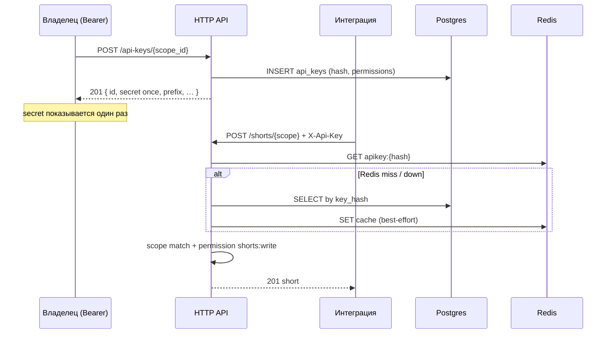
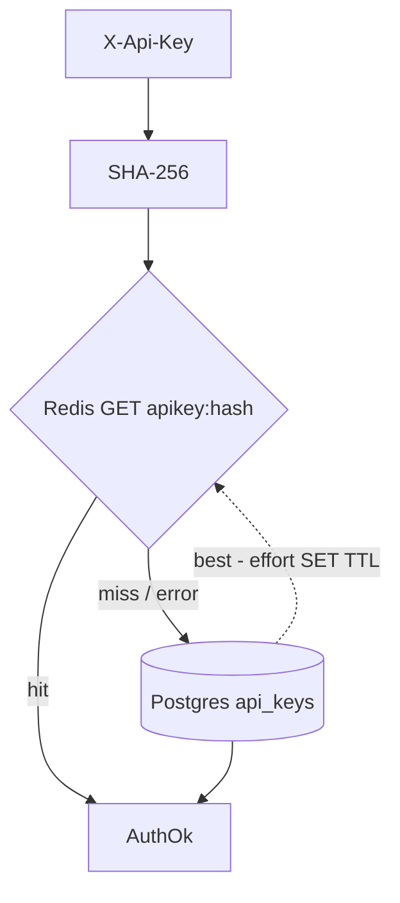

# API Keys Module

> **Статус:** реализовано в backend (миграция `20270101000500_api_keys`,
> handlers `/api-keys/{scope_id}` (POST/GET/PATCH/DELETE), dual-auth
> `ScopeAccess` для scoped short/folders/stats/scopes-update).
> Redis — optional cache (fail-open).

Модуль **программного доступа** к API в рамках одного scope: владелец создаёт
ключ с набором прав, разработчик кладёт его в заголовке запросов и вызывает
те же ручки short/stats, что и UI (без OAuth-сессии).

Ключ **привязан к одному `scope_id`**. Чужие scope недоступны, даже при `*`.

> Те же правила доступа (`permissions`) переиспользуются модулем совместной
> работы (приглашения / роли участников scope) — один словарь прав, два
> носителя: `api_keys` и будущие `scope_members`.

---

## Оглавление

| Иконка | Раздел                                      | Ссылка                                                     |
|--------|---------------------------------------------|------------------------------------------------------------|
| 🎯     | Use cases                                   | [ссылка](#use-cases)                                       |
| 🔑     | Модель ключа и заголовок                    | [ссылка](#модель-ключа-и-заголовок)                        |
| 🛡️    | Permissions (общий словарь с collaboration) | [ссылка](#permissions-общий-словарь-с-collaboration)       |
| 🗄️    | Хранение: Postgres SoT, Redis cache         | [ссылка](#хранение-postgres-sot-redis-cache)               |
| 📉     | Дешёвый дизайн и лимиты                     | [ссылка](#дешёвый-дизайн-и-лимиты)                         |
| ⚙️     | Конфигурация                                | [ссылка](#конфигурация)                                    |
| 📋     | Сводная таблица эндпоинтов                  | [ссылка](#сводная-таблица-эндпоинтов)                      |
| ↳      | POST /api-keys/{scope_id:int}               | [ссылка](module_api_keys/post-scopes-api-keys.md)          |
| ↳      | GET /api-keys/{scope_id:int}                | [ссылка](module_api_keys/get-scopes-api-keys.md)           |
| ↳      | PATCH /api-keys/{scope_id:int}              | [ссылка](module_api_keys/patch-scopes-api-keys-key_id.md)  |
| ↳      | DELETE /api-keys/{scope_id:int}             | [ссылка](module_api_keys/delete-scopes-api-keys-key_id.md) |

---

## Use cases

| Сценарий                                 | Как                                                                             |
|------------------------------------------|---------------------------------------------------------------------------------|
| CI создаёт короткие ссылки в scope «Ads» | Ключ с `["shorts:write"]`, `X-Api-Key` в pipeline                               |
| Партнёр только читает статистику         | Ключ с `["stats:read", "shorts:read"]`                                          |
| Полный доступ бота к одному scope        | Ключ с `"*"`                                                                    |
| Утечка ключа                             | `DELETE` → ключ сразу недействителен (PG); Redis-кеш инвалидируется best-effort |
| Смена прав / имени                       | `PATCH` (secret не меняется; интеграции не перевыпускают ключ)                  |
| Ротация secret                           | `DELETE` + `POST`                                                               |
| Collaboration (позже)                    | Те же `permissions` у участника scope                                           |



---

## Модель ключа и заголовок

### Заголовок

```http
X-Api-Key: kk_<secret>
```

- Отдельно от `Authorization: Bearer <uuid>` (пользовательская сессия).
- Middleware: если есть `X-Api-Key` — аутентификация по API key; Bearer
  пользователя для этого запроса не требуется.
- Одновременно оба заголовка: приоритет у **Bearer пользователя** (UI/админ
  операции управления ключами), `X-Api-Key` игнорируется. Так владелец всегда
  может управлять ключами своей сессией.

CORS: добавить `X-Api-Key` в `cors.allowed_headers` (`base.yaml`).

### Формат secret

| Часть       | Описание                                                                                 |
|-------------|------------------------------------------------------------------------------------------|
| Префикс     | `kk_` (константа продукта)                                                               |
| Secret      | cryptographically random, длина из `api_keys.secret_bytes` (default 32 → hex 64 символа) |
| Полный ключ | `kk_` + hex(secret); **отдаётся только в ответе create**                                 |

В БД:

| Поле                                         | Назначение                                               |
|----------------------------------------------|----------------------------------------------------------|
| `id`                                         | UUID ключа (для PATCH / DELETE / списка)                 |
| `key_prefix`                                 | первые 8 символов после `kk_` — для UI/логов (не секрет) |
| `key_hash`                                   | `SHA-256` полного ключа, UNIQUE                          |
| `scope_id`                                   | привязка                                                 |
| `permissions`                                | JSON: `"*"` или `["shorts:write", …]`                    |
| `name`                                       | человекочитаемое имя                                     |
| `created_by`                                 | `user_id` владельца-создателя                            |
| `created_at` / `last_used_at` / `revoked_at` | аудит                                                    |

Сырой secret **никогда** не логируется и не возвращается в GET.

---

## Permissions (общий словарь с collaboration)

Значение поля `permissions`:

1. строка `"*"` — полный доступ **внутри этого scope**;
2. массив строк `"resource:action"`.

### Ресурсы и действия

| Resource     | Actions                        | Что покрывает (примеры ручек)                                  |
|--------------|--------------------------------|----------------------------------------------------------------|
| `shorts`     | `read`, `write`, `delete`, `*` | GET/POST/PATCH/DELETE shorts, availability                     |
| `folders`    | `read`, `write`, `delete`, `*` | folders CRUD / move                                            |
| `stats`      | `read`, `*`                    | `/stats/{scope}/*`                                             |
| `subdomains` | `read`, `write`, `delete`, `*` | subdomain CRUD (только если subdomain принадлежит этому scope) |
| `scopes`     | `read`, `write`, `*`           | GET/PATCH этого scope (не create/delete чужих)                 |
| `transfer`   | `export`, `import`, `*`        | transfer jobs                                                  |

Семантика:

- `write` = **create + update** (как просил продукт; один grant для редактора).
- `resource:*` = все actions ресурса.
- `"*"` = все resources/actions в scope.
- Пустой массив `[]` → 400 `validation_error` при create.
- Неизвестный `resource` / `action` → 400 `validation_error`.

### Что API key **никогда** не может

Даже при `"*"`:

- создавать/листить/отзывать другие API keys (только Bearer-владелец);
- создавать новые scope / удалять scope;
- выходить за `scope_id` ключа;
- вызывать admin/support/auth/qa ручки.

Это же ограничение закладывается для collaboration: участник с `"*"` в scope ≠
владелец аккаунта.

### Проверка на запросе

1. Извлечь identity из `X-Api-Key`.
2. `path.scope_id` (или scope из body для bulk без path) **обязан** совпасть
   с `key.scope_id` → иначе 403 `api_key_scope_mismatch_error`.
3. Требуемый grant для ручки (таблица ниже) ∈ permissions → иначе 403
   `permission_denied_error`.

| Ручка (группа)               | Требуемый grant                       |
|------------------------------|---------------------------------------|
| `GET /shorts…`, availability | `shorts:read` или `shorts:*` или `*`  |
| `POST/PATCH …/shorts…`       | `shorts:write` / `shorts:*` / `*`     |
| `DELETE …/shorts…`           | `shorts:delete` / `shorts:*` / `*`    |
| folders GET                  | `folders:read` / …                    |
| folders write/move           | `folders:write` / …                   |
| folders delete               | `folders:delete` / …                  |
| stats `*`                    | `stats:read` / `stats:*` / `*`        |
| subdomains                   | аналогично                            |
| transfer export/import       | `transfer:export` / `transfer:import` |
| PATCH scope meta             | `scopes:write`                        |

---

## Хранение: Postgres SoT, Redis cache

**Postgres — единственный source of truth.** Падение Redis не ломает auth и
управление ключами.



| Операция                 | Postgres                        | Redis                                                         |
|--------------------------|---------------------------------|---------------------------------------------------------------|
| Create                   | INSERT                          | SET cache (best-effort)                                       |
| Auth hot path            | fallback SELECT by `key_hash`   | primary GET                                                   |
| Patch (name/permissions) | UPDATE                          | SET/DEL cache (best-effort); права в PG — SoT                 |
| Delete / revoke          | `revoked_at = now()` или DELETE | DEL best-effort; при ошибке Redis — ок, TTL всё равно истечёт |
| List                     | SELECT без secret               | не нужен                                                      |

Инварианты надёжности:

- Auth **не** возвращает 5xx только из-за недоступности Redis.
- После revoke: даже при «живом» Redis-entry проверка `revoked_at` / отсутствие
  строки в PG при miss-path; для hit-path — при revoke всегда пытаемся `DEL`,
  плюс короткий TTL кеша (`api_keys.redis_cache_ttl`).
- `last_used_at` обновляется **асинхронно / throttled** (не чаще N минут), чтобы
  не жечь PG на каждом редиректе/API-вызове; при сбое апдейта — ignore.

---

## Дешёвый дизайн и лимиты

| Решение                                      | Зачем дёшево                                           |
|----------------------------------------------|--------------------------------------------------------|
| **4 ручки** (create / list / patch / delete) | Нет rotate / get-by-id                                 |
| PATCH только `name` + `permissions`          | Secret не трогаем → меньше утечек и churn у интеграций |
| Ротация secret = revoke + create             | Отдельной rotate-ручки нет                             |
| Лимит ключей на scope                        | `api_keys.max_per_scope` в conf                        |
| Один scope на ключ                           | Простая ACL, без ACL matrix                            |
| Hash + prefix                                | Не храним plaintext                                    |
| Redis optional cache                         | Не нужен watcher/replication для keys                  |
| Грубые grants (`write` = create+update)      | Меньше комбинаций в checks                             |
| Один словарь permissions                     | Reuse в collaboration без второго движка               |

Ротация secret: клиент `DELETE` старый → `POST` новый.

---

## Конфигурация

Секция `api_keys` в [`services/backend/conf/base.yaml`](../../../../services/backend/conf/base.yaml):

```yaml
api_keys:
  max_per_scope: 10          # жёсткий лимит активных ключей на scope
  secret_bytes: 32          # энтропия secret (без префикса kk_); кодируется hex
  redis_cache_ttl: 5m       # TTL кеша auth; revoke + короткий TTL = fail-safe
  last_used_min_interval: 5m  # throttle записи last_used_at
```

Также: `cors.allowed_headers` += `"X-Api-Key"`.

Превышение `max_per_scope` при create → `402 api_key_limit_error` (или `409`,
если лимит считаем конфликтом ресурса; в контракте — **402** по аналогии с
лимитами подписки на сущности scope).

### Consumer auth (реализация)

`ScopeAccess` (Bearer приоритетнее `X-Api-Key`) на:

- **shorts:** create, list, bulk_create, bulk_update, bulk_delete, availability
- **folders:** list, bulk_create, bulk_delete, update, move
- **subdomains:** create, list, delete
- **scopes:** PATCH meta only (create / delete / list scopes — Bearer only)
- **stats:** overview, series, breakdown, ranking, short_card

**Недоступно через API key** (только Bearer): управление `api_keys`, create /
delete / list scopes, auth, support, notifications, transfer (пока).

**Redis/cache principal** (как у `AuthenticatedUser`): `id`, `scope_id`,
`owner_user_id`, `subscription`, `permissions` — PG на hot path authorize не
вызывается.

**Tracing actor:** `user:{uuid}` / `apikey:{uuid}`.

**Ошибки consumer-ручек:** `403 permission_denied_error`,
`403 api_key_scope_mismatch_error` (см. таблицы эндпоинтов).

---

## Сводная таблица эндпоинтов

Управление ключами — только **Bearer владельца** scope.

| Метод    | Путь                   | Auth            | Описание                                                |
|----------|------------------------|-----------------|---------------------------------------------------------|
| `POST`   | `/api-keys/{scope_id}` | 🔒 Bearer owner | Создать ключ (secret один раз)                          |
| `GET`    | `/api-keys/{scope_id}` | 🔒 Bearer owner | Список ключей (без secret)                              |
| `PATCH`  | `/api-keys/{scope_id}` | 🔒 Bearer owner | Обновить `name` / `permissions` (в body нужен `key_id`) |
| `DELETE` | `/api-keys/{scope_id}` | 🔒 Bearer owner | Отозвать / удалить ключ (в body нужен `key_id`)         |

Использование ключа: любые разрешённые ручки short/stats/transfer с
`X-Api-Key` (см. таблицу grants). Отдельных «proxy»-ручек нет.
