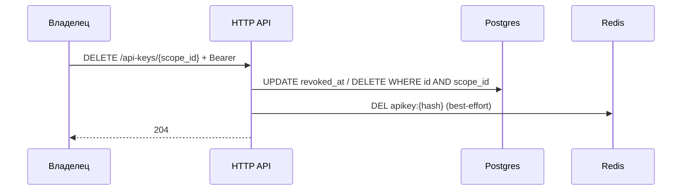

<a id="delete-scopes-api-keys-key_id"></a>

### <span style="background:#EF5350;padding:5px">DELETE</span> `/api-keys/{scope_id:int}`

|                | Описание                                                                |
|----------------|-------------------------------------------------------------------------|
| **Назначение** | Отозвать (удалить) API key. После ответа ключ немедленно недействителен |
| **Логика**     | 1. Bearer: владелец `scope_id`.                                         |
|                | 2. Находит ключ по `key_id` + `scope_id` (чужой scope → 404).           |
|                | 3. Ставит `revoked_at` (или hard-delete — на усмотрение реализации;     |
|                | контракт: ключ больше не аутентифицирует).                              |
|                | 4. Best-effort `DEL` записи в Redis; сбой Redis **не** откатывает       |
|                | revoke (TTL кеша всё равно истечёт).                                    |
| **Параметры**  | `scope_id:int` — path; `key_id:uuid` — body                              |
| **Auth**       | 🔒 Bearer владельца                                                     |

---

| Kind                    | Код | Описание                      |
|-------------------------|-----|-------------------------------|
|                         | 204 | Ключ отозван                  |
| auth_error              | 401 | Не авторизован                |
| scope_not_found_error   | 404 | Scope не найден / нет доступа |
| api_key_not_found_error | 404 | Ключ не найден в этом scope   |
| server_error            | 500 | Внутренняя ошибка             |

---

<details>
<summary><b>Схема</b></summary>



</details>

<details open>
<summary><b>Пример ответа</b></summary>

Тело пустое, статус `204 No Content`.

</details>

<details open>
<summary><b>Пример запроса</b></summary>

```json
{
  "key_id": "550e8400-e29b-41d4-a716-446655440000"
}
```

</details>

> Ротация secret: `DELETE` + `POST`. Смена `name` / `permissions` — через
> [`PATCH`](patch-scopes-api-keys-key_id.md).
