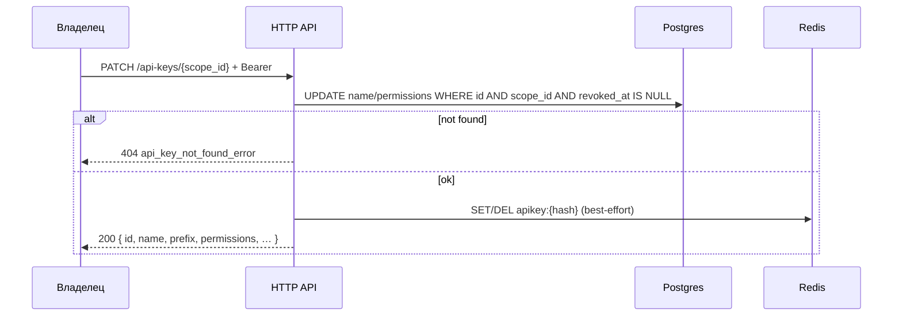

<a id="patch-scopes-api-keys-key_id"></a>

### <span style="background:#FFA726;padding:5px">PATCH</span> `/api-keys/{scope_id:int}`

|                | Описание                                                              |
|----------------|-----------------------------------------------------------------------|
| **Назначение** | Обновить `name` и/или `permissions` существующего ключа               |
| **Логика**     | 1. Bearer: владелец `scope_id`.                                       |
|                | 2. Находит активный ключ по `key_id` + `scope_id` (отозванный → 404). |
|                | 3. Partial update: переданы только изменяемые поля (оба optional,     |
|                | хотя бы одно обязательно).                                            |
|                | 4. Валидирует `name` / `permissions` так же, как при create.          |
|                | 5. Пишет в Postgres.                                                  |
|                | 6. Best-effort обновляет Redis-кеш (`SET` с новыми permissions) или   |
|                | `DEL` при сбое SET — auth fallback в PG.                              |
|                | 7. **Secret не меняется** и в ответе не возвращается.                 |
| **Параметры**  | `scope_id:int` — path; `key_id:uuid` — body                           |
| **Auth**       | 🔒 Bearer владельца (не `X-Api-Key`)                                  |

---

| Kind                    | Код | Описание                                        |
|-------------------------|-----|-------------------------------------------------|
|                         | 200 | Ключ обновлён                                   |
| validation_error        | 400 | Пустое тело / некорректные `name`/`permissions` |
| auth_error              | 401 | Не авторизован                                  |
| scope_not_found   | 404 | Scope не найден / нет доступа                   |
| api_key_not_found_error | 404 | Ключ не найден / отозван в этом scope           |
| server_error            | 500 | Внутренняя ошибка                               |

---

<details open>
<summary><b>Пример запроса — сузить права</b></summary>

```json
{
  "key_id": "550e8400-e29b-41d4-a716-446655440000",
  "permissions": [
    "shorts:read",
    "stats:read"
  ]
}
```

</details>

<details open>
<summary><b>Пример запроса — переименовать</b></summary>

```json
{
  "key_id": "550e8400-e29b-41d4-a716-446655440000",
  "name": "ci-ads-bot-v2"
}
```

</details>

<details>
<summary><b>Схема</b></summary>



</details>

<details open>
<summary><b>Пример ответа 200</b></summary>

```json
{
  "id": "550e8400-e29b-41d4-a716-446655440000",
  "name": "ci-ads-bot-v2",
  "prefix": "a1b2c3d4",
  "permissions": [
    "shorts:read",
    "stats:read"
  ],
  "scope_id": 10000001,
  "created_at": "2026-07-28T12:00:00Z",
  "last_used_at": "2026-07-28T15:30:00Z"
}
```

</details>

> Ротация secret — по-прежнему `DELETE` + `POST`. PATCH меняет только метаданные
> и права; интеграциям не нужно перевыпускать ключ в заголовках.
