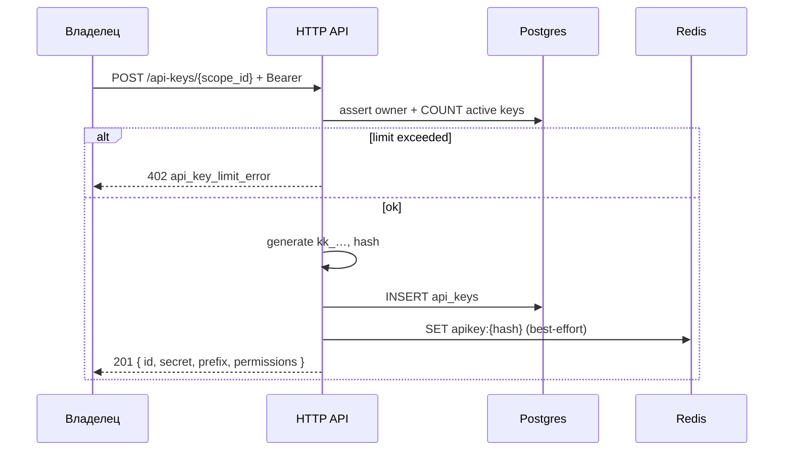

<a id="post-scopes-api-keys"></a>

### <span style="background:#42A5F5;padding:5px">POST</span> `/api-keys/{scope_id:int}`

|                | Описание                                                                |
|----------------|-------------------------------------------------------------------------|
| **Назначение** | Создать API key, привязанный к scope, с набором `permissions`           |
| **Логика**     | 1. Bearer: пользователь — владелец `scope_id`.                          |
|                | 2. Считает активные ключи scope; если ≥ `api_keys.max_per_scope` → 402. |
|                | 3. Валидирует `name`, `permissions` (`"*"` или непустой массив grants). |
|                | 4. Генерирует secret (`kk_` + random), считает `SHA-256`, пишет в PG.   |
|                | 5. Best-effort кладёт запись в Redis-кеш.                               |
|                | 6. Возвращает `201` + **полный `secret` один раз**.                     |
| **Параметры**  | `scope_id:int` — path                                                   |
| **Auth**       | 🔒 Bearer владельца (не `X-Api-Key`)                                    |

---

| Kind                    | Код | Описание                                                       |
|-------------------------|-----|----------------------------------------------------------------|
|                         | 201 | Ключ создан                                                    |
| validation_error        | 400 | Некорректные `name` / `permissions`                            |
| auth_error              | 401 | Не авторизован                                                 |
| api_key_not_payed_error | 402 | Запрошены n-ный API ключ без его имения (ограничены подпиской) |
| scope_not_found_error   | 404 | Scope не найден / не принадлежит пользователю                  |
| server_error            | 500 | Внутренняя ошибка                                              |

---

<details open>
<summary><b>Пример запроса — полный доступ в scope</b></summary>

```json
{
  "name": "ci-ads-bot",
  "permissions": "*"
}
```

</details>

<details open>
<summary><b>Пример запроса — только создание/правка ссылок + stats</b></summary>

```json
{
  "name": "partner-stats",
  "permissions": [
    "shorts:write",
    "shorts:read",
    "stats:read"
  ]
}
```

</details>

<details>
<summary><b>Схема</b></summary>



</details>

<details open>
<summary><b>Пример ответа 201</b></summary>

```json
{
  "id": "550e8400-e29b-41d4-a716-446655440000",
  "name": "ci-ads-bot",
  "prefix": "a1b2c3d4",
  "secret": "kk_a1b2c3d4e5f6…",
  "permissions": "*",
  "scope_id": 10000001,
  "created_at": "2026-07-28T12:00:00Z",
  "last_used_at": null
}
```

</details>

> Поле `secret` **больше нигде не отдаётся**. Клиент обязан сохранить его
> сразу. В логах — только `prefix` / `id`.
