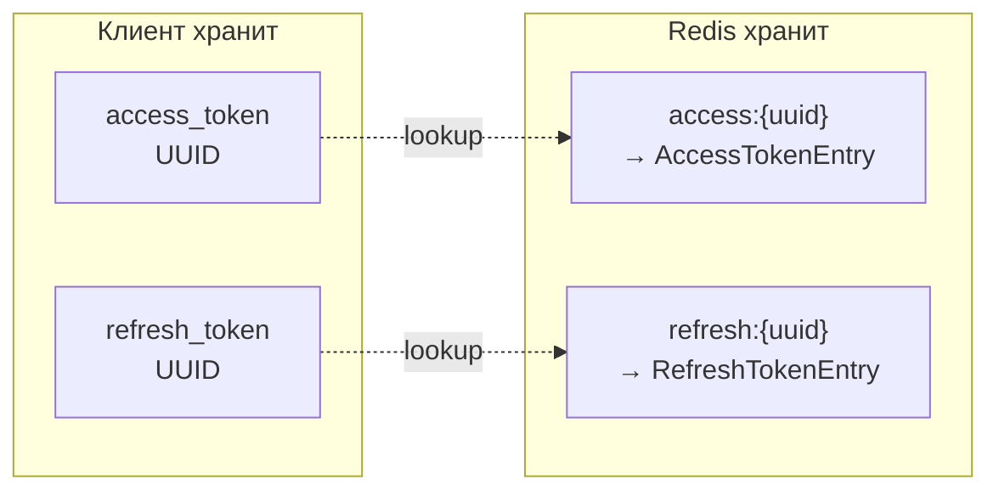
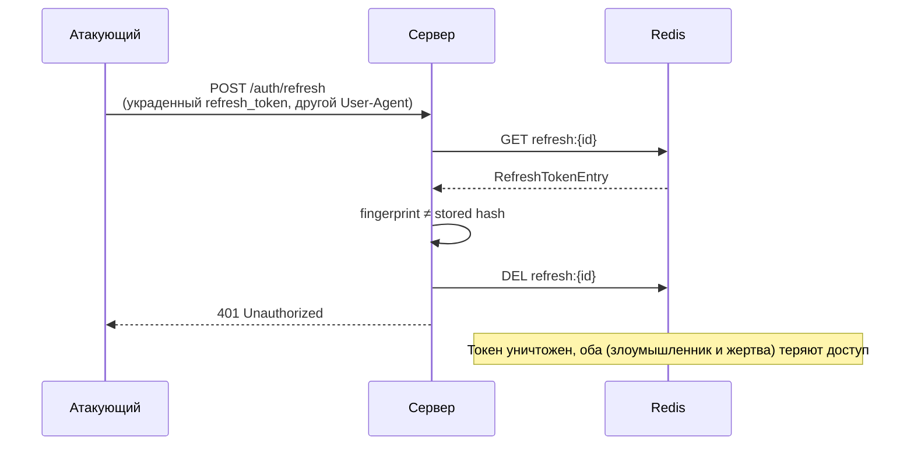

# Auth Module

Модуль для авторизации пользователей и управления токенами доступа.
Аутентификация реализована через OAuth2:

- [Яндекс ID](https://oauth.yandex.ru/)
- [Google](https://developers.google.com/identity/protocols/oauth2)
- MAX (мессенджер) — в разработке
- Microsoft — в разработке

> **Дорожная карта (не v1):** для полного соответствия
> [ФЗ-149](https://eais.rkn.gov.ru/docs/149.pdf) /
> [ФЗ-152](https://72.rkn.gov.ru/p21978/p25026/p25030/) возможны SMS и пароль;
> для корпоративного доступа — SSO. Сейчас вход **только через OAuth**.

---

## Оглавление

| Иконка | Раздел                                | Ссылка                                                   |
|--------|---------------------------------------|----------------------------------------------------------|
| 🧭     | Информация по реализации              | [ссылка](#информация-по-реализации)                      |
| 🔐     | Модель токенов                        | [ссылка](#модель-токенов)                                |
| 🧬     | Fingerprint и защита от кражи токенов | [ссылка](#fingerprint-и-защита-от-кражи-токенов)         |
| 🗄️    | Хранилища данных                      | [ссылка](#хранилища-данных)                              |
| 🔁     | Консистентность Postgres ↔ Redis      | [ссылка](#консистентность-postgres--redis)               |
| ⚙️     | Конфигурация                          | [ссылка](#конфигурация)                                  |
| 📋     | Сводная таблица эндпоинтов            | [ссылка](#сводная-таблица-эндпоинтов)                    |
| 🔗     | Эндпоинты                             | [ссылка](#сводная-таблица-эндпоинтов)                    |
| ↳      | POST /auth/oauth_login                | [ссылка](module_auth/post-auth-oauth_login.md)           |
| ↳      | POST /auth/refresh                    | [ссылка](module_auth/post-auth-refresh.md)               |
| ↳      | GET /auth/subscription_plans          | [ссылка](module_auth/get-auth-subscription_plans.md)     |
| ↳      | GET /auth/profile                     | [ссылка](module_auth/get-auth-profile.md)                |
| ↳      | PATCH /auth/profile                   | [ссылка](module_auth/patch-auth-profile.md)              |
| ↳      | GET /auth/sessions                    | [ссылка](module_auth/get-auth-sessions.md)               |
| ↳      | DELETE /auth/sessions/{session_id}    | [ссылка](module_auth/delete-auth-sessions-session_id.md) |
| ↳      | POST /auth/logout                     | [ссылка](module_auth/post-auth-logout.md)                |
| ↳      | POST /auth/logout_all                 | [ссылка](module_auth/post-auth-logout_all.md)            |

---

## Информация по реализации

Сессия авторизации хранится в виде токена `Authorization: Bearer <токен>`,  
где `<токен>` — stateful uuid в `Redis` c TTL, информацией:

```json
{
  "user_id": "UUID",
  "session_id": "UUID",
  "token_id": "UUID",
  "subscription": "FREE",
  "roles": []
}
```

Для консистентности данных в Postgres и Redis реализован [Session Watcher Service](../session_watcher.md)
(в т.ч. lifecycle подписки / cooling — см. [Payment](../privat_http_api/module_payment.md)).

Типы подписки (см. также [subscription_politics](../../business/subscription_politics.md)):

| Subscription  | Описание                                                               |
|---------------|------------------------------------------------------------------------|
| FREE          | Бесплатный доступ для ознакомления                                     |
| FREE_PLUS     | Расширенный бесплатный тариф (публичный каталог на запуске, `is_view`) |
| PERSONAL      | Индивидуальное использование                                           |
| PRO           | Создатели, фрилансеры                                                  |
| BUSINESS      | Малый бизнес / ИП (корп.)                                              |
| BUSINESS_PLUS | Растущие команды (корп.)                                               |

---

## Модель токенов

Система использует **stateful opaque-токены** (UUID), не JWT.



- **Access token** — короткоживущий (по умолчанию 15 мин prod, 8 ч dev), передаётся в заголовке
  `Authorization: Bearer <uuid>`.
- **Refresh token** — долгоживущий (по умолчанию 31 день), нужен для получения новой пары токенов.
- При каждом `/auth/refresh` старый refresh-токен инвалируется, выдается новый (**rolling rotation**).

---

## Fingerprint и защита от кражи токенов

При создании refresh-токена сервер вычисляет **fingerprint-хеш** из:

- `User-Agent`
- `X-Fingerprint` (опционально, генерируется клиентом один раз)

При каждом `/auth/refresh` сервер пересчитывает fingerprint и сравнивает с сохранённым в Redis.  
В случае несовпадения — токен уничтожается и доступ блокируется.



---

## Хранилища данных

### PostgreSQL — долгосрочное хранение

| Таблица              | Назначение                                                                                                                                                                                     |
|----------------------|------------------------------------------------------------------------------------------------------------------------------------------------------------------------------------------------|
| `users`              | Профиль пользователя (id, email, display_name, subscription, roles; billing: `subscription_ends_at`, `cooling_until`, `cooling_enforced_at` — [Payment](../privat_http_api/module_payment.md)) |
| `oauth_accounts`     | OAuth-провайдер пользователя (provider, user_id) — один аккаунт, один провайдер                                                                                                                |
| `subscription_plans` | Справочник тарифных планов с лимитами; `is_view` — видимость в GET `/auth/subscription_plans`                                                                                                  |
| `sessions`           | Аудит сессий, ревокация, revocation_reason                                                                                                                                                     |

### Redis — оперативный кеш токенов

| Ключ                      | Содержимое                                                              | TTL         |
|---------------------------|-------------------------------------------------------------------------|-------------|
| `access:{token_id}`       | AccessTokenEntry (user_id, session_id, subscription, roles)             | acces_ttl   |
| `refresh:{token_id}`      | RefreshTokenEntry (user_id, session_id, fingerprint_hash, subscription) | refresh_ttl |
| `refresh_index:{user_id}` | SET всех refresh-токенов пользователя                                   | —           |

> `subscription` и `roles` кешируются в access token при логине — auth middleware

---

## Консистентность Postgres ↔ Redis

Паттерн **deferred Redis writes**:

1. Все операции с Postgres выполняются в транзакции.
2. Операции с Redis откладываются (defer) в очередь.
3. После успешного `tx.commit()` выполняются queued Redis-записи.
4. Если транзакция откатывается — очередь удаляется, орфанные данные не остаются.

> Для устранения расхождений работает сервис [Session Watcher](../session_watcher.md), который сверяет списки сессий
> между Redis и Postgres.

### Поведение при потере данных Redis

| Данные                    | Источник истины        | Fallback при miss Redis                                                           | Примечание                                                                                        |
|---------------------------|------------------------|-----------------------------------------------------------------------------------|---------------------------------------------------------------------------------------------------|
| Access token              | Redis (`access:{id}`)  | **Postgres** — `sessions.current_access_token_id` + JOIN `users`                  | Middleware [`auth.rs`](../../../services/backend/src/views/http_api/src/actix/middleware/auth.rs) |
| Refresh token             | Redis (`refresh:{id}`) | **Нет** — payload (fingerprint, subscription) только в Redis                      | После eviction нужен повторный login                                                              |
| `refresh_index:{user_id}` | Redis SET              | **Частично** — Session Watcher пересобирает индекс из существующих `refresh:{id}` | Не восстанавливает сами токены                                                                    |
| `sessions.expires_at`     | Postgres               | —                                                                                 | Обновляется при login и каждом `/auth/refresh` (rolling TTL)                                      |
| Rate limit / ban          | Redis                  | Fail-open (запрос пропускается)                                                   | Осознанная деградация                                                                             |
| `short:resolve:*`         | Postgres               | Cache miss → SELECT                                                               | Корректно, медленнее                                                                              |
| Bloom availability        | Postgres               | BF miss / отсутствие BF → SELECT                                                  | Корректно; ложноположительный BF → лишний SELECT                                                  |

**Практический вывод:** при полной очистке Redis уже выданные **access**-токены продолжают работать до истечения access
TTL (или session `expires_at` в PG). **Refresh** и **logout_all** по evicted refresh-токенам — нет; пользователь
re-login после истечения access.

---

## Конфигурация

Файл: `conf/local.yaml` или `prod.yaml`

```yaml
auth:
  acces_ttl: 15m      # Время жизни access-токена
  refresh_ttl: 31d    # Время жизни refresh-токена
  lock_duration: 15m  # Базовая длительность блокировки
  user_agent: "..."   # User-Agent для OAuth-запросов

  yandex:
    client_id: "..."
    client_secret: "..."

  google:
    client_id: "..."
    client_secret: "..."
```

---

## Сводная таблица эндпоинтов

| Метод    | Путь                       | Авторизация | Описание                       |
|----------|----------------------------|-------------|--------------------------------|
| `POST`   | `/auth/oauth_login`        | —           | Вход / регистрация через OAuth |
| `POST`   | `/auth/refresh`            | —           | Обновление пары токенов        |
| `GET`    | `/auth/subscription_plans` | —           | Справочник тарифных планов     |
| `GET`    | `/auth/profile`            | 🔒 Bearer   | Получение профиля              |
| `PATCH`  | `/auth/profile`            | 🔒 Bearer   | Обновление профиля             |
| `GET`    | `/auth/sessions`           | 🔒 Bearer   | Список активных сессий         |
| `DELETE` | `/auth/sessions/{id}`      | 🔒 Bearer   | Отзыв конкретной сессии        |
| `POST`   | `/auth/logout`             | 🔒 Bearer   | Выход (текущая сессия)         |
| `POST`   | `/auth/logout_all`         | 🔒 Bearer   | Выход (все сессии)             |
