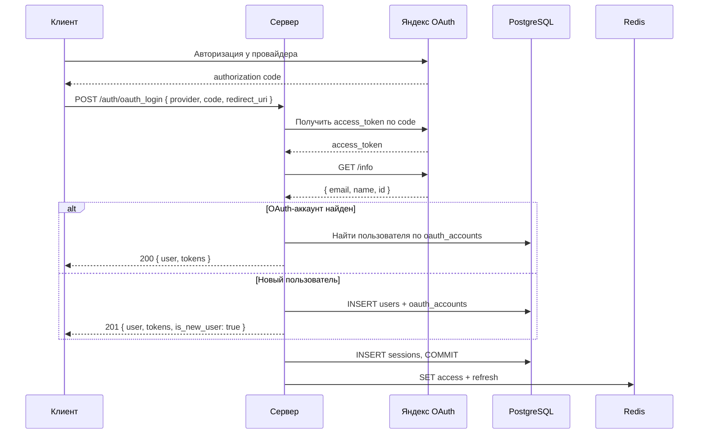

<a id="post-auth-oauth_login"></a>

### <span style="background:#42A5F5;padding:5px">POST</span> `/auth/oauth_login`

|                | Описание                                                                      |
|----------------|-------------------------------------------------------------------------------|
| **Назначение** | Вход или регистрация через OAuth2-провайдера (Яндекс ID, Google)      |
| **Логика**     | 1. Сервер обменивает authorization code на access_token провайдера.           |
|                | 2. Получает профиль пользователя у провайдера (email, name, id).              |
|                | 3. Проверяет, есть ли `oauth_accounts` с такой связкой provider+id:           |
|                | &nbsp; - Если есть — логинит этого пользователя (выдаёт токены).              |
|                | &nbsp; - Если нет — создаёт нового пользователя и привязывает OAuth.          |
|                | 4. Создаёт запись сессии в Postgres, сохраняет access/refresh токены в Redis. |
|                | 5. Возвращает токены и признак is_new_user.                                   |
| **Заголовки**  | `User-Agent`, `X-Fingerprint` (опционально)                                   |

---

| Kind                 | Код | Описание                                         |
|----------------------|-----|--------------------------------------------------|
|                      | 200 | OAuth: залогинен существующий пользователь       |
|                      | 201 | OAuth: зарегистрирован новый пользователь        |
| validation_error     | 400 | Ошибка валидации или ошибка запроса к провайдеру |
| auth_error           | 401 | Нет или некорректный access token                |
| email_conflict_error | 409 | Пользователь с таким email уже существует        |
| server_error         | 500 | Внутренняя ошибка сервера                        |

---

<details open>
<summary><b>Пример запроса</b></summary>

```json
{
  "code": "4/0AQSTgQF...xyz",
  "provider": "GOOGLE",
  "redirect_uri": "https://example.com/home"
}
```

`provider`: `YANDEX` | `GOOGLE`.

</details>

<details>
<summary><b>Схема</b></summary>



</details>

<details open>
<summary><b>Пример ответа</b></summary>

```json
{
  "tokens": {
    "access_token": "string",
    "expires_in": 900,
    "refresh_token": "string",
    "token_type": "bearer"
  },
  "user": {
    "id": "uuid",
    "auth_provider": "YANDEX",
    "email": "user@example.com",
    "display_name": "John",
    "subscription": "FREE",
    "roles": [
      "RoleFromCompany"
    ],
    "created_at": "2025-01-15T10:00:00Z",
    "updated_at": "2025-01-17T10:00:00Z"
  },
  "is_new_user": true
}
```

</details>
