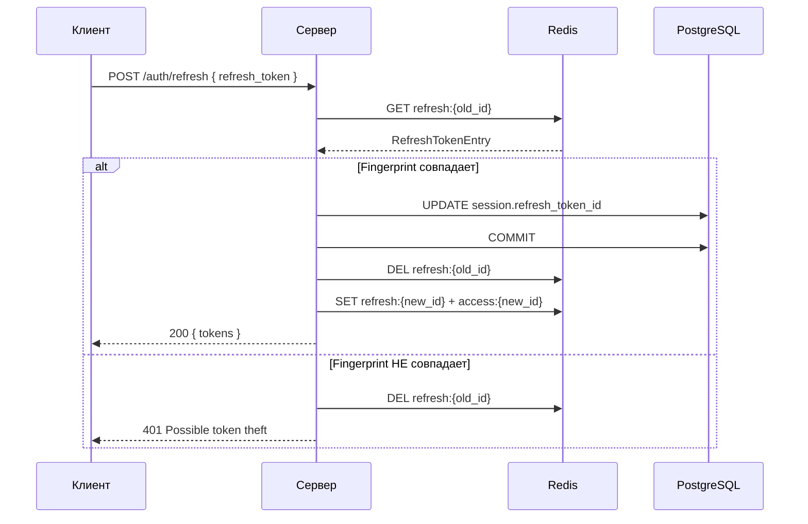

<a id="post-auth-refresh"></a>

### <span style="background:#42A5F5;padding:5px">POST</span> `/auth/refresh`

|                | Описание                                                                                      |
|----------------|-----------------------------------------------------------------------------------------------|
| **Назначение** | Обновление access/refresh токена (rolling rotation)                                           |
| **Логика**     | 1. Проверяет наличие refresh_token и валидирует fingerprint (`User-Agent` + `X-Fingerprint`). |
|                | 2. В случае несовпадения fingerprint — токен удаляется, возврат ошибки 401.                   |
|                | 3. В случае успеха:                                                                           |
|                | &nbsp; - В Postgres обновляется привязка к новому refresh_token.                              |
|                | &nbsp; - Старый refresh_token удаляется из Redis.                                             |
|                | &nbsp; - Генерируются и сохраняются новые access/refresh токены.                              |
|                | 4. Возвращает новую пару токенов.                                                             |
| **Заголовки**  | `User-Agent`, `X-Fingerprint` (опциональные)                                                  |

---

| Kind             | Код | Описание                                                              |
|------------------|-----|-----------------------------------------------------------------------|
|                  | 200 | Новая пара токенов                                                    |
| validation_error | 400 | Ошибка валидации: пустой или некорректный refresh_token               |
| auth_error       | 401 | Refresh-токен не найден, истёк, отозван, или fingerprint не совпадает |
| server_error     | 500 | Внутренняя ошибка сервера                                             |

---

<details open>
<summary><b>Пример запроса</b></summary>

```json
{
  "refresh_token": "a1b2c3d4-e5f6-7890-abcd-ef1234567890"
}
```

</details>

<details>
<summary><b>Схема</b></summary>



</details>

<details open>
<summary><b>Пример ответа</b></summary>

```json
{
  "tokens": {
    "access_token": "string",
    "expires_in": 900,
    "refresh_token": "string",
    "token_type": "bearer"
  }
}
```

</details>

