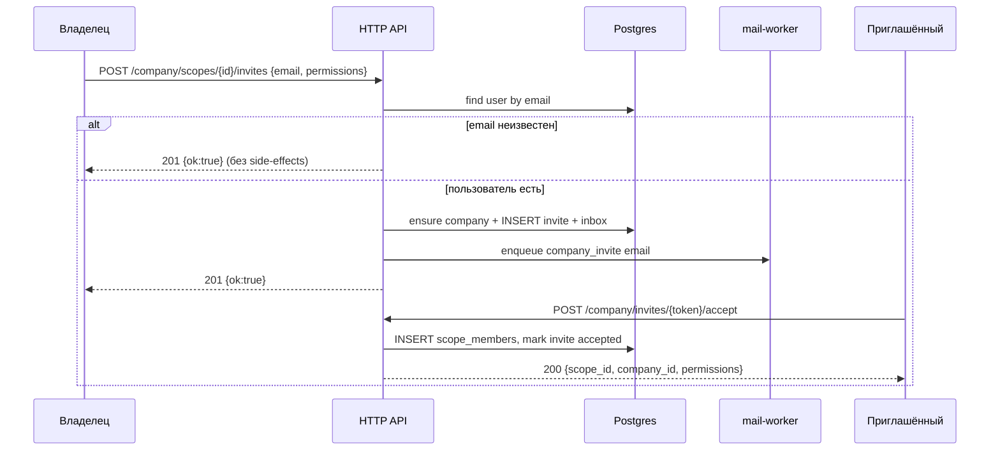

# Company Module

Совместная работа над проектом (scope): приглашения по email, права
участников (тот же словарь `permissions`, что у
[`module_api_keys`](module_api_keys.md)), in-app + email «Подключиться»,
SSE-обновления explorer (shorts/folders) и soft-lock редактирования ссылки.

Компания — **контейнер владения** scope (`scopes.company_id`). Личная
подписка владельца задаёт лимиты scope и seats (`max_seats`). Отдельной
company-подписки и отдельного company API-token нет.

---

## Оглавление

| Иконка | Раздел                                         | Ссылка                                                          |
|--------|------------------------------------------------|-----------------------------------------------------------------|
| 🎯     | Use cases                                      | [ссылка](#use-cases)                                            |
| 🏢     | Модель: company / members / invites            | [ссылка](#модель-company--members--invites)                     |
| 🛡️    | Permissions и авторизация                      | [ссылка](#permissions-и-авторизация)                            |
| ✉️     | Приглашения (anti-enumeration)                 | [ссылка](#приглашения-anti-enumeration)                         |
| 📡     | SSE collab + soft-lock                         | [ссылка](#sse-collab--soft-lock)                                |
| 📉     | Дешёвый дизайн                                 | [ссылка](#дешёвый-дизайн)                                       |
| ⚙️     | Конфигурация                                   | [ссылка](#конфигурация)                                         |
| 📋     | Сводная таблица эндпоинтов                     | [ссылка](#сводная-таблица-эндпоинтов)                           |
| ↳      | POST /company/scopes/{scope_id}/invites        | [ссылка](module_company/post-company-scopes-invites.md)         |
| ↳      | GET /company/scopes/{scope_id}/members         | [ссылка](module_company/get-company-scopes-members.md)          |
| ↳      | PATCH /company/scopes/{scope_id}/members/{user_id} | [ссылка](module_company/patch-company-scopes-members.md)    |
| ↳      | DELETE /company/scopes/{scope_id}/members/{user_id} | [ссылка](module_company/delete-company-scopes-members.md)  |
| ↳      | DELETE /company/scopes/{scope_id}/invites/{invite_id} | [ссылка](module_company/delete-company-scopes-invites.md) |
| ↳      | POST /company/invites/{token}/accept           | [ссылка](module_company/post-company-invites-accept.md)         |
| ↳      | GET /company/scopes/{scope_id}/events          | [ссылка](module_company/get-company-scopes-events.md)           |
| ↳      | POST /company/scopes/{scope_id}/locks/shorts/{short_id} | [ссылка](module_company/post-company-scopes-locks.md)  |
| ↳      | POST …/locks/shorts/{short_id}/heartbeat       | [ссылка](module_company/post-company-scopes-locks-heartbeat.md) |
| ↳      | DELETE …/locks/shorts/{short_id}               | [ссылка](module_company/delete-company-scopes-locks.md)         |

---

## Use cases

| Сценарий                                      | Как                                                                 |
|-----------------------------------------------|---------------------------------------------------------------------|
| Владелец зовёт коллегу в проект               | `POST …/invites` → in-app + email с кнопкой «Подключиться»          |
| Коллега принимает                             | `POST /company/invites/{token}/accept` → scope в списке с corp      |
| Email не зарегистрирован                      | Ответ как при успехе; **никаких** side-effects (anti-enumeration)   |
| Первый invite в personal scope                | Авто: создать `companies` → scope → `owner.type=company`            |
| Ограничить права редактора                    | `permissions` как у API key (`shorts:write`, `stats:read`, …)       |
| Два человека в explorer                       | SSE: чужие create/update/delete shorts/folders + actor              |
| Не править одну ссылку вдвоём                 | Soft-lock Redis; чужой PATCH → `409 short_edit_locked_error`        |
| Удалить участника                             | `DELETE …/members/{user_id}` → сразу нет доступа и scope из списка  |



---

## Модель: company / members / invites

### Таблицы

| Таблица           | Назначение                                                                 |
|-------------------|----------------------------------------------------------------------------|
| `companies`       | `id`, `name`, `owner_user_id`, `created_at`                                |
| `scope_members`   | `(scope_id, user_id)` + `permissions` + `joined_at`                        |
| `scope_invites`   | pending: `email`, `permissions`, `token_hash`, TTL, `invited_by`           |

`scopes.company_id` → FK `companies.id`. Инвариант scope: ровно одно из
`owner_user_id` / `company_id` (как сейчас).

Владелец компании **не** дублируется в `scope_members`: доступ owner =
полный (`"*"`) ко всем scope компании, которыми он владеет через
`companies.owner_user_id`.

### Авто-конвертация personal → company

При **первом успешном** invite (email найден, side-effects разрешены), если
scope ещё personal:

1. `INSERT companies (owner_user_id, name ← scope.name)`.
2. `UPDATE scopes SET company_id=…, owner_user_id=NULL`.
3. Инвалидация кеша списка scopes владельца.

Повторные invite в тот же company-scope компанию не создают.

### Кто видит scope в `GET /scopes`

| Роль                         | Видит scope                                      |
|------------------------------|--------------------------------------------------|
| Personal owner               | свои `owner_user_id = me`                        |
| Company owner                | все scope с `company_id` своей компании          |
| `scope_members` (accepted)   | **только** scopes, куда принят invite            |
| Pending invite               | scope **не** в списке, пока нет accept           |

Фильтр `owner_type=company` у invitee возвращает только его member-scopes.

### Seats

Гейт: у тарифа **владельца компании** `max_seats IS NOT NULL AND max_seats > 0`.
Поле `is_corporate` на гейт **не** влияет (может оставаться для UI/маркетинга).

Учёт места (на компанию):

```text
used_seats = 1  -- владелец
           + COUNT(DISTINCT user_id) из scope_members по всем scope компании
             WHERE user_id ≠ owner
           + COUNT(pending invites) по всем scope компании
             (email ещё не принят; один email = одно место)
```

При `used_seats >= max_seats` → `402 seats_limit_error`.

Лимиты shorts/folders/subdomains/scopes — **только** по подписке владельца
компании (как у API key principal → `owner_user_id`).

---

## Permissions и авторизация

Словарь grants — тот же, что в
[module_api_keys § Permissions](module_api_keys.md#permissions-общий-словарь-с-collaboration).

| Actor                         | Доступ к short/folders/stats/…                                      |
|-------------------------------|---------------------------------------------------------------------|
| Company / personal **owner**  | полный в своём scope                                                |
| `scope_members`               | только grants из `permissions`                                      |
| `X-Api-Key`                   | без изменений (owner-bound key)                                     |

Управление командой (invite / patch / delete member / revoke invite) —
**только** company owner (или personal owner до конвертации). Даже `"*"` у
участника это **не** даёт.

Ошибки доступа на consumer-ручках:

| Kind                       | Код | Когда                                              |
|----------------------------|-----|----------------------------------------------------|
| `permission_denied_error`  | 403 | Member/API key без нужного grant                   |
| `scope_forbidden_error`    | 403 | Scope чужой / не member / не owner (очевидно «нет доступа к проекту») |
| `company_owner_not_payed_error` | 402 | Member на corp-scope, у billing owner `FREE`/`FREE_PLUS` (cooling или post-cooling). `reason` = email владельца |
| `api_key_scope_mismatch_error` | 403 | как раньше                                     |

Участники **не** работают в corp-scope, пока подписка владельца
неоплачена: `ScopeAccess` для non-owner при `company_id IS NOT NULL` и
`billing_subscription.is_unpaid()` → `402 company_owner_not_payed_error`
(email владельца в `reason`). Владелец scope/company по-прежнему проходит.

`ScopeAccess` (Bearer): owner **или** member+grant; иначе
`scope_forbidden_error` / `permission_denied_error`.

Кеш member hot-path (optional, fail-open): Redis
`scope_member:{scope_id}:{user_id}` → permissions JSON, TTL
`company.member_cache_ttl`. PG — SoT. Инвалидация при patch/delete/accept.

`AccessTokenEntry.roles` **не** раздувается ACL scope: роли остаются
глобальными; membership — отдельный кеш/PG.

---

## Приглашения (anti-enumeration)

`POST /company/scopes/{scope_id}/invites`:

1. Auth: owner scope/company.
2. Валидация email + permissions.
3. Проверка seats / self-invite / уже member.
4. Lookup user by email:
   - **нет пользователя** → `201 { "ok": true }` **без** INSERT / mail /
     notification / company convert.
   - **есть** → ensure company, INSERT `scope_invites`, in-app
     `kind=company_invite`, email `company_invite`, ответ тот же
     `201 { "ok": true }`.

Тело успеха **одинаковое** в обоих ветках. Pending invite появляется в
`GET …/members` только если был реальный INSERT.

Accept: Bearer пользователя, чей **email профиля** совпадает с invite
(case-insensitive). Иначе `403 invite_email_mismatch_error`.

TTL invite — `company.invite_ttl` (default 7d). Истечение — lazy на
accept/list (как support TTL).

In-app payload:

```json
{
  "invite_token": "…",
  "scope_id": 10000001,
  "scope_name": "Marketing",
  "inviter_display_name": "Иван"
}
```

Email: ссылка `{public_origin}/home?company_invite={token}` + кнопка
«Подключиться». Канал email ставится в `mail:queue` (без отдельного pref в
v1 — всегда при успешном invite; отписка = не принимать).

---

## SSE collab + soft-lock

### SSE `GET /company/scopes/{scope_id}/events`

- Auth: owner или member с `shorts:read` **или** `folders:read`.
- Транспорт: Redis Pub/Sub `company:collab:{scope_id}` + heartbeat.
- **Без** истории: только live; при коннекте — `event: hello` + текущие
  soft-locks snapshot.
- События **только** explorer: shorts / folders create|update|delete|move.
  Subdomains, custom domains, scope meta, api keys, stats — **не** шлём.

Формат:

```text
event: hello
data: {"scope_id":10000001,"locks":[{"short_id":1,"user_id":"…","display_name":"Аня","expires_at":"…"}]}

event: short_changed
data: {"action":"created","short_ids":[42],"actor":{"user_id":"…","display_name":"Иван"},"at":"…"}

event: folder_changed
data: {"action":"moved","folder_ids":["…"],"actor":{…},"at":"…"}

event: short_lock
data: {"short_id":42,"user_id":"…","display_name":"Аня","expires_at":"…"}

event: short_unlock
data: {"short_id":42,"user_id":"…"}

event: ping
data: {"t":"…"}
```

Клиент: при чужом `*_changed` — подсветка строк + точечный reload
shorts/folders; свой actor игнорирует (optimistic UI уже применил).

Лимиты: `company.sse_max_per_user`, idle close по отсутствию read; pub
только если у scope есть `company_id` (personal без команды — no-op).

### Soft-lock ссылки

Пока открыт редактор short:

| Метод | Путь | Действие |
|-------|------|----------|
| POST | `/company/scopes/{scope_id}/locks/shorts/{short_id}` | Acquire |
| POST | `…/heartbeat` | Продлить TTL |
| DELETE | `…/locks/shorts/{short_id}` | Release |

- Redis `company:lock:short:{short_id}` → `{user_id, display_name, scope_id, expires_at}`.
- TTL `company.lock_ttl` (default 45s); heartbeat ≤ TTL/2.
- Acquire тем же user — идемпотентный refresh.
- Чужой hold → `409 short_edit_locked_error` + тело `{holder_display_name, expires_at}`.
- Мутации short (PATCH bulk / update затронутого id): если lock у другого →
  тот же `409`. Owner **не** обходит чужой lock (честный collab); lock
  своего user — ок.
- Нужен grant `shorts:write` (owner всегда может).
- SSE: `short_lock` / `short_unlock` при acquire/release/expiry (expiry —
  lazy при следующем acquire или heartbeat-отсутствии у клиентов).

Folders **без** lock в v1 (только short).

---

## Дешёвый дизайн

| Решение | Зачем дёшево |
|---------|--------------|
| Нет company billing | лимиты = подписка owner |
| Гейт `max_seats > 0` | без ветвления is_corporate |
| Invite только существующим user | нет pending-orphan / mail на пустоту |
| Одинаковый 201 на invite | anti-enumeration без shadow-rows |
| Member только invited scopes | простая ACL, без matrix company→all scopes |
| Redis Pub/Sub SSE | без отдельного fan-out сервиса |
| Soft-lock только Redis | нет PG строк, TTL самоочистка |
| SSE только shorts/folders | меньше трафика и UI-сложности |
| Member cache fail-open | PG fallback как api keys |

---

## Конфигурация

Секция `company` в `services/backend/conf/base.yaml`:

```yaml
company:
  invite_ttl: 7d
  member_cache_ttl: 5m
  lock_ttl: 45s
  sse_heartbeat: 15s
  sse_max_per_user: 4
  invite_email_enabled: true
```

---

## Сводная таблица эндпоинтов

| Метод    | Путь | Auth | Описание |
|----------|------|------|----------|
| `POST`   | `/company/scopes/{scope_id}/invites` | 🔒 owner | Пригласить по email |
| `GET`    | `/company/scopes/{scope_id}/members` | 🔒 owner/member | Участники + seats; invites только owner |
| `PATCH`  | `/company/scopes/{scope_id}/members/{user_id}` | 🔒 owner | Сменить permissions |
| `DELETE` | `/company/scopes/{scope_id}/members/{user_id}` | 🔒 owner или self | Удалить / выйти |
| `DELETE` | `/company/scopes/{scope_id}/invites/{invite_id}` | 🔒 owner | Отозвать invite |
| `POST`   | `/company/invites/{token}/accept` | 🔒 invitee | Принять |
| `GET`    | `/company/scopes/{scope_id}/events` | 🔒 member/owner | SSE collab |
| `POST`   | `/company/scopes/{scope_id}/locks/shorts/{short_id}` | 🔒 write | Acquire lock |
| `POST`   | `…/locks/shorts/{short_id}/heartbeat` | 🔒 holder | Продлить |
| `DELETE` | `…/locks/shorts/{short_id}` | 🔒 holder | Release |

`token` в path accept — plaintext из письма/inbox (в БД только `token_hash`).
