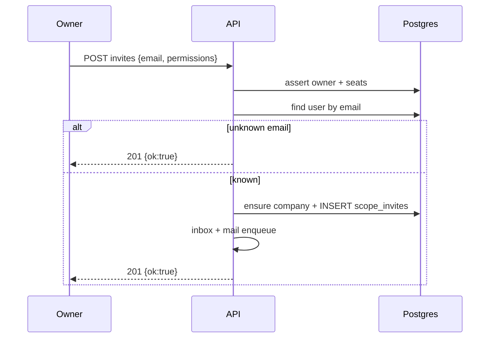

<a id="post-company-scopes-invites"></a>

### <span style="background:#42A5F5;padding:5px">POST</span> `/company/scopes/{scope_id:int}/invites`

|                | Описание                                                                 |
|----------------|--------------------------------------------------------------------------|
| **Назначение** | Пригласить пользователя в scope по email                                 |
| **Логика**     | 1. Bearer: владелец personal scope или owner компании scope.             |
|                | 2. Тариф владельца: `max_seats > 0`, иначе 402 `seats_not_available_error`. |
|                | 3. Валидирует `email`, `permissions` (как API keys).                     |
|                | 4. Self-invite / уже member / pending на этот email → 409.               |
|                | 5. Seats компании исчерпаны → 402 `seats_limit_error`.                   |
|                | 6. Lookup user by email (case-insensitive):                              |
|                | &nbsp;&nbsp;&nbsp;• **нет** → `201 {"ok":true}` без side-effects;        |
|                | &nbsp;&nbsp;&nbsp;• **есть** → ensure company (авто-convert personal),   |
|                | &nbsp;&nbsp;&nbsp;&nbsp;&nbsp;INSERT invite, in-app + email, тот же 201. |
| **Параметры**  | `scope_id:int` — path                                                    |
| **Auth**       | 🔒 Bearer owner                                                          |

---

| Kind                       | Код | Описание                                      |
|----------------------------|-----|-----------------------------------------------|
|                            | 201 | Принято (одинаково при unknown email)         |
| validation_error           | 400 | Некорректные `email` / `permissions`          |
| auth_error                 | 401 | Не авторизован                                |
| seats_not_available_error  | 402 | У тарифа нет seats (`max_seats` null/0)       |
| seats_limit_error          | 402 | Исчерпан лимит мест компании                  |
| scope_forbidden_error      | 403 | Не владелец scope/company                     |
| already_member_error       | 409 | Уже участник или pending invite               |
| self_invite_error          | 409 | Invite на свой email                          |
| scope_not_found            | 404 | Scope не найден                               |
| server_error               | 500 | Внутренняя ошибка                             |

---

<details open>
<summary><b>Пример запроса</b></summary>

```json
{
  "email": "anna@example.com",
  "permissions": [
    "shorts:read",
    "shorts:write",
    "folders:read",
    "folders:write",
    "stats:read"
  ]
}
```

</details>

<details open>
<summary><b>Пример ответа 201</b></summary>

```json
{
  "ok": true
}
```

</details>

<details>
<summary><b>Схема</b></summary>



</details>
