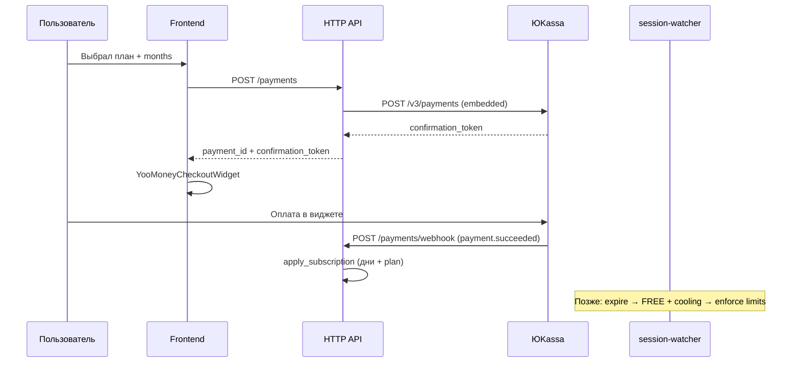
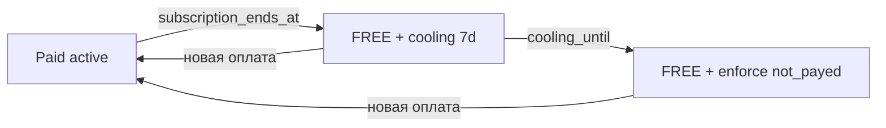

# Payment Module (ЮKassa)

Модуль **оплаты и возвратов подписки** через
[виджет ЮKassa](https://yookassa.ru/developers/payment-acceptance/integration-scenarios/widget/basics)
и [API возвратов](https://yookassa.ru/developers/payment-acceptance/after-the-payment/refunds).

Истечение оплаченного периода и охладительный интервал обрабатывает
[`session-watcher`](../session_watcher.md).

**Правила:**

1. Провайдер — ЮKassa (виджет `confirmation.type = embedded`).
2. Статус платежа для применения тарифа — webhook ЮKassa
   (`payment.succeeded` / `payment.canceled` / `refund.succeeded`), не callback
   виджета на клиенте.
3. Подписка в днях: 1 месяц = **30 дней**; покупка / продление на 1..12 месяцев;
   при 12 месяцах скидка **20%**.
4. После истечения `users.subscription = FREE` сразу; 7-дневный cooling —
   отдельные поля профиля (`cooling_until`, `is_cooling`).
5. Переход на тариф **дешевле** текущего при активной оплаченной подписке
   через `POST /payments` **недоступен** (409).
6. Переход на тариф **дороже** — доплата по формуле апгрейда (см. ниже).

Связанные API: [`GET /auth/subscription_plans`](module_auth/get-auth-subscription_plans.md),
[`GET /auth/profile`](module_auth/get-auth-profile.md).

---

## Оглавление

| Иконка | Раздел                                         | Ссылка                                                         |
|--------|------------------------------------------------|----------------------------------------------------------------|
| 🎯     | Use cases                                      | [ссылка](#use-cases)                                           |
| 💳     | Приём платежа (виджет)                         | [ссылка](#приём-платежа-виджет)                                |
| ⬆️     | Покупка, продление и апгрейд                   | [ссылка](#покупка-продление-и-апгрейд)                         |
| ↩️     | Возвраты                                       | [ссылка](#возвраты)                                            |
| 📅     | Срок подписки и cooling                        | [ссылка](#срок-подписки-и-cooling)                             |
| 🔒     | Гейты FREE / cooling / post-cooling            | [ссылка](#гейты-free--cooling--post-cooling)                   |
| 🗄️    | Модель данных                                  | [ссылка](#модель-данных)                                       |
| ⚙️     | Конфигурация                                   | [ссылка](#конфигурация)                                        |
| 🔁     | Session Watcher (lifecycle)                    | [ссылка](#session-watcher-lifecycle)                           |
| 📋     | Сводная таблица эндпоинтов                     | [ссылка](#сводная-таблица-эндпоинтов)                          |
| ↳      | POST /payments                                 | [ссылка](module_payment/post-payments.md)                      |
| ↳      | GET /payments                                  | [ссылка](module_payment/get-payments.md)                       |
| ↳      | GET /payments/{payment_id}                     | [ссылка](module_payment/get-payments-payment_id.md)            |
| ↳      | POST /payments/{payment_id}/refunds            | [ссылка](module_payment/post-payments-payment_id-refunds.md)   |
| ↳      | POST /payments/webhook                         | [ссылка](module_payment/post-payments-webhook.md)              |

Endpoint-файлы: [`module_payment/`](module_payment/).

---

## Use cases

| # | Сценарий | Кто | Как |
|---|----------|-----|-----|
| 1 | Купить / продлить тариф на N месяцев | User | `POST /payments` (`plan` + `months`) → виджет → webhook |
| 2 | Апгрейд на более дорогой тариф | User | `POST /payments` (только `plan`) → доплата → webhook |
| 3 | Полный возврат в первые 3 дня | User | `POST …/refunds` → full refund → дни вычитаются |
| 4 | Частичный возврат за неиспользованные дни | User | `POST …/refunds` → pro-rata |
| 5 | Подписка истекла | Watcher | `subscription = FREE`, `cooling_until = now+7d` |
| 6 | Cooling: редиректы живы, create/edit paid — нет | API | гейты FREE; delete разрешён |
| 7 | После cooling: excess → `not_payed` | Watcher | оставить N новейших ресурсов FREE-лимита |



---

## Приём платежа (виджет)

Интеграция по
[документации виджета](https://yookassa.ru/developers/payment-acceptance/integration-scenarios/widget/basics):

1. Клиент вызывает [`POST /payments`](module_payment/post-payments.md) с
   `plan` и `months` (1..12).
2. Backend считает сумму, создаёт платёж в ЮKassa:
   - `capture: true` (одностадийный);
   - `confirmation.type: embedded`;
   - `metadata`: `payment_id` (наш UUID), `user_id`, `plan`, `months`.
3. Ответ API: `payment_id`, `confirmation_token`, `amount`, `status=pending`.
4. Frontend инициализирует виджет токеном; после success/fail **не** применяет
   тариф сам — только поллит [`GET /payments/{id}`](module_payment/get-payments-payment_id.md)
   или ждёт обновления профиля.
5. ЮKassa шлёт [`POST /payments/webhook`](module_payment/post-payments-webhook.md);
   при `payment.succeeded` backend идемпотентно начисляет дни.

### Ценообразование (покупка / продление)

| Параметр | Правило |
|----------|---------|
| База | `subscription_plans.price_rub` выбранного `plan` (₽/мес) |
| Период | `months ∈ [1, 12]` |
| Дни | `days_granted = months × 30` |
| Сумма | `amount_rub = price_rub × months` |
| Год | при `months = 12` → `amount_rub = floor(amount_rub × 0.8)` (−20%) |
| Валюта | только `RUB` |
| Минимум ЮKassa | ≥ 1 ₽ |

Примеры (`PERSONAL`, `price_rub = 199`):

| months | Без скидки | К оплате | Дни |
|--------|------------|----------|-----|
| 1 | 199 | **199** | 30 |
| 6 | 1 194 | **1 194** | 180 |
| 12 | 2 388 | **1 910** (−20%) | 360 |

---

## Покупка, продление и апгрейд

Сравнение тарифов — по `subscription_plans.price_rub` (дороже / дешевле /
тот же). `FREE` и `FREE_PLUS` через оплату **не** покупаются
(`plan_not_purchasable_error`).

| Сценарий | Условие | Тело | `kind` платежа | Сумма | После `payment.succeeded` |
|----------|---------|------|----------------|-------|---------------------------|
| Покупка | нет активного paid / cooling / FREE | `plan` + `months` | `purchase` | цена за `months` | `subscription := plan`, `ends_at := now + days` |
| Продление | тот же `plan`, `ends_at > now` | `plan` + `months` | `renewal` | цена за `months` | `ends_at += days` |
| Апгрейд | `plan` **дороже** текущего, `ends_at > now` | только `plan` (`months` нет) | `upgrade` | [формула](#формула-апгрейда) | `subscription := plan`, **`ends_at` без изменений** |
| Понижение | `plan` **дешевле** текущего при `ends_at > now` | — | — | — | **409** `plan_downgrade_forbidden_error` |

После любого успешного платежа: `cooling_until = NULL`,
`cooling_enforced_at = NULL`; claims `subscription` в access-токене
обновляются.

Апгрейд и продление **раздельны**: сначала доплата за оставшиеся дни на новый
тариф, затем при необходимости отдельный `renewal` с `months`.

### Формула апгрейда

Период в формуле — **один биллинговый месяц = 30 дней**. Цены — месячные
`price_rub` текущего и целевого тарифа (годовая скидка 20% к апгрейду
**не** применяется).

```text
remaining_days = max(0, ceil((subscription_ends_at − now) / 1 day))
period_days    = 30
amount_rub     = floor( (price_new − price_old) × remaining_days / period_days )
```

То же словами:

> Сумма доплаты = (Цена нового тарифа за период − Цена старого тарифа за период)
> × (Оставшиеся дни / Количество дней в периоде)

где «цена за период» = `price_rub` тарифа (период = 30 дней).

| Ограничение | Поведение |
|-------------|-----------|
| `remaining_days = 0` | апгрейд недоступен → оформлять как покупку с `months` |
| `amount_rub < 1` | 400 `upgrade_amount_too_small_error` |
| `price_new ≤ price_old` | 409 `plan_downgrade_forbidden_error` |

Пример: `PERSONAL` (199 ₽) → `PRO` (399 ₽), осталось **20** дней:

```text
floor( (399 − 199) × 20 / 30 ) = floor(133.333…) = 133 ₽
```

После оплаты пользователь на `PRO` до прежнего `subscription_ends_at`.

---

## Возвраты

Пользователь инициирует через
[`POST /payments/{payment_id}/refunds`](module_payment/post-payments-payment_id-refunds.md).
Фактический перевод денег — API ЮKassa
([возвраты](https://yookassa.ru/developers/payment-acceptance/after-the-payment/refunds));
списание дней — после `refund.succeeded` (webhook) или синхронного
`succeeded` в ответе create-refund.

### Полный возврат (≤ 3 суток с `paid_at`)

| Условие | Значение |
|---------|----------|
| Окно | `now − paid_at ≤ 3 days` |
| Сумма | вся `amount_rub − already_refunded` |
| Дни | вычесть все ещё «живые» дни этого платежа из `subscription_ends_at` |
| Статус платежа | `refunded` |

Если после вычитания `subscription_ends_at ≤ now` — сразу перевести на FREE
+ стартовать cooling (как при естественном истечении).

### Частичный возврат (после 3 суток, пока период платежа не исчерпан)

Формула (пример из ТЗ: купил 30 дней, на 10-й день → вернуть за 20):

```text
used_days     = clamp(floor((now − period_start) / 1 day), 0, days_granted)
unused_days   = days_granted − used_days
refund_rub    = floor(amount_rub × unused_days / days_granted)
```

где `period_start` — момент, с которого этот платёж начал действовать
(обычно `paid_at`; при стеке — `coverage_start_at` строки платежа).

| Ограничение ЮKassa | Поведение |
|--------------------|-----------|
| Мин. partial | 1 ₽; если `refund_rub < 1` → 400 `refund_amount_too_small_error` |
| Остаток | сумма всех refund ≤ `amount_rub`; остаток 0 или ≥ 1 ₽ |
| Способ оплаты | только на исходное средство; partial поддерживается не всеми методами → 402/409 с `refund_not_supported_error` |

После успешного partial:

- `days_revoked = unused_days` (или пропорционально сумме, если уже был
  частичный refund ранее — см. идемпотентность ниже);
- `subscription_ends_at -= days_revoked`;
- платёж → `partially_refunded` (или `refunded`, если остаток 0).

### Общие правила возвратов

- Только владелец платежа; только `status ∈ {succeeded, partially_refunded}`.
- Один **активный** refund-job на платёж (пока `pending` в ЮKassa) → 409.
- Повторный полный после полного — 409 `already_refunded_error`.
- Комиссия ЮKassa **не** возвращается (как в их доке) — пользователю
  возвращается только `amount` платежа / его доля.

---

## Срок подписки и cooling

### Поля профиля (расширение `GET /auth/profile`)

| Поле | Тип | Описание |
|------|-----|----------|
| `user.subscription` | enum | Текущий тариф (**FREE** уже в cooling) |
| `user.subscription_ends_at` | timestamptz? | Конец оплаченного периода; `null` у вечного FREE |
| `user.cooling_until` | timestamptz? | Конец 7-дневного окна; `null` если не в cooling |
| `user.is_cooling` | bool | `cooling_until IS NOT NULL AND now < cooling_until` |
| `user.cooling_enforced` | bool | post-cooling лимиты уже применены |

UI **обязан** показывать FREE + баннер cooling («тариф закончился, до
{cooling_until} редиректы сохраняются; создание платных фич недоступно»).

### Таймлайн



| Фаза | `subscription` | Редирект excess | Create / edit выше FREE | Delete |
|------|----------------|-----------------|-------------------------|--------|
| Paid active | PERSONAL+ | все активные по правилам short | по лимитам плана | ✓ |
| Cooling (7d) | **FREE** | **все** ещё работают | **нет** (402 `*_not_payed_error`) | ✓ |
| Post-cooling | FREE | только N в лимите FREE; остальные `inactive_reason=not_payed` | по лимитам FREE | ✓ |

Длительность cooling: **7 суток** с момента истечения
(`payment.cooling_days`, default 7).

---

## Гейты FREE / cooling / post-cooling

### Create / edit (mutating выше FREE)

Проверка лимитов всегда по **текущему** `users.subscription` (= FREE в
cooling). Примеры kind:

| Действие | Kind при отказе |
|----------|-----------------|
| Создать short сверх `max_shorts` | `short_name_not_payed_error` |
| Subdomain | `subdomain_not_payed_error` |
| Custom domain | `custom_domain_not_payed_error` |
| API key | `api_key_not_payed_error` |
| Transfer | `transfer_not_payed_error` |
| PATCH short / folder / scope «улучшение» | те же 402 по затронутому ресурсу |

Разрешено в cooling и post-cooling: **DELETE** shorts / folders / subdomains /
custom domains / api keys; PATCH, не увеличивающий потребление лимита
(например выключить ссылку, удалить тег) — разрешён.

### Post-cooling enforce (`inactive_reason = not_payed`)

После `cooling_until` session-watcher помечает ресурсы сверх лимитов FREE.

**Порядок отбора «что оставить»** (N = лимит FREE-плана):

| Ресурс | Оставить | Остальные |
|--------|----------|-----------|
| `shorts` | **N новейших** по `created_at DESC` (среди не soft-deleted) | `is_active=false`, `inactive_reason=not_payed` |
| `subdomains` | N новейших | soft-policy: редирект off через recompute short |
| `custom_domains` | N новейших | soft-delete / deactivate shorts |
| `scopes` | N новейших (default personal всегда в N) | скрыть / read-only |
| `api_keys` | N новейших на scope | revoke |

Приоритет в
[`compute_short_activity`](module_short.md#активность-ссылки-is_active--inactive_reason):

| Приоритет | `inactive_reason` | Условие |
|-----------|-------------------|---------|
| … | … | существующие |
| **25** | **`not_payed`** | ресурс вне лимита FREE после enforce |
| 20 | `archived` | … |

Публичный редирект для `not_payed` → не выполняется (как для других
inactive); API list отдаёт `inactive_reason` чтобы UI объяснил причину.

Повторная оплата → снять `not_payed` с ресурсов в пределах нового лимита
(recompute), обнулить cooling-поля.

---

## Модель данных

### Расширение `users`

| Колонка | Тип | Описание |
|---------|-----|----------|
| `subscription_ends_at` | TIMESTAMPTZ NULL | Конец оплаченного периода |
| `cooling_until` | TIMESTAMPTZ NULL | Конец 7d cooling; NULL = не в cooling |
| `cooling_enforced_at` | TIMESTAMPTZ NULL | Когда применили post-cooling not_payed |

Индексы для watcher:

```sql
CREATE INDEX idx_users_subscription_ends
    ON users (subscription_ends_at)
    WHERE subscription_ends_at IS NOT NULL
      AND subscription <> 'FREE';

CREATE INDEX idx_users_cooling_until
    ON users (cooling_until)
    WHERE cooling_until IS NOT NULL
      AND cooling_enforced_at IS NULL;
```

### `payments`

| Колонка | Тип | Описание |
|---------|-----|----------|
| `id` | UUID PK | Наш id (в metadata ЮKassa) |
| `user_id` | UUID FK | |
| `yookassa_payment_id` | TEXT UNIQUE | id платежа ЮKassa |
| `plan` | subscription_type | Целевой тариф |
| `from_plan` | subscription_type NULL | Исходный тариф (для `upgrade`) |
| `kind` | ENUM | `purchase` \| `renewal` \| `upgrade` |
| `months` | SMALLINT NULL | 1..12; `NULL` для `upgrade` |
| `days_granted` | INT | `months * 30` или `0` для `upgrade` |
| `amount_rub` | NUMERIC(12,2) | Итоговая сумма |
| `currency` | CHAR(3) | `RUB` |
| `status` | ENUM | см. ниже |
| `coverage_start_at` | TIMESTAMPTZ NULL | С какого момента платёж покрывает дни |
| `paid_at` | TIMESTAMPTZ NULL | |
| `refunded_amount_rub` | NUMERIC(12,2) DEFAULT 0 | |
| `days_revoked` | INT DEFAULT 0 | Сумма отозванных дней |
| `confirmation_token` | TEXT NULL | Не хранить долго; можно NULL после succeeded |
| `idempotence_key` | TEXT UNIQUE | Ключ создания в ЮKassa |
| `description` | TEXT | |
| `created_at` / `updated_at` | TIMESTAMPTZ | |

`payment_status`: `pending` | `waiting_for_capture` | `succeeded` |
`canceled` | `refunded` | `partially_refunded`.

### `payment_refunds`

| Колонка | Тип | Описание |
|---------|-----|----------|
| `id` | UUID PK | |
| `payment_id` | UUID FK | |
| `yookassa_refund_id` | TEXT UNIQUE NULL | |
| `kind` | ENUM | `full` \| `partial` |
| `amount_rub` | NUMERIC(12,2) | |
| `days_revoked` | INT | |
| `status` | ENUM | `pending` \| `succeeded` \| `canceled` |
| `idempotence_key` | TEXT UNIQUE | |
| `cancellation_details` | JSONB NULL | из ЮKassa |
| `created_at` / `updated_at` | | |

### `payment_webhook_events` (идемпотентность)

| Колонка | Тип |
|---------|-----|
| `event_id` | TEXT PK (из тела ЮKassa / hash) |
| `event` | TEXT (`payment.succeeded`, …) |
| `payload` | JSONB |
| `processed_at` | TIMESTAMPTZ |

Повтор того же события → 200 без повторного начисления.

---

## Конфигурация

```yaml
payment:
  provider: yookassa
  shop_id: "..."              # из секретов / env
  secret_key: "..."           # из секретов / env
  return_url: "https://ккрч.рф/billing/result"
  webhook_path: "/api/v1/payments/webhook"
  # IP allowlist ЮKassa (доп. к проверке объекта платежа GET /v3/payments/{id})
  webhook_ip_allowlist: []
  full_refund_days: 3         # полное окно возврата
  cooling_days: 7
  days_per_month: 30
  annual_discount_percent: 20 # только при months=12
  request_timeout: 15s
```

Секреты **не** в git; в `deploy/.env.prod.example` — плейсхолдеры
`YOOKASSA_SHOP_ID`, `YOOKASSA_SECRET_KEY`.

---

## Session Watcher (lifecycle)

Расширение [`session_watcher`](../session_watcher.md) — третий цикл
`subscription_lifecycle_loop` (рядом с reconcile / cleanup):

### Sweep A — истечение → FREE + cooling

1. Выбрать пользователей:
   `subscription_ends_at <= now()` AND `subscription` платный
   AND `cooling_until IS NULL`.
2. В транзакции:
   - `subscription = FREE`;
   - `cooling_until = now() + cooling_days`;
   - `cooling_enforced_at = NULL`.
3. Обновить / инвалидировать Redis access claims (`subscription=FREE`).
4. Опционально: notification `subscription_expired`.

### Sweep B — конец cooling → enforce `not_payed`

1. Выбрать:
   `cooling_until <= now()` AND `cooling_enforced_at IS NULL`
   AND `subscription = FREE`.
2. Для каждого пользователя применить лимиты FREE (см. таблицу выше).
3. `cooling_enforced_at = now()`; `cooling_until` сохраняется для аудита
   (`is_cooling=false`, `cooling_enforced=true`).

Интервал: `watcher.subscription_interval` (default `1m`).

---

## Сводная таблица эндпоинтов

| Метод  | Путь | Auth | Назначение |
|--------|------|------|------------|
| POST   | [`/payments`](module_payment/post-payments.md) | 🔒 Bearer | Создать платёж + `confirmation_token` |
| GET    | [`/payments`](module_payment/get-payments.md) | 🔒 Bearer | История платежей |
| GET    | [`/payments/{payment_id}`](module_payment/get-payments-payment_id.md) | 🔒 Bearer | Статус платежа |
| POST   | [`/payments/{payment_id}/refunds`](module_payment/post-payments-payment_id-refunds.md) | 🔒 Bearer | Полный / частичный возврат |
| POST   | [`/payments/webhook`](module_payment/post-payments-webhook.md) | — (ЮKassa) | Входящие уведомления |

Все ручки — префикс `/api/v1`, роутер `views/http_api/.../routers/payment/`.
