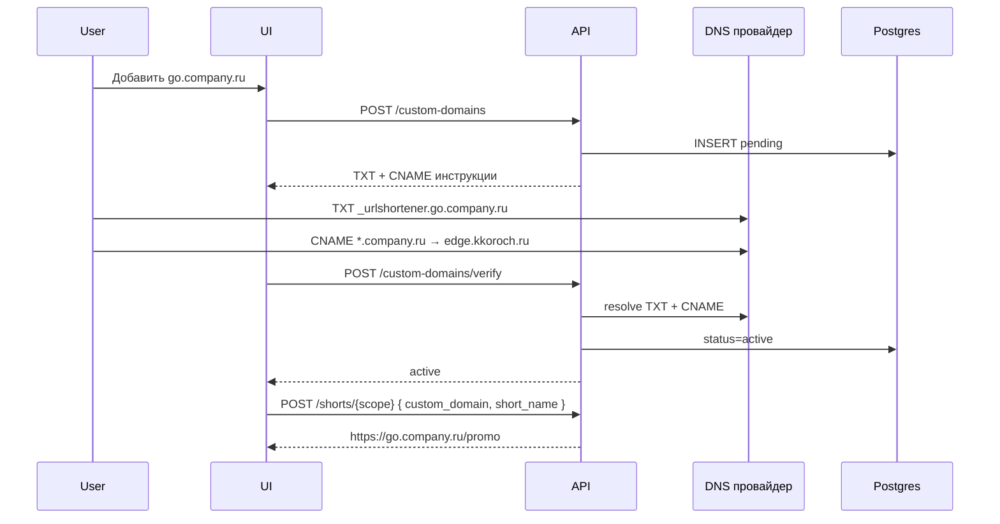
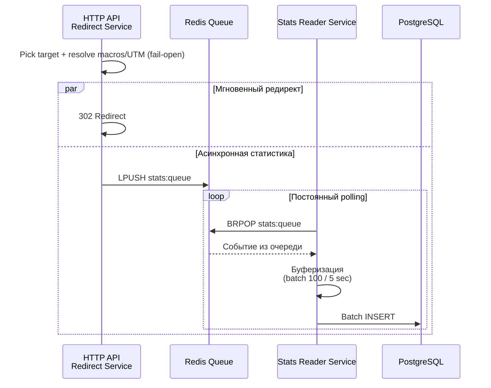

# Short Module

Модуль для создания и эксплуатации коротких URL: высокая нагрузка на редирект,
минимальная задержка. Публичный редирект открыт наружу — при проектировании
учитываем утечки и безопасность.

> Программный доступ через `X-Api-Key` — контракт
> [`module_api_keys`](module_api_keys.md): permissions, приоритет Bearer над
> ключом, ошибки `403 permission_denied_error` /
> `api_key_scope_mismatch_error`.

---

## Оглавление

| Иконка | Раздел                               | Ссылка                                               |
|--------|--------------------------------------|------------------------------------------------------|
| 📌     | Основные feature                     | [ссылка](#основные-feature)                          |
| 🎯     | Targets + CPC                        | [ссылка](#targets--cpc-несколько-destination-url)    |
| 🏷️    | UTM и макросы платформ РФ            | [ссылка](#utm-метки-и-макросы-платформ-рф)           |
| 📊     | Какую статистику собираем            | [ссылка](#какую-статистику-собираем)                 |
| ↳      | Статистика если ссылка изменена      | [ссылка](#статистика-если-ссылка-изменена)           |
| ⚙️     | Как собираем статистику              | [ссылка](#как-собираем-статистику)                   |
| 🗄️    | Как кешируем необходимое             | [ссылка](#как-кешируем-необходимое)                  |
| 🚀     | Кеширование GET-методов              | [ссылка](#кеширование-get-методов)                   |
| ♻️     | Инвалидация кеша                     | [ссылка](#инвалидация-кеша)                          |
| 📋     | Сводная таблица эндпоинтов           | [ссылка](#сводная-таблица-эндпоинтов)                |
| ↳      | POST /shorts/{scope:int?}            | [ссылка](module_short/post-shorts-create.md)         |
| ↳      | GET /shorts/{scope:int?}             | [ссылка](module_short/get-shorts.md)                 |
| ↳      | POST /shorts/{scope:int?}/bulk       | [ссылка](module_short/post-shorts-bulk-create.md)    |
| ↳      | DELETE /shorts/bulk                  | [ссылка](module_short/delete-shorts-bulk.md)         |
| ↳      | GET /shorts/availability             | [ссылка](module_short/get-shorts-availability.md)    |
| ↳      | POST /folders/{scope:int?}/bulk      | [ссылка](module_short/post-folders-bulk-create.md)   |
| ↳      | DELETE /folders/bulk                 | [ссылка](module_short/delete-folders-bulk.md)        |
| ↳      | GET /folders/{scope:int?}            | [ссылка](module_short/get-folders.md)                |
| ↳      | PATCH /folders/{folder_id:uuid}/move | [ссылка](module_short/patch-folders-move.md)         |
| ↳      | PATCH /folders/{folder_id:uuid}      | [ссылка](module_short/patch-folders.md)              |
| ↳      | GET /{short_name:str}                | [ссылка](module_short/get-shorts-redirect.md)        |
| ↳      | PATCH /shorts/bulk                   | [ссылка](module_short/patch-shorts-bulk.md)          |
| ↳      | POST /scopes                         | [ссылка](module_short/post-scopes.md)                |
| ↳      | GET /scopes                          | [ссылка](module_short/get-scopes.md)                 |
| ↳      | PATCH /scopes/{scope:int?}           | [ссылка](module_short/patch-scopes.md)               |
| ↳      | DELETE /scopes/{scope:int?}          | [ссылка](module_short/delete-scopes.md)              |
| ↳      | POST /subdomains                     | [ссылка](module_short/post-subdomains.md)            |
| ↳      | GET /subdomains                      | [ссылка](module_short/get-subdomains.md)             |
| ↳      | DELETE /subdomains/{subdomain:str}   | [ссылка](module_short/delete-subdomains.md)          |
| ↳      | POST /custom-domains                 | [ссылка](module_short/post-custom-domains.md)        |
| ↳      | GET /custom-domains                  | [ссылка](module_short/get-custom-domains.md)         |
| ↳      | POST /custom-domains/verify          | [ссылка](module_short/post-custom-domains-verify.md) |
| ↳      | DELETE /custom-domains               | [ссылка](module_short/delete-custom-domains.md)      |
| 🌐     | Custom domains (собственный домен)   | [ссылка](#custom-domains-собственный-домен)          |

---

## Основные feature

- Сбор всевозможной статистики по укороченной ссылке
- Папочная структура для хранения ссылок, которую можно настроить разные правила:
    - Название по папочной структуре
    - Название по последней папке
    - Название кастомное
- Поддержка тегов для ссылок, а так же понятные фильтры
- Поддержка кастомный поддоменов для ссылок (для B2B клиентов)
- **Собственный домен (custom domain)** — привязка FQDN клиента (`go.company.ru`)
  с DNS TXT-верификацией владения и CNAME на edge; см.
  [Custom domains](#custom-domains-собственный-домен)
- Массовое создание ссылок (для B2B клиентов)
- Поддержка разных типов редиректа (301, 302, 307, 308)
- Поддержка разных типов ссылок:
    - обычные
    - с капчей
    - с паролем,
    - с ограничением по времени
    - с ограничением по количеству переходов
- **Несколько destination URL (`targets[]`)** с процентным распределением трафика,
  per-target и глобальными soft-лимитами кликов — см. [Targets + CPC](#targets--cpc-несколько-destination-url)
- **CPC и бюджет**: стоимость клика на каждый target, soft-автостоп по budget
  (global + per-target) — там же
- **UTM-метки + макросы** рекламных платформ РФ (Google Ads, Яндекс.Директ,
  ВКонтакте / VK Ads, Target My.com): пресеты, обязательные поля при *настройке*,
  подстановка макросов через **per-platform** query/headers —
  см. [UTM и макросы](#utm-метки-и-макросы-платформ-рф). На редиректе отсутствие
  UTM/макросов **не ошибка** (в статистику пишется `null`)
- Поддержка scope для ссылок
- Публичное API для этого модуля
- Защита от рекурсивных редиректов: `targets[].url` не может указывать на домены
  из `short.base_domains` (и их поддомены) → `400 recursive_redirect_error`.
  SPA-пути фронта отдельным reserved-list на `short_name` не блокируются —
  коллизии с `/api`, `/docs` и т.п. решаются разнесением домена/прокси.

---

## Custom domains (собственный домен)

> **Статус:** реализовано в backend (миграция `20270101000600_custom_domains`,
> handlers `/custom-domains`, dual-auth `ScopeAccess`, лимит
> `subscription_plans.max_custom_domains`).

Фича для B2B: клиент использует **свой** FQDN (`go.company.ru`,
`links.brand.ru`) вместо поддомена на `short.base_domains`. Отличается от
существующих [subdomains](#сводная-таблица-эндпоинтов): там `name` — это
**метка** на нашей зоне (`my-brand` → `my-brand.example.com`), здесь — полный
домен клиента.

### Use cases

| Сценарий                        | Как                                                           |
|---------------------------------|---------------------------------------------------------------|
| Брендированные ссылки в рекламе | `https://go.company.ru/promo` вместо `https://kk.example/abc` |
| White-label для агентства       | Один scope — несколько доменов кампаний (в лимите подписки)   |
| Миграция с Bitly / clck.su      | Импорт back-half; `custom_domain` в create short              |
| Отзыв домена                    | `DELETE /custom-domains` → ссылки на домене не редиректят     |

### Модель

Домен привязан к **`scope_id`** (как subdomain). Владелец — через `scopes`.

| Поле                        | Тип          | Описание                             |
|-----------------------------|--------------|--------------------------------------|
| `domain`                    | `string`     | PK, FQDN lowercase (`go.company.ru`) |
| `scope_id`                  | `i64`        | FK → scopes                          |
| `status`                    | enum         | см. ниже                             |
| `verification_token`        | `uuid`       | Секрет для TXT; не отдаётся в GET    |
| `verification_expires_at`   | `timestamp?` | TTL токена (default 72h)             |
| `verified_at`               | `timestamp?` | Успешная TXT-проверка                |
| `routing_checked_at`        | `timestamp?` | Успешная CNAME/A-проверка            |
| `last_check_at`             | `timestamp?` | Последний вызов verify               |
| `last_check_error`          | `string?`    | Человекочитаемая ошибка DNS          |
| `created_at` / `deleted_at` | `timestamp`  | аудит / soft-delete                  |

**Статусы:**

| `status`               | Описание                | Можно создавать shorts? |
|------------------------|-------------------------|-------------------------|
| `pending_verification` | TXT ещё не найден       | нет                     |
| `verified`             | TXT ок, CNAME/A ещё нет | нет                     |
| `active`               | TXT + routing ок        | **да**                  |
| `verification_failed`  | Истёк token без успеха  | нет (reissue POST)      |
| `deleted`              | soft-delete             | нет                     |

### DNS: верификация владения (TXT)

После `POST /custom-domains` клиент добавляет **одну** TXT-запись:

| Поле            | Значение                                   |
|-----------------|--------------------------------------------|
| **Host / Name** | `_urlshortener.{domain}`                   |
| **Type**        | `TXT`                                      |
| **Value**       | `urlshortener-verify={verification_token}` |
| **TTL**         | 300–3600 (рекомендация)                    |

Пример для `go.company.ru`:

```text
_urlshortener.go.company.ru.  IN  TXT  "urlshortener-verify=a1b2c3d4-e5f6-7890-abcd-ef1234567890"
```

**Apex-домен** (`company.ru`, без поддомена): host =
`_urlshortener.company.ru` (не `@`). Зарегистрировать сам wildcard
`*.company.ru` как custom domain **нельзя** (валидация FQDN).

Проверка: публичный DNS resolver (конфиг `custom_domains.dns_resolvers`),
таймаут `dns_lookup_timeout` (default 5s). Совпадение **точное** по значению
TXT (после trim кавычек). Несколько TXT на host — достаточно одного совпадения.

### DNS: маршрутизация (после TXT)

CNAME на «простой» apex (`@`) у большинства регистраторов **нельзя** —
в инструкциях всегда **wildcard**:

| Тип домена                 | Запись        | Host           | Value                                                  |
|----------------------------|---------------|----------------|--------------------------------------------------------|
| Поддомен (`go.company.ru`) | `CNAME`       | `*.company.ru` | `custom_domains.routing_cname_target`                  |
| Apex (`company.ru`)        | `CNAME`       | `*.company.ru` | то же                                                  |
| Apex bare (`@`)            | `A` / `ALIAS` | `@`            | IP / alias на edge (опционально, отдельно от wildcard) |

Пример target в prod: `edge.kkoroch.ru` (`custom_domains.routing_cname_target`).

`POST /custom-domains/verify` проверяет TXT **и** routing за один вызов.
Routing-probe: для FQDN с ≥3 labels — CNAME на сам `{domain}`; для apex —
на `_urlshortener-edge.{domain}` (синтетика под wildcard). Домен становится
`active` только когда оба условия выполнены.

> **WARNING:** записи DNS часто вступают в силу не сразу (минуты, иногда до
> нескольких часов из‑за TTL и кеша резолверов). Если после verify домен ещё
> не `active` — подождать и повторить проверку; повторно сохранять записи у
> регистратора обычно не нужно.

Первый label `routing_cname_target` (по умолчанию `edge`) **зарезервирован** —
`POST /subdomains` с таким именем → `400 subdomain_validation_error`.

### Интеграция с короткими ссылками

При create/PATCH short — опциональное поле **`custom_domain`** (FQDN):

- Допустимо только если домен в статусе `active` и принадлежит тому же
  `scope_id`, что и short.
- **Взаимоисключение** с полем `subdomain`: задать оба → `400 validation_error`.
- Публичный URL: `https://{custom_domain}/{short_name}`.
- Resolve cache key: `short:resolve:{custom_domain}:{short_name}` (тот же
  формат, что для platform subdomain label).
- `GET /shorts/availability` — query `custom_domain` вместо `subdomain`
  (взаимоисключающие).

При soft-delete домена — `inactive_reason = custom_domain_deleted` (приоритет
70, наравне с `subdomain_deleted`).

### Валидация домена

- FQDN: 1–253 символа, lowercase ASCII + punycode для IDN (`xn--…`).
- Запрещены: IP-адреса, wildcard (`*.`), домены из `short.base_domains` и их
  поддомены (`recursive_domain_error`).
- Глобальная уникальность: один FQDN — один аккаунт (активная запись).
- Лимит на scope: `custom_domains.max_per_scope` (конфиг + подписка).

### Надёжность

- **Postgres — source of truth.** Redis только для list-cache (как subdomains).
- Сбой DNS при verify **не** ломает API: `200` + `verified: false` +
  `last_check_error`; статус домена не понижается с `active`/`verified` без
  явной re-verify политики.
- Фоновый **re-verify** (опционально, `custom_domains.reverify_interval`):
  worker проверяет TXT у `active` доменов; при пропаже TXT → `verified` +
  деактивация shorts (как при delete). Redis down на verify — не блокирует
  ручную проверку.
- Rate limit verify: `verify_min_interval` на домен (default 30s) — защита от
  DNS abuse.

### Конфигурация (`conf/base.yaml`)

```yaml
custom_domains:
  max_per_scope: 3              # дефолт; переопределяется подпиской
  verification_token_ttl: 72h
  verify_min_interval: 30s
  dns_lookup_timeout: 5s
  dns_resolvers:
    - "8.8.8.8"
    - "1.1.1.1"
  txt_host_prefix: "_urlshortener"
  txt_value_prefix: "urlshortener-verify="
  # Полный CNAME-target; первый label (`edge`) нельзя как platform subdomain.
  routing_cname_target: "edge.kkoroch.ru"
  reverify_interval: 720h     # 30d; 0 = выключено
```

### Permissions (API keys / collaboration)

| Resource         | Actions                        | Примечание                 |
|------------------|--------------------------------|----------------------------|
| `custom_domains` | `read`, `write`, `delete`, `*` | CRUD доменов в scope ключа |

`write` покрывает `POST /custom-domains` и `POST /custom-domains/verify`.

### Дешёвый дизайн

- **4 ручки** (create, list, verify, delete) — без отдельного GET-by-domain
  (достаточно list + filter).
- Verify **on-demand** (кнопка в UI), не постоянный polling с нашей стороны.
- Один TXT host prefix, без multi-step challenge.
- Token в PG, не в Redis.



---

## Активность ссылки (`is_active` / `inactive_reason`)

Клиент **читает** `is_active` и `inactive_reason`, но **не задаёт** их при
create/PATCH. Состояние считает сервер.

### Единая причина (не список)

В БД одно поле `inactive_reason`. При любом событии, влияющем на активность
(клик/лимит, архив, сроки, subdomain, PATCH лимитов), выполняется **полный
пересчёт** [`compute_short_activity`](../../../../services/backend/src/domain/src/models/short_activity.rs):
выбирается **наиболее приоритетная** сработавшая причина.

Приоритет (выше → важнее):

| Приоритет | `inactive_reason`       | Условие                      |
|-----------|-------------------------|------------------------------|
| 70        | `custom_domain_deleted` | custom domain soft-deleted   |
| 70        | `subdomain_deleted`     | subdomain soft-deleted       |
| 60        | `expired`               | `expiration_time <= now`     |
| 50        | `max_clicks`            | `clicks_count >= max_clicks` |
| 40        | `budget`                | `spent >= budget`            |
| 30        | `targets_exhausted`     | нет активных targets         |
| 20        | `archived`              | `is_archived = true`         |
| 10        | `not_started`           | `beginning_time > now`       |

Примеры:

- Архив + исчерпан `max_clicks` → reason=`max_clicks` (не `archived`).
- PATCH увеличил `max_clicks`, но ссылка всё ещё в архиве → остаётся
  `archived`, **не** активируется.
- Снятие архива при отсутствии других причин → `is_active=true`.

### Архив

`is_archived=true` → после recompute ссылка неактивна (`archived`, если нет
более приоритетной причины) и **не редиректит**. Это отличается от старого
комментария миграции «архив доступен по прямой ссылке».

### Сроки (`beginning_time` / `expiration_time`)

1. При create/PATCH с датами — сразу recompute (scheduled-ссылка создаётся
   сразу с `not_started`).
2. Фоновый цикл в **stats-reader** (`activity_sync_interval`, default `1h`)
   подбирает кандидатов по индексам `idx_shorts_beginning_due` /
   `idx_shorts_expiration_due` **без лишних колонок**: уже обработанные
   (`reason ≠ not_started` / `= expired`) в выборку не попадают.
3. Redirect дополнительно проверяет даты (safety-net на лаг воркера).

### Soft-stop кликов

Как и раньше: клик, перешагнувший лимит, ещё редиректит; stats-reader
инкрементирует счётчик и вызывает полный recompute.

---

## Targets + CPC (несколько destination URL)

Короткая ссылка хранит destinations в массиве **`targets`** (`targets[].url`).
Веса трафика, per-target и глобальные soft-лимиты кликов/бюджета, CPC.

### Модель

**Short (глобально):** `max_clicks?`, `budget?`, `currency` (default `RUB`),
`spent` (ro), `clicks_count` (ro), `targets[]` (≥ 1).

**Target:**

| Поле           | Тип          | Описание                                                 |
|----------------|--------------|----------------------------------------------------------|
| `id`           | `i64`        | Стабильный id (ro после create)                          |
| `url`          | `string`     | Destination; может содержать `{макросы}` / `{{макросы}}` |
| `weight`       | `u8`         | Доля трафика % (1–100). **Σ weight = 100**               |
| `max_clicks`   | `i64?`       | Soft-лимит кликов на target                              |
| `clicks_count` | `i64`        | ro                                                       |
| `cpc`          | `string?`    | Стоимость клика (decimal). `null` → не тарифицируется    |
| `budget`       | `string?`    | Soft-бюджет target                                       |
| `spent`        | `string`     | ro                                                       |
| `is_active`    | `bool`       | Soft-выключение при лимите/бюджете                       |
| `utm`          | `UtmConfig?` | См. ниже                                                 |
| `position`     | `i16`        | Порядок в UI                                             |

Валидация:

- `targets.len() ∈ [1, max_targets]` (конфиг, default 10); `Σ weight = 100`
- `target.budget` без `target.cpc` → `400 cpc_budget_validation_error`
- `cpc` без `budget` — **ок**; CPC/budget/max_clicks на targets **независимы**
  (один target с CPC, другой без — допустимо)
- глобальный `budget` / `max_clicks` **не** требуют per-target аналогов
- если заданы и глобальный, и per-target лимиты: глобальный ≥ сумма
  заданных target-лимитов → иначе `max_clicks_validation_error` /
  `budget_validation_error`
- битый URL → `long_url_validation_error`; UTM `required` без полей →
  `utm_validation_error`

### Распределение трафика и soft-stop

1. Глобальные проверки short (`is_active` + safety-net по датам).
2. Eligible targets: `is_active` и не исчерпаны `max_clicks`/`budget`
   (исчерпанный target **пропускается**, вес перераспределяется между
   оставшимися eligible).
3. Weighted random среди eligible (веса нормализуются).
4. Если eligible пуст → `404 short_limited_error` / `short_budget_error`;
   short soft-deactivate через полный recompute (`inactive_reason`:
   `max_clicks` | `budget` | `targets_exhausted` — с учётом приоритета).

Soft-stop как у текущего `max_clicks`: клик, перешагнувший лимит, **ещё**
редиректит; затем deactivate target и/или short + drop resolve-cache.

Human-only для CPC/`spent`/лимитов кампании; боты в raw с `is_bot=true`,
`cpc_charged=null`.

### Кеш resolve

В `short:resolve:*` лежит весь `targets[]` (+ budget/spent). Выбор target и
макросы — на каждый запрос.

### БД

`shorts`: поля `budget`, `spent`, `currency`; destinations — таблица
`short_targets` (`url`, `weight`, `max_clicks`, `clicks_count`, `cpc`, `budget`,
`spent`, `is_active`, `position`, `utm_*`, timestamps). Миграция:
`20270101000200_short_links`.

---

## UTM-метки и макросы платформ РФ

Опора на UX [Tilda UTM Generator](https://tilda.cc/ru/utm/)
(копия: `documentation/src/business/Генератор UTM-меток.htm`).

### UtmConfig (на target, только при настройке)

```json
{
  "platform": "yandex_direct",
  "required": true,
  "source": "yandex",
  "medium": "cpc",
  "campaign": "{campaign_id}",
  "content": "{ad_id}",
  "term": "{keyword}"
}
```

| Поле            | При create/PATCH                                                 | На редиректе                                               |
|-----------------|------------------------------------------------------------------|------------------------------------------------------------|
| `platform`      | пресет дефолтов + выбор **extractor'а** платформы                | выбирает, откуда читать макросы                            |
| `required`      | если `true` — `source`/`medium`/`campaign` обязательны в конфиге | **игнорируется**: редирект никогда не падает из‑за UTM     |
| `source`…`term` | шаблоны/`utm_*` для сборки destination                           | подставляются; пустые → параметр не пишем / в stats `null` |

Сборка query: один `?`, `&`, lowercase `utm_*`, fragment в конце.

### Fail-open на редиректе

- Нет query/headers с UTM или макросами → редирект **успешен**.
- В `ClickEvent` / БД: `utm_* = null`, `macro_values = {}` или отсутствующие ключи.
- Нераскрытый `{macro}` в URL → пустая строка в Location (не оставляем сырой
  `{keyword}` на лендинге), в stats соответствующее поле `null`.

Ошибки `utm_validation_error` / `macro_validation_error` — **только** на
create/PATCH, не на публичном редиректе.

### Per-platform extractors (обязательно)

У каждой платформы свой способ отдать клик-контекст. Универсального
«только query» недостаточно: например VK/прокси могут слать значения
**только в кастомных заголовках**. Резолвер — **адаптер по `utm.platform`**:

```text
resolve(platform, request) → Map<macro_name, Option<value>>
  1) platform-specific headers (приоритетнее, если платформа так работает)
  2) platform-specific query keys
  3) generic fallback: utm_* query, X-Macro-{Name}, X-Utm-{Name}
```

| `platform`        | Query (типично)                                                              | Headers (платформенные / кастомные)                             | Синтаксис макросов в URL |
|-------------------|------------------------------------------------------------------------------|-----------------------------------------------------------------|--------------------------|
| `google_ads`      | ValueTrack: `keyword`, `campaignid`, `creative`, `network`, …; также `utm_*` | опционально `X-Macro-*`                                         | `{name}`                 |
| `yandex_direct`   | `{campaign_id}`→`campaign_id`, `ad_id`, `keyword`, `device_type`, …; `utm_*` | опционально `X-Macro-*`                                         | `{name}`                 |
| `vkontakte`       | `campaign_id`, `ad_id`, …                                                    | **кастомные заголовки VK** (см. ниже) — читать в первую очередь | `{name}`                 |
| `vk_ads`          | `utm_*`, `campaign_id`/`banner_id` как `{{…}}`                               | **кастомные заголовки VK Ads** + generic `X-Macro-*`            | `{{name}}`               |
| `my_target`       | `{{campaign_id}}`, `{{banner_id}}`, `{{geo}}`, …                             | кастомные заголовки myTarget при наличии                        | `{{name}}`               |
| `custom` / `null` | только generic: `utm_*` + `X-Macro-*` / `X-Utm-*`                            | generic                                                         | `{name}` и `{{name}}`    |

**VK / VK Ads — кастомные заголовки.** Платформа (или промежуточный прокси)
может не класть макросы в query короткой ссылки, а отдать их только в headers.
Extractor `vkontakte` / `vk_ads` обязан читать известный набор (расширяемый в
конфиге `short.macro_extractors.vk_ads.headers`):

| Header (пример / конфиг)                    | Макрос        |
|---------------------------------------------|---------------|
| `X-Vk-Campaign-Id` / `X-VK-Ads-Campaign-Id` | `campaign_id` |
| `X-Vk-Banner-Id` / `X-VK-Ads-Banner-Id`     | `banner_id`   |
| `X-Vk-Ad-Id`                                | `ad_id`       |
| `X-Vk-Geo` / `X-VK-Ads-Geo`                 | `geo`         |
| `X-Vk-Gender` / `X-VK-Ads-Gender`           | `gender`      |
| `X-Vk-Age` / `X-VK-Ads-Age`                 | `age`         |

Точный whitelist — в yaml; при появлении официальных имён от VK — правка
конфига без смены контракта API. Если header нет — значение `null` в stats,
редирект не падает.

Аналогично для myTarget: `short.macro_extractors.my_target.headers`.

### Пресеты `source` / `medium`

| `platform`      | source      | medium | Типичные campaign/content/term                                     |
|-----------------|-------------|--------|--------------------------------------------------------------------|
| `google_ads`    | `google`    | `cpc`  | `{network}` / `{creative}` / `{keyword}`                           |
| `yandex_direct` | `yandex`    | `cpc`  | `{campaign_id}` / `{ad_id}` / `{keyword}`                          |
| `vkontakte`     | `vkontakte` | `cpc`  | `{campaign_id}` / `{ad_id}`                                        |
| `vk_ads`        | `vk_ads`    | `cpc`  | `{{campaign_id}}` / `{{banner_id}}`                                |
| `my_target`     | `mycom`     | `cpc`  | `{{campaign_id}}` / `{{banner_id}}` / `{{geo}}.{{gender}}.{{age}}` |

### Справочник макросов (кратко)

- **Google Ads** `{…}`: `adgroupid`, `campaignid`, `creative`, `keyword`, `device`,
  `matchtype`, `network`, `placement`, `targetid`, …
- **Яндекс.Директ** `{…}`: `ad_id`/`banner_id`, `campaign_id`, `keyword`,
  `device_type`, `gbid`, `position`, `source`, `region_id`, …
- **VK** `{…}`: `campaign_id`, `ad_id`, `platform`, `random`, …
- **VK Ads / myTarget** `{{…}}`: `advertiser_id`, `ad_plan_id`, `campaign_id`,
  `banner_id`, `geo`, `gender`, `age`, `random`, `impression_hour`, …

Полные таблицы — как у Tilda / справки платформ; в коде — константы рядом с
extractor'ом платформы.

### Статистика по UTM/платформе

В `link_click_events`: `target_id`, `destination_url`, `utm_source|medium|campaign|content|term`
(nullable), `ad_platform`, `cpc_charged`, `macro_values` JSONB.
Агрегаты: by target, by `utm_*`, by `ad_platform`.

---

## Какую статистику собираем

- **Количество переходов** — общее число кликов по сокращенной ссылке, базовый показатель популярности и охвата.

- **Переходы по target** — какой destination URL выбран (вес / A/B / ротация),
  `target_id`, финальный `destination_url` после макросов.

- **CPC / spend** — `cpc_charged` на клик, накопленный `spent` по short и по target
  (только human-клики).

- **UTM-разрез** — фактические `utm_source`, `utm_medium`, `utm_campaign`,
  `utm_content`, `utm_term` после резолва; `ad_platform` пресета.

- **Макросы платформы** — пойманные значения динамических переменных
  (`macro_values` JSONB) для отчётов по объявлениям/ключам/гео.

- **Время перехода** — точная временная метка каждого клика, позволяющая строить графики активности и выявлять пиковые
  периоды.

- **Геолокация посетителей по IP** — определение местоположения пользователя (широта, долгота, город, страна, часовой
  пояс) для анализа регионального распределения аудитории.

- **Операционная система** — идентификация ОС посетителя (Windows, iOS, Android, macOS и др.) для оптимизации целевой
  страницы под предпочтения пользователей.

- **Тип устройства** — классификация устройства (десктоп, мобильный, планшет) для оценки мобильного трафика и адаптации
  контента.

- **Браузер** — фиксация используемого браузера (Chrome, Safari, Firefox, Edge) для обеспечения корректного отображения
  целевой страницы.

- **Referrer** — источник перехода (URL страницы, с которой пришел пользователь), позволяющий определить эффективность
  каналов трафика: соцсети, поисковики, email-рассылки.

- **HTTP Status Code** — код HTTP-ответа, возвращенный при редиректе (301, 302 и др.); логирование кода помогает
  анализировать корректность настройки ссылки и влияние на кэширование.

- **Time to Redirect (TTFB)** — время обработки запроса сервером до отправки редиректа; ключевая метрика
  производительности самого сервиса сокращения ссылок.

- **Bot Detection** — флаг, идентифицирующий ботов (поисковые краулеры, парсеры); необходим для фильтрации
  нечеловеческого трафика и корректного подсчета уникальных пользователей. Боты **не** тарифицируются CPC и
  **не** расходуют budget / human `max_clicks` на target.

---

### Статистика если ссылка изменена

- **Кол-во переходов по типу редиректа** — распределение кликов в зависимости от типа редиректа (301, 302, 307 и др.),
  позволяющее оценить корректность настройки и влияние на кэширование.

- **Кол-во переходов по типу ссылки** — аналитика переходов в разрезе типов ссылок (обычные, с капчей, и др.) для
  сравнения эффективности разных групп.

- **Кол-во переходов по названию ссылки** — детальная статистика по каждой конкретной ссылке, идентифицируемой по
  заданному названию или slug, для оценки эффективности отдельных кампаний или материалов.

- **Переходы / spend по target** — даже после смены URL у target история кликов
  остаётся привязанной к `target_id`; смена `url` не переносит старые клики на новый адрес
  (в raw пишется `destination_url` на момент клика).

- **UTM / платформа** — срезы по `ad_platform` и `utm_*` переживают edit ссылки;
  при удалении target у raw-кликов `target_id` становится NULL
  (`ON DELETE SET NULL`), utm-поля события сохраняются.

---

## Как собираем статистику

При получении полной ссылки `http_api` должно отправить событие в `redis-queue` с данными о переходе,
после чего [Stats Reader Service](../stats_reader.md) обработает это событие и сохранит данные в `postgres`.

Дополнительно:

- `http_api` отправляет `scope_id`; `stats-reader` через JOIN со `scopes` определяет владельца
  (`owner_user_id` / `company_id`) и применяет retention к общей таблице кликов по его подписке.
- `stats-reader` обновляет per-short агрегат по каждой ссылке; агрегаты не удаляются retention-процессом.
- для `shorts` с captcha/password неуспешные попытки учитываются в отдельных счетчиках, но не увеличивают
  `clicks_total`.
- при удалении ссылки удаляются записи в общей таблице кликов, но агрегированный срез этой ссылки сохраняется.



---

## Как кешируем необходимое

При создании ссылки `http_api` должен положить данные о ней в `redis` с TTL, зависящим от типа подписки
пользователя. При запросе на редирект `http_api` должен сначала проверить наличие данных в `redis`, и если их там нет,
то обратиться к `postgres` для получения данных.

## Кеширование GET-методов

Используем cache-aside в Redis, чтобы не ходить в Postgres на каждый GET. Ключи легкие, TTL короткий.

- `short:resolve:{subdomain}:{short_name}` → данные редиректа (`targets[]`, budget/spent,
  ограничения, защита). Выбор target и подстановка макросов — на hot path. TTL по подписке.
- `shorts:list:{scope}:{v}:{filters_hash}` → список ссылок по scope и фильтрам. TTL 30-60 сек.
- `folders:list:{scope}:{v}` → список папок по scope. TTL 60 сек.
- `scopes:list:{owner}:{v}:{filters_hash}` → список scope для пользователя/компании. TTL 60 сек.
- `subdomains:list:{owner}:{v}:{filters_hash}` → список subdomain для пользователя/компании. TTL 60 сек.
- `custom_domains:list:{owner}:{v}:{filters_hash}` → список custom domains. TTL 60 сек.
- `shorts:availability:{subdomain}:{short_name}` → доступность short_name. TTL 10-30 сек.

`filters_hash` строится по нормализованному JSON фильтров (порядок полей фиксирован), чтобы одинаковые запросы попадали
в один ключ.

## Инвалидация кеша

- Любое создание/обновление/удаление коротких ссылок → `INCR shorts:scope:{scope}:v` и удаление
  `short:resolve:{subdomain}:{short_name}` (для patch также по старому имени/поддомену).
- Изменения папок (create/update/delete/move) → `INCR folders:scope:{scope}:v`. Если меняются ссылки в папке — также
  `INCR shorts:scope:{scope}:v`.
- Изменения scope (create/update/delete) → `INCR scopes:list:{owner}:v`; при удалении scope также сбрасываем версии
  `shorts:scope:{scope}:v` и `folders:scope:{scope}:v`.
- Изменения subdomain (create/delete) → `INCR subdomains:list:{owner}:v` и очистка `shorts:availability:{subdomain}:*` и
  `short:resolve:{subdomain}:*`.
- Изменения custom domain (create/verify/delete) → `INCR custom_domains:list:{owner}:v`; при delete/active —
  `short:resolve:{custom_domain}:*`, availability keys.

---

## Сводная таблица эндпоинтов

| Метод    | Путь                             | Авторизация            | Описание                            |
|----------|----------------------------------|------------------------|-------------------------------------|
| `POST`   | `/shorts/{scope:int?}`           | 🔒 Bearer \| X-Api-Key | Создание короткой ссылки            |
| `GET`    | `/shorts/{scope:int?}`           | 🔒 Bearer \| X-Api-Key | Список ссылок                       |
| `POST`   | `/shorts/{scope:int?}/bulk`      | 🔒 Bearer \| X-Api-Key | Массовое создание ссылок            |
| `DELETE` | `/shorts/bulk`                   | 🔒 Bearer \| X-Api-Key | Массовое удаление ссылок            |
| `GET`    | `/shorts/availability`           | 🔒 Bearer \| X-Api-Key | Проверка доступности short_name     |
| `POST`   | `/folders/{scope:int?}/bulk`     | 🔒 Bearer \| X-Api-Key | Массовое создание папок             |
| `DELETE` | `/folders/bulk`                  | 🔒 Bearer \| X-Api-Key | Массовое удаление папок (`on_shorts`) |
| `GET`    | `/folders/{scope:int?}`          | 🔒 Bearer \| X-Api-Key | Список папок                        |
| `PATCH`  | `/folders/{folder_id:uuid}/move` | 🔒 Bearer \| X-Api-Key | Перемещение папки                   |
| `PATCH`  | `/folders/{folder_id:uuid}`      | 🔒 Bearer \| X-Api-Key | Обновление папки                    |
| `GET`    | `/{short_name:str}`              | —                      | Редирект                            |
| `PATCH`  | `/shorts/bulk`                   | 🔒 Bearer \| X-Api-Key | Массовое обновление ссылок          |
| `POST`   | `/scopes`                        | 🔒 Bearer              | Создание scope                      |
| `GET`    | `/scopes`                        | 🔒 Bearer              | Список scope                        |
| `PATCH`  | `/scopes/{scope:int?}`           | 🔒 Bearer \| X-Api-Key | Обновление scope                    |
| `DELETE` | `/scopes/{scope:int?}`           | 🔒 Bearer              | Удаление scope                      |
| `POST`   | `/subdomains`                    | 🔒 Bearer \| X-Api-Key | Создание subdomain                  |
| `GET`    | `/subdomains`                    | 🔒 Bearer \| X-Api-Key | Список subdomains                   |
| `DELETE` | `/subdomains/{subdomain:str}`    | 🔒 Bearer \| X-Api-Key | Удаление subdomain                  |
| `POST`   | `/custom-domains`                | 🔒 Bearer \| X-Api-Key | Регистрация домена + TXT инструкции |
| `GET`    | `/custom-domains`                | 🔒 Bearer \| X-Api-Key | Список custom domains               |
| `POST`   | `/custom-domains/verify`         | 🔒 Bearer \| X-Api-Key | Проверка TXT + routing              |
| `DELETE` | `/custom-domains`                | 🔒 Bearer \| X-Api-Key | Удаление custom domain              |

---

---

## Механика `{random_suffix=N}`

Шаблон `{random_suffix=N}` в поле `short_name` при создании ссылки автоматически заменяется
конкретным суффиксом длиной N символов.

### Алфавит

Base58-подобный (58 символов). Исключены визуально конфликтные символы:

```
23456789ABCDEFGHJKLMNPQRSTUVWXYZabcdefghijkmnopqrstuvwxyz
```

| Исключён | Причина            |
|----------|--------------------|
| `0`      | Похож на `O`       |
| `O`      | Похож на `0`       |
| `I`      | Похож на `l` и `1` |
| `l`      | Похож на `I` и `1` |

Пространство суффиксов: `58^N` уникальных значений.

### Режимы генерации

| Условие                          | Режим                               | Детали                                                                             |
|----------------------------------|-------------------------------------|------------------------------------------------------------------------------------|
| `N ≤ threshold` (по умолчанию 5) | **Sequential** (глобальный счётчик) | Атомарный UPSERT в `short_id_blocks`; ключ `(subdomain, prefix, N)` без `scope_id` |
| `N > threshold` И есть поддомен  | **Random + reservation**            | CSPRNG → INSERT в `short_name_reservations`; до `random_max_retries` попыток       |
| `subdomain = None` (любой N)     | **Sequential всегда**               | Глобальный namespace; random неприемлем при росте нагрузки                         |

> Конфигурируется через `short.sequential_threshold`, `short.max_allowed_n`,
> `short.random_max_retries`, `short.random_reservation_ttl` в `conf/base.yaml`.

### Авто-эскалация N

Если пространство `58^N` исчерпано (sequential counter ≥ max) или random-retry лимит
достигнут (случайные коллизии под нагрузкой), сервер **автоматически** увеличивает N на 1
и повторяет генерацию — вплоть до `max_allowed_n` (по умолчанию 16).

Клиент получает ошибку только когда и `max_allowed_n` исчерпан:

```json
{
  "kind": "short_name_exhausted_error",
  "reason": "..."
}
```

HTTP 409. Рекомендация клиенту: использовать N > `max_allowed_n` в шаблоне.

### Random + reservation: защита от гонки

1. Генерируем кандидата (CSPRNG).
2. `INSERT INTO short_name_reservations ON CONFLICT DO NOTHING` — атомарная «бронь».
    - Если конфликт → другая транзакция забронировала это имя → retry с новым кандидатом.
    - Если успех → имя «наше» до конца транзакции.
3. INSERT в `shorts`.
4. `DELETE FROM short_name_reservations` (в той же транзакции перед commit).
5. COMMIT.

Если транзакция откатывается — бронь откатывается тоже. TTL `random_reservation_ttl`
защищает от «висячих» броней при краше процесса (перед новой резервацией
просроченные строки удаляются).

### Защита от within-batch дубликатов

В bulk-запросах несколько элементов с одинаковым шаблоном могут разрешиться в одно имя.
`ON CONFLICT DO NOTHING` молча дропал бы второй элемент — post-insert check ошибочно
считал бы его успехом.

**Решение:** перед bulk INSERT строится `HashSet` разрешённых имён батча. Дубликат
регистрируется как `short_name_conflict_error` ещё до обращения к DB.
