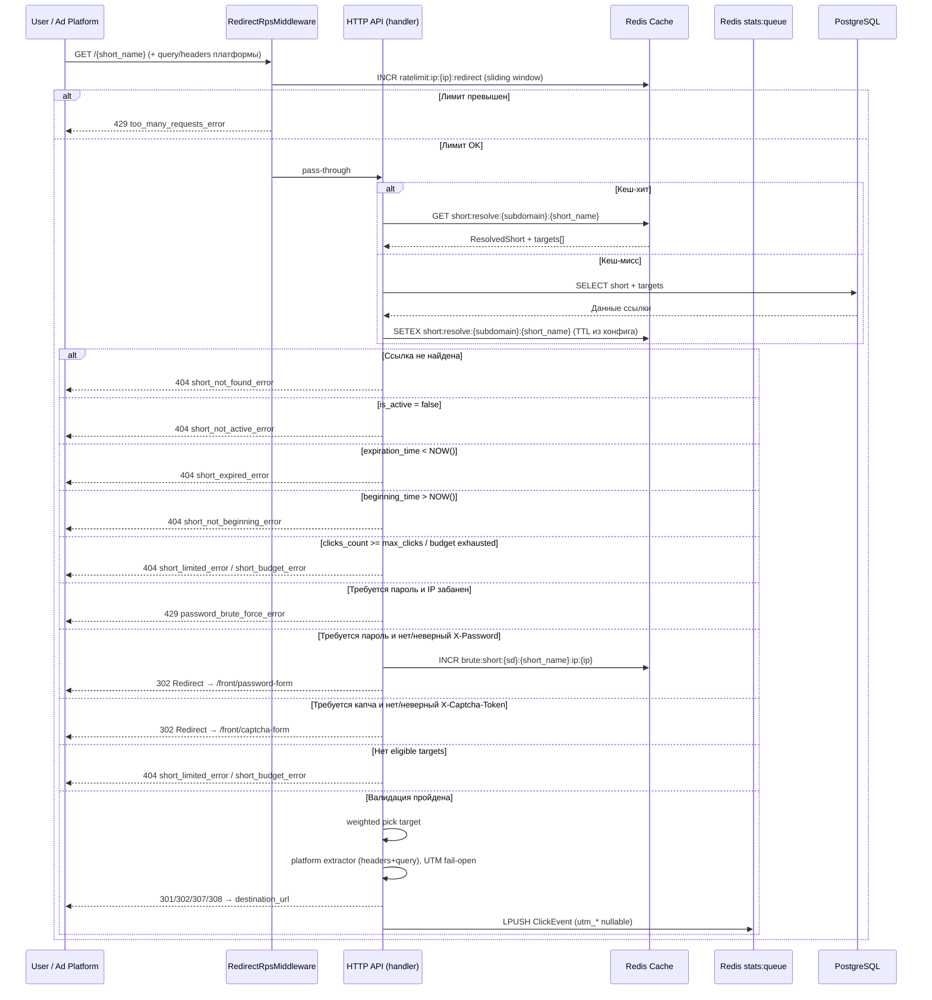

### GET `/{short_name:str}`

> Subdomain парсится из запроса (например, для `https://my-short-link.example.com/abc123` subdomain будет
> `my-short-link`, а short_name будет `abc123`).
>
> SPA-маршруты фронта (`/home`, `/docs`, `/auth`, …) обслуживает nginx/Vite; бэкенд на корне отдаёт
> публичный редирект только если short найден. Запрет рекурсивных destination задаётся списком
> `short.base_domains` на create/update, а не списком reserved path.

|                | Описание                                                                                |
|----------------|-----------------------------------------------------------------------------------------|
| **Назначение** | Публичный редирект по короткой ссылке                                                   |
| **Логика**     | 0. `RedirectRpsMiddleware` проверяет RPS-лимит по IP; при превышении → 429              |
|                | 1. Ищет short_name и subdomain в кеше или БД (`ResolvedShort` с `targets[]`)            |
|                | 2. Проверяет ограничения (срок, лимит переходов, бюджет, активность)                    |
|                | 3. Если ссылка защищена паролем:                                                        |
|                | &nbsp; - IP забанен по brute-force → 429 `password_brute_force_error`                   |
|                | &nbsp; - нет X-Password или пароль неверен → редирект на front с формой ввода пароля    |
|                | &nbsp; - N неверных попыток за окно → IP банится на `ban_ttl`                           |
|                | 4. Если ссылка требует капчу, но нет X-Captcha-Token → редирект на front с формой капчи |
|                | 5. Выбирает eligible target по `weight`                                                 |
|                | 6. Резолвит макросы/UTM через **per-platform** extractor (query + кастомные headers)     |
|                | &nbsp; &nbsp; — отсутствие UTM/макросов **не ошибка**: в stats пишется `null`           |
|                | 7. Возвращает 301/302/307/308 на финальный URL                                          |
|                | 8. Публикует `ClickEvent` (`target_id`, nullable `utm_*`, `cpc`, `destination_url`)     |
| **Параметры**  | `short_name:str` - имя ссылки (может содержать `/`)                                    |
|                | Query: `utm_*` и макрос-параметры платформы (зависят от `utm.platform`)                 |
| **Заголовки**  | `X-Password:str?` - пароль для защищённых ссылок (опционально)                          |
|                | `X-Captcha-Token:str?` - токен о решении капчи (опционально)                            |
|                | Platform headers (VK и др.) + generic `X-Macro-{Name}` / `X-Utm-{Name}` — см. module_short.md |

Формы на фронте (`short.password_form_url_template` / `short.captcha_form_url_template`):

- Relative Location сохраняет `Host` (и поддомен): пользователь снова шлёт `GET /{short_name}` с
  `X-Password` / `X-Captcha-Token`.
- В шаблоне: `{short_name}` (percent-encoded), `{subdomain}` (пусто, если без поддомена).
  Пример: `/password-form?short_name={short_name}&subdomain={subdomain}`.
- Опционально `X-Short-Subdomain` — если форма открыта на apex без поддомена в Host.
- При `Accept: application/json` → **200** `{ "location": "...", "status": 301|302|… }`
  (нужно для фронтовых форм: `fetch`+`redirect:manual` прячет Location).

---

| Ответ                      | Код | Описание                                               |
|----------------------------|-----|--------------------------------------------------------|
|                            | 301 | Перманентный редирект                                  |
|                            | 302 | Временный редирект                                     |
|                            | 307 | Временный редирект (strict)                            |
|                            | 308 | Перманентный редирект (strict)                         |
|                            | 302 | Редирект для ввода пароля                              |
|                            | 302 | Редирект с капчей                                      |
| too_many_requests_error    | 429 | RPS-лимит превышен (из middleware, до handler'а)       |
| password_brute_force_error | 429 | IP заблокирован после N неудачных попыток ввода пароля |
| short_not_found_error      | 404 | Ссылка не найдена или отключена                        |
| short_expired_error        | 404 | Ссылка истекла                                         |
| short_not_beginning_error  | 404 | Ссылка еще не активна                                  |
| short_limited_error        | 404 | Истек лимит по переходу по ссылке                      |
| short_budget_error         | 404 | Исчерпан бюджет (global / все targets)                 |
| short_not_active_error     | 404 | Ссылка не активна                                      |
| server_error               | 500 | Внутренняя ошибка сервера                              |

---

Кеш: `short:resolve:{subdomain}:{short_name}`, TTL из конфига `short.resolve_cache_ttl` (по умолчанию 5 минут).
В кеше — `targets[]` (+ budget/spent); выбор target и макросы — на каждый запрос.

**RPS-лимит** обрабатывается middleware `RedirectRpsMiddleware` до входа в handler. Параметры из конфига
`redirect_rate_limit`: `window` и `max_requests`. Fail-open: при недоступности Redis запрос пропускается.

**Brute-force защита паролей**: параметры из `redirect_rate_limit.password_brute_force` — `window`, `max_attempts`,
`ban_ttl`. Ключи Redis: `brute:short:{sd}:{short_name}:ip:{ip}` (счётчик) и
`brute:ban:short:{sd}:{short_name}:ip:{ip}` (бан).

**Проверка пароля** выполняется через `PasswordService::verify` (Argon2) — асинхронно, блокирующий вызов на Tokio thread
pool.

<b>Схема</b>

