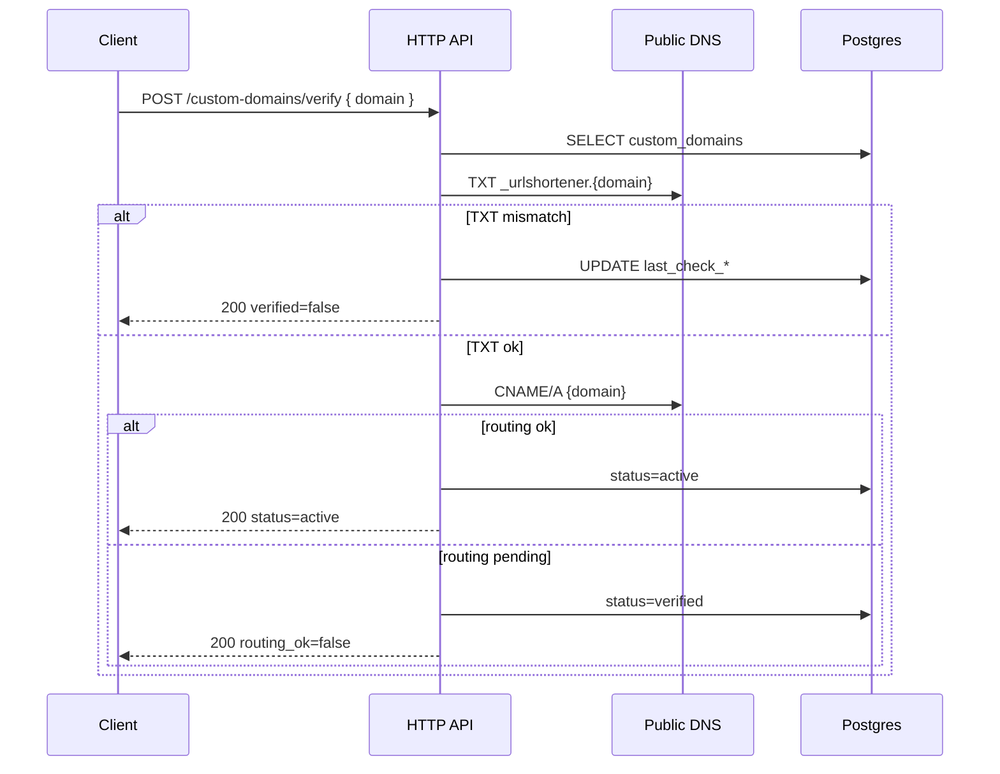

<a id="post-custom-domains-verify"></a>

### <span style="background:#42A5F5;padding:5px">POST</span> `/custom-domains/verify`

|                      | Описание                                                                                              |
|----------------------|-------------------------------------------------------------------------------------------------------|
| **Назначение**       | Проверяет DNS TXT (владение) и CNAME/A (маршрутизация) для зарегистрированного домена                 |
| **Auth**             | Bearer или X-Api-Key                                                                                  |
| **Логика**           | 1. Находит домен по `domain` + принадлежность scope пользователю                                      |
|                      | 2. Rate limit: не чаще `custom_domains.verify_min_interval` на домен (default 30s) → 429              |
|                      | 3. Если `verification_expires_at` прошло → `410 verification_expired_error`; reissue через `POST /custom-domains` |
|                      | 4. **TXT check:** резолв `_urlshortener.{domain}` (или apex-правило из конфига), ищет `urlshortener-verify={token}` |
|                      | 5. TXT не найден → `status` остаётся `pending_verification`, `last_check_error` заполняется, **200** с `verified: false` |
|                      | 6. TXT найден → `verified_at = now()`, `status = verified`                                          |
|                      | 7. **Routing check:** CNAME `{domain}` → `custom_domains.routing_cname_target` (или A для apex)     |
|                      | 8. Routing ок → `status = active`, `routing_checked_at = now()`                                       |
|                      | 9. Routing не ок при успешном TXT → `status = verified`, в ответе `routing_ok: false` + подсказка   |
|                      | 10. Пишет `last_check_at`; best-effort обновляет Redis-кеш списка                                   |
| **Параметры**        | `domain:str` — FQDN в body                                                                            |
| **Инвалидация кеша** | `INCR custom_domains:list:{owner}:v`; при переходе в `active` — bloom/warmup resolve cache        |

> DNS lookup выполняется **синхронно** в handler'е с таймаутом
> `custom_domains.dns_lookup_timeout`. Сбой резолвера (timeout, SERVFAIL) →
> **не** меняет статус домена, `503 dns_resolver_unavailable_error` или
> `200` + `verified: false` + `last_check_error` (выбор за реализацией; в v1 —
> `200` с ошибкой в теле, чтобы UI мог показать «попробуйте позже»).

---

| Ответ                          | Код | Описание                                                       |
|--------------------------------|-----|----------------------------------------------------------------|
| success (verified)             | 200 | TXT (+ опционально routing) проверены, тело с `status`         |
| success (not yet)              | 200 | Проверка выполнена, верификация не пройдена (`verified: false`) |
| auth_error                     | 401 | Не авторизован                                                 |
| permission_denied_error        | 403 | Недостаточно прав у API key                                    |
| api_key_scope_mismatch_error   | 403 | API key привязан к другому scope                               |
| not_found                      | 404 | Домен не найден                                                |
| verification_expired_error     | 410 | Истёк срок `verification_token`; пересоздать через POST      |
| too_many_requests              | 429 | Слишком частые проверки                                        |
| server_error                   | 500 | Внутренняя ошибка сервера                                      |

---

<details open>
<summary><b>Пример запроса</b></summary>

```json
{
  "domain": "go.company.ru"
}
```

</details>

<details open>
<summary><b>Пример ответа — TXT ок, CNAME ещё нет</b></summary>

```json
{
  "domain": "go.company.ru",
  "status": "verified",
  "verified": true,
  "routing_ok": false,
  "last_check_at": "2026-07-30T10:20:00Z",
  "last_check_error": "CNAME go.company.ru does not point to edge.kkoroch.ru",
  "dns_instructions": {
    "routing": {
      "type": "CNAME",
      "host": "go.company.ru",
      "value": "edge.kkoroch.ru"
    }
  }
}
```

</details>

<details open>
<summary><b>Пример ответа — полностью active</b></summary>

```json
{
  "domain": "go.company.ru",
  "status": "active",
  "verified": true,
  "routing_ok": true,
  "verified_at": "2026-07-30T10:15:00Z",
  "routing_checked_at": "2026-07-30T10:20:00Z",
  "last_check_at": "2026-07-30T10:20:00Z",
  "last_check_error": null
}
```

</details>

<details>
<summary><b>Схема</b></summary>



</details>
