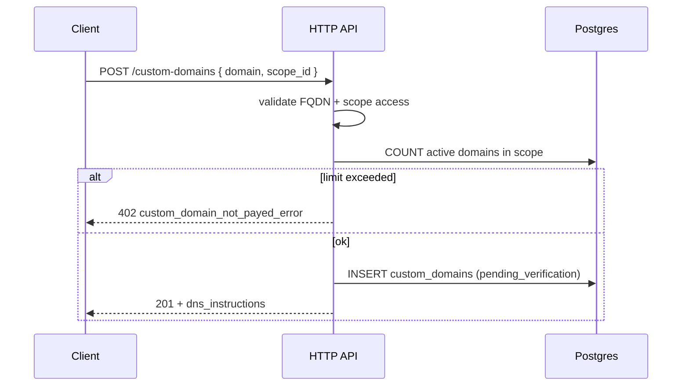

<a id="post-custom-domains"></a>

### <span style="background:#42A5F5;padding:5px">POST</span> `/custom-domains`

|                      | Описание                                                                                              |
|----------------------|-------------------------------------------------------------------------------------------------------|
| **Назначение**       | Регистрирует собственный домен (FQDN) в scope и выдаёт инструкции для DNS TXT-верификации             |
| **Auth**             | Bearer или X-Api-Key                                                                                  |
| **Логика**           | 1. Валидирует `domain` (FQDN, lowercase, без wildcard/IP)                                             |
|                      | 2. Отклоняет домены из `short.base_domains` и их поддомены → `400 recursive_domain_error`            |
|                      | 3. Проверяет лимит `custom_domains.max_per_scope` по подписке владельца scope → 402                   |
|                      | 4. Если домен уже `active` у другого владельца → 409                                                  |
|                      | 5. Если домен уже `pending` / `verified` у **этого** scope — возвращает `200` с теми же инструкциями  |
|                      | 6. Генерирует `verification_token` (UUIDv4), пишет запись в Postgres (`status = pending_verification`) |
|                      | 7. Возвращает `201` + TXT/CNAME инструкции (см. [Custom domains](../module_short.md#custom-domains-собственный-домен)) |
| **Параметры**        | `domain:str` — FQDN (`go.company.ru`, `links.example.com`); `scope_id:int` — scope владельца        |
| **Инвалидация кеша** | `INCR custom_domains:list:{owner}:v`                                                                  |

> Owner домена выводится из `scope_id` через JOIN со `scopes` (как у
> [subdomains](post-subdomains.md)). Отдельного `company_id` у домена нет.

---

| Ответ                          | Код | Описание                                                          |
|--------------------------------|-----|-------------------------------------------------------------------|
| success                        | 201 | Домен зарегистрирован, инструкции выданы                          |
| idempotent                     | 200 | Домен уже в ожидании верификации у этого scope — инструкции те же |
| domain_validation_error        | 400 | Некорректный FQDN (wildcard, IP, пустая строка, …)                |
| recursive_domain_error         | 400 | Домен совпадает с `short.base_domains` или его поддоменом         |
| validation_error               | 400 | Прочие ошибки валидации                                           |
| auth_error                     | 401 | Не авторизован                                                    |
| permission_denied_error        | 403 | Недостаточно прав у API key                                       |
| api_key_scope_mismatch_error   | 403 | API key привязан к другому scope                                  |
| custom_domain_not_payed_error  | 402 | Лимит custom domains по подписке                                  |
| scope_not_found          | 404 | Scope не найден / нет доступа                                     |
| domain_taken                 | 409 | Домен уже активен у другого аккаунта                              |
| server_error                   | 500 | Внутренняя ошибка сервера                                         |

---

<details open>
<summary><b>Пример запроса</b></summary>

```json
{
  "domain": "go.company.ru",
  "scope_id": 42
}
```

</details>

<details open>
<summary><b>Пример ответа 201</b></summary>

```json
{
  "custom_domain": {
    "domain": "go.company.ru",
    "scope_id": 42,
    "status": "pending_verification",
    "verification_token": "a1b2c3d4-e5f6-7890-abcd-ef1234567890",
    "verification_expires_at": "2026-08-02T09:00:00Z",
    "verified_at": null,
    "routing_checked_at": null,
    "created_at": "2026-07-30T09:00:00Z",
    "deleted_at": null
  },
  "dns_instructions": {
    "ownership": {
      "type": "TXT",
      "host": "_urlshortener.go.company.ru",
      "value": "urlshortener-verify=a1b2c3d4-e5f6-7890-abcd-ef1234567890",
      "ttl_hint": 300
    },
    "routing": {
      "type": "CNAME",
      "host": "*.company.ru",
      "value": "edge.kkoroch.ru",
      "note": "CNAME на apex (@) у регистраторов обычно нельзя — ставьте wildcard `*.зона`. Для самого apex дополнительно A/ALIAS на edge. После TXT-верификации."
    }
  }
}
```

</details>

<details>
<summary><b>Схема</b></summary>



</details>
