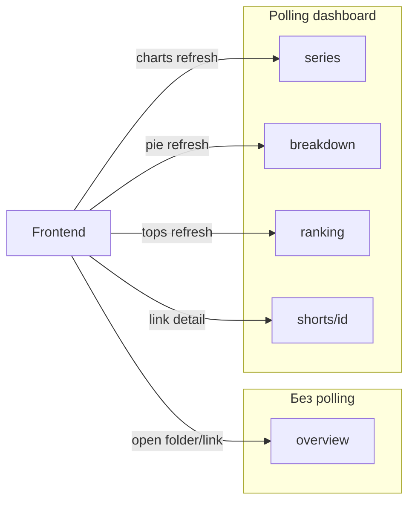
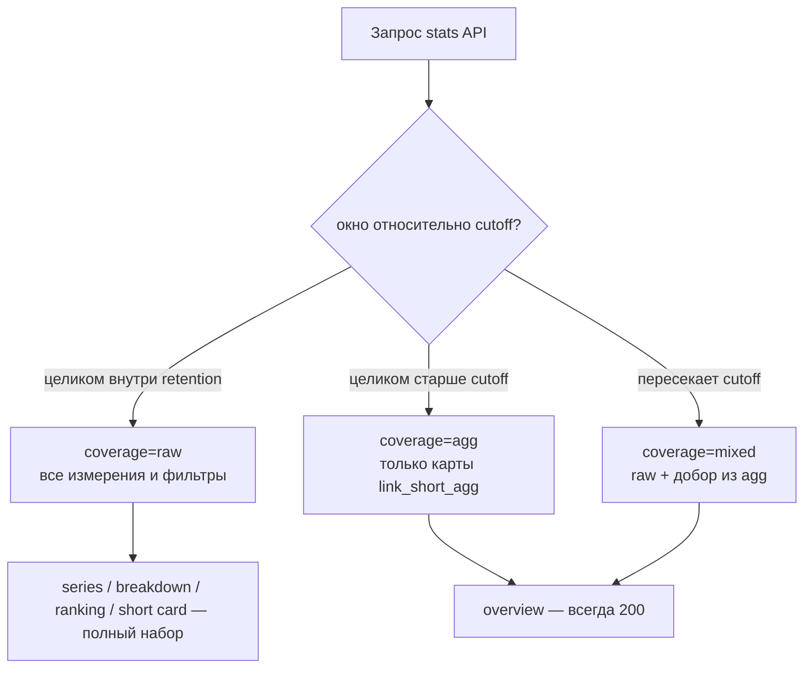

# Stats Module

Модуль **чтения** статистики переходов для владельца scope. Данные пишет
асинхронно [Stats Reader](../stats_reader.md) из очереди `stats:queue` после
публичного редиректа (`GET /{short_name}`). Этот модуль **не** принимает
клики — только агрегированные и оконные отчёты для frontend.

Frontend открывает дашборды и **поллит** детальные ручки. Поэтому на
`/api/v1/stats/*` действует **жёсткий** RPS-лимит (отдельный от redirect /
общего API): при злоупотреблении — `429` + бан по IP/user.

Источник правды по кликам — миграция `20270101000300_stats`
(`link_click_events` + `link_short_agg`).

---

## Оглавление

| Иконка | Раздел                                      | Ссылка                                                         |
|--------|---------------------------------------------|----------------------------------------------------------------|
| 🎯     | Use cases                                   | [ссылка](#use-cases)                                           |
| 🗄️    | Источники данных                            | [ссылка](#источники-данных)                                    |
| ⏳     | Ручки до / после окончания retention        | [ссылка](#ручки-до--после-окончания-retention)                 |
| 📐     | Модель запроса (entity + окно)              | [ссылка](#модель-запроса-entity--окно)                         |
| 📊     | Метрики и измерения                         | [ссылка](#метрики-и-измерения)                                 |
| ⚡     | RPS, polling, кеш                           | [ссылка](#rps-polling-кеш)                                     |
| 🔧     | Agg maps (UTM, CPC, referrer)           | [ссылка](#agg-maps-utm-cpc-referrer)                       |
| ⚙️     | Конфигурация                                | [ссылка](#конфигурация)                                        |
| 📋     | Сводная таблица эндпоинтов                  | [ссылка](#сводная-таблица-эндпоинтов)                          |
| ↳      | GET /stats/{scope}/overview                 | [ссылка](module_stats/get-stats-overview.md)                   |
| ↳      | GET /stats/{scope}/series                   | [ссылка](module_stats/get-stats-series.md)                     |
| ↳      | GET /stats/{scope}/breakdown                | [ссылка](module_stats/get-stats-breakdown.md)                  |
| ↳      | GET /stats/{scope}/geo                      | [ссылка](module_stats/get-stats-geo.md)                        |
| ↳      | GET /stats/{scope}/ranking                  | [ссылка](module_stats/get-stats-ranking.md)                    |
| ↳      | GET /stats/{scope}/shorts/{short_id}        | [ссылка](module_stats/get-stats-short.md)                      |

---

## Use cases

### 1. Краткая сводка (без polling) — **всегда**

Карточка / мини-дашборд при открытии папки или ссылки: несколько KPI и
маленьких графиков **одним** запросом.

| UI | Ручка | Entity |
|----|-------|--------|
| Виджеты папки | `GET .../overview?folder_id=` | ссылки в папке |
| Виджеты ссылки | `GET .../overview?short_id=` | одна ссылка |
| Виджеты scope | `GET .../overview` | весь scope |

**Гарантия продукта:** `overview` доступен **на любом тарифе и в любой момент
жизни ссылки**, в том числе когда raw-клики уже удалены retention-ом. Источник
— `link_short_agg` (+ raw только если окно ещё внутри
`stats_click_retention_days`). Без краткой статистики UI папки/ссылки не
собирается.

Окно — только **preset** (`24h` / `7d` / `30d`), без произвольного `from`/`to`.
Ответ упакован: `kpis` + укороченный `series` + top-N `breakdowns` + (для
scope/folder) `top_shorts`. Поле `coverage`: `raw` | `agg` | `mixed`.

Клиент **не** поллит overview: загрузка при mount / смене фильтра / ручной
refresh. Кеш длиннее, чем у series.

### 2. Полная аналитика (polling)

Экран «Статистика» с выбором периода, срезов и топов.

| UI | Ручка | Что рисует |
|----|-------|------------|
| Линия / столбцы по времени | `GET .../series` | клики, spend, bots |
| Pie / bar по разрезу | `GET .../breakdown` | device, geo, UTM, target, … |
| Карта кликов | `GET .../geo` | страны / регионы РФ / hex |
| Таблица топов | `GET .../ranking` | топ ссылок / campaigns / referrers |
| Карточка ссылки | `GET .../shorts/{id}` | lifetime agg + окно |

Рекомендуемый интервал polling: **≥ 60 с** (см. конфиг
`stats_rate_limit.min_poll_interval`). Чаще — риск `429` и бана.

Entity для series / breakdown / ranking: scope (default) | `folder_id` |
`short_id` (взаимоисключающие).



---

## Источники данных

| Хранилище | Таблица / ключ | Retention | Роль для API |
|-----------|----------------|-----------|--------------|
| Postgres raw | `link_click_events` (PARTITION BY `occurred_at`) | `subscription_plans.stats_click_retention_days` владельца scope | полная аналитика в окне retention |
| Postgres agg | `link_short_agg` | **бессрочно** (не трогает retention sweeper) | краткая сводка **всегда**; day/os/device/… после retention |
| Redis | `stats:cache:*` | короткий TTL | cache-aside ответов GET |

Индексы из миграции:

- `(short_id, occurred_at)` — срезы по ссылке и окну (bots + humans);
- `(scope_id, occurred_at)` — окна / retention по scope.

Срок raw берётся из плана владельца
([subscription_politics](../../business/subscription_politics.md), колонка
`stats_click_retention_days` в `20270101000100_subscriptions`):

| Подписка | `stats_click_retention_days` |
|----------|------------------------------|
| FREE | 30 |
| PERSONAL | 90 |
| PRO | 180 |
| BUSINESS | 365 |
| BUSINESS_PLUS | 730 |

`cutoff = now() - retention_days`. События с `occurred_at < cutoff` из raw
удаляются (партиции / DELETE). Строки `link_short_agg` **остаются**.

---

## Ручки до / после окончания retention

Два режима данных (поле ответа `coverage`):

| `coverage` | Когда | Источник |
|------------|-------|----------|
| `raw` | запрошенное окно целиком ≥ `cutoff` | только `link_click_events` |
| `agg` | окно целиком старше `cutoff`, либо lifetime без окна | только `link_short_agg` (KPI/series — сумма `clicks_by_day` **в окне**, не lifetime `total_clicks`) |
| `mixed` | окно пересекает `cutoff` (часть дней ещё в raw) | day series: agg для дней `< cutoff` ∪ raw для дней `≥ cutoff`; KPI = сумма этих сегментов |



### Матрица ручек

| Ручка | Внутри retention (`coverage=raw`) | После / вне raw (`coverage=agg`) | Пересечение (`mixed`) |
|-------|-----------------------------------|----------------------------------|------------------------|
| **`GET .../overview`** | ✅ полный пакет виджетов из raw | ✅ **обязательно** из agg (KPI + day series + os/device/browser/country/status + UTM/target/spend maps) | ✅ |
| **`GET .../series`** | ✅ `hour` и `day`; любые `metrics` и фильтры | ✅ только `granularity=day`; метрики из day-map / `spend_by_day`; фильтры UTM/target/city/referrer → `400 stats_requires_raw_error` | ✅ day; hour только на сегменте ≥ cutoff |
| **`GET .../breakdown`** | ✅ все `dimension` из [таблицы](#метрики-и-измерения) | ✅ agg-измерения: `os`, `device`, `browser`, `country`, `status_code`, `target`, `utm_*`, `ad_platform`, `referrer_domain`. `city`, `destination_host`, `hour` → `400` | ✅ |
| **`GET .../ranking`** | ✅ все `by` + фильтры | ✅ `by=short` — окно из `stats_by_day`; `by=dimension` — lifetime maps (`window_merge=agg_lifetime`) | ✅ **`window_merge=full`**: per-short / per-dimension merge `stats_by_day` + raw |
| **`GET .../shorts/{id}`** | ✅ `lifetime` (agg) + `window` (raw) | ✅ `lifetime` **всегда**; блок `window` либо урезан до agg day-maps, либо `window.coverage=agg` без raw-only срезов | ✅ |

### Что именно «краткая статистика» обещает навсегда

Даже у FREE через год после кликов `overview` и `shorts/{id}.lifetime` отдают:

| Виджет / поле | Источник в `link_short_agg` |
|---------------|-----------------------------|
| `kpis.clicks` / `total_clicks` | `total_clicks` |
| `kpis.bots` | `bot_clicks_total` |
| дневной sparkline | `clicks_by_day`, `spend_by_day` (rolling 30d) |
| pie device / os / browser / country | соответствующие JSONB maps |
| status codes | `clicks_by_status_code` |
| avg TTFB (окно) | `stats_by_day.sum_ttfb_ms` / `ttfb_samples` (+ raw при mixed) |
| avg TTFB (lifetime) | `sum_ttfb_ms` / `ttfb_samples` |
| failed captcha / password | счётчики agg |
| UTM / target / spend / referrer | lifetime maps в `link_short_agg` (`clicks_by_utm_*`, `clicks_by_target`, `spend_*`, …) |

Произвольные `from`/`to` глубже retention **не** открывают raw — сервер не
восстанавливает удалённые события. Клиент видит `coverage=agg` и
`retention_days` / `raw_available_from` в meta ответа.

### Лимит окна = retention плана

Для запросов, требующих raw (`series` hour, фильтры UTM, `dimension=city`, …):

- `to - from` ≤ `stats_click_retention_days` плана владельца;
- `from` ≥ `now() - retention_days` (иначе `400 stats_window_outside_retention_error`
  **или** автоматический degrade в `agg`, если запрос выразим через agg —
  см. ниже).

Правило degrade (предсказуемо для фронта):

1. Если запрос **выразим** через agg (day series без фильтров; breakdown
   os/device/…; overview) → `200` + `coverage=agg`.
2. Если запрос **требует raw** (hour, city, destination_host, фильтр
   `utm_*`/`target_id` при отсутствии карты в agg) → `400`
   `stats_requires_raw_error` с `raw_available_from`.

`overview` **никогда** не отвечает 400 из‑за retention: виджеты и семантика окна
**те же**, что до retention; для дней без raw используется `stats_by_day`
(rolling 30d в agg). Меняется только `meta.coverage` (`mixed` / `agg`).

### Meta в каждом ответе

```json
{
  "meta": {
    "retention_days": 30,
    "raw_available_from": "2026-06-16T12:00:00Z",
    "coverage": "agg",
    "subscription": "FREE"
  }
}
```

---

## Модель запроса (entity + окно)

### Entity

Ровно один уровень (приоритет, если ошибочно переданы оба фильтра → `400`):

| Параметры | Entity | Множество short_id |
|-----------|--------|--------------------|
| _(нет)_ | scope | все shorts scope |
| `folder_id` | folder | shorts с `folder_id` **в поддереве** папки (включая вложенные) |
| `short_id` | short | одна ссылка |

Доступ: scope принадлежит текущему пользователю (как у short-модуля). Чужой /
несуществующий → `404 scope_not_found_or_denied` / `folder_not_found_error` /
`short_not_found_error` (без утечки существования вне владельца).

### Окно времени

| Ручка | Окно |
|-------|------|
| `overview` | только `window=24h\|7d\|30d` (default `7d`); **всегда 200**, источник raw и/или agg |
| `series` / `breakdown` / `ranking` / `shorts/{id}` | `from` + `to` (RFC3339 UTC) **или** `window` preset |

Ограничения:

- верхняя граница «полного» raw-окна = `stats_click_retention_days` плана
  владельца (FREE 30 … BUSINESS_PLUS 730) — см.
  [ручки до / после retention](#ручки-до--после-окончания-retention);
- `from < to`; timezone ответа — UTC; `day` — календарный UTC-день;
- `granularity=hour` только если диапазон ≤ `stats.max_hourly_range`
  (default **7d**) **и** окно внутри raw retention, иначе `400`;
- запрос «глубже» retention: degrade в `agg` если выразим, иначе
  `stats_requires_raw_error`.

### Фильтры (общие для series / breakdown / ranking)

| Параметр | Тип | Описание |
|----------|-----|----------|
| `include_bots` | bool | default `false` — только human (`is_bot = false`) |
| `target_id` | i64? | только клики выбранного destination |
| `utm_source` / `utm_medium` / `utm_campaign` / `utm_content` / `utm_term` | str? | точное совпадение; пустые/null в raw не матчятся |
| `ad_platform` | str? | `google_ads` / `yandex_direct` / … |
| `country` | char(2)? | `geo_country` |
| `device` / `os` / `browser` | str? | классы из enrichment |
| `referrer_domain` | str? | нормализованный домен |

Фильтры применяются **после** выбора entity (AND).

---

## Метрики и измерения

### Метрики (что считаем)

| Ключ | Описание | Human-only по умолчанию |
|------|----------|-------------------------|
| `clicks` | число событий | да |
| `bots` | `is_bot = true` | — (считается отдельно) |
| `spend` | Σ `cpc_charged` (null → 0) | да (боты не тарифицируются) |
| `avg_ttfb_ms` | среднее `ttfb_ms` по non-null | да |
| `failed_captcha` / `failed_password` | из `link_short_agg` (lifetime) | n/a |

Unique visitors **пока нет** (нет fingerprint cookie в raw) — не обещаем в API.

### Измерения для `breakdown` / `ranking`

| `dimension` | Источник | Примечание |
|-------------|----------|------------|
| `day` / `hour` | raw (или agg day-map) | series использует это же |
| `os` | raw / agg | |
| `device` | raw / agg | |
| `browser` | raw / agg | |
| `country` | raw / agg | `unknown` если null |
| `city` | raw | только при малом entity+окне; top-N |
| `status_code` | raw / agg | |
| `referrer_domain` | raw / agg | `(direct)` если null |
| `target` | raw / agg | key = `target_id`, label = текущий `url` или snapshot |
| `utm_source` / `utm_medium` / `utm_campaign` / `utm_content` / `utm_term` | raw / agg | `(none)` если null |
| `ad_platform` | raw / agg | |
| `short` | raw / join shorts | **только** `ranking?by=short` (на `breakdown` нет) |
| `destination_host` | raw `destination_url` | host после макросов |

Типичные графики frontend:

- линия кликов / spend по дням;
- pie device / os / browser;
- bar top countries / cities;
- bar / table UTM campaign × clicks × spend;
- stacked targets (A/B);
- referrer domains;
- bot share (clicks vs bots);
- avg TTFB trend (ops).

---

## RPS, polling, кеш

### RPS

Middleware на префиксе `/api/v1/stats` (отдельный от `RedirectRpsMiddleware` и
общего `rate_limit`):

1. Счётчик sliding window по ключу `ratelimit:stats:{user_id}` (и запасной
   `…:ip:{ip}` для без-токена — сюда не пускаем: все ручки Bearer).
2. Превышение warn → метрика / лог; превышение ban → `429` + Redis ban TTL.
3. Fail-open при недоступности Redis **запрещён** для stats (в отличие от
   redirect): при ошибке Redis → `503` (лучше отказать, чем отдать дорогой
   SQL под DDoS).

Параметры — `stats_rate_limit` в конфиге (см. ниже). Значения **жёстче**, чем
у общего API: polling с 5 вкладками не должен класть Postgres.

### Контракт polling

- Заголовок ответа `Cache-Control: private, max-age=<ttl>`;
- `ETag` = hash(`entity` + окно + фильтры + `agg_watermark`);
  `agg_watermark` = max(`link_short_agg.updated_at`) по затронутым short_id;
- при `If-None-Match` совпадении → **304** без тела (дешёвый poll);
- при `429` — `Retry-After` (секунды).

### Кеш Redis (cache-aside)

| Ключ | TTL | Инвалидация |
|------|-----|-------------|
| `stats:overview:{scope}:{entity}:{window}:{filters_hash}` | 60–120 с | по TTL; watermark не критичен |
| `stats:series:{…}` | 15–30 с | TTL + ETag |
| `stats:breakdown:{…}` | 15–30 с | TTL + ETag |
| `stats:ranking:{…}` | 30–60 с | TTL |
| `stats:short:{short_id}:{window}:{filters_hash}` | 15–30 с | TTL; drop при delete short |

Инвалидация по записи клика **не** делается синхронно (writer асинхронный):
клиент видит eventual consistency в пределах TTL / интервала poll.

---

## Agg maps (UTM, CPC, referrer)

`link_short_agg` (миграция `20270101000300_stats`) уже включает:

- `clicks_by_target`, `clicks_by_utm_source|medium|campaign|content|term`
- `clicks_by_ad_platform`, `clicks_by_referrer_domain`
- `spend_total`, `spend_by_day`, `spend_by_target`

**Rolling day-maps:** `clicks_by_day` и `spend_by_day` хранят **только последние 30
календарных дней** (UTC); при каждом human-клике writer вызывает
`trim_stats_day_map()`. Lifetime KPI (`total_clicks`, os/device/… maps, target/UTM)
— бессрочно.

Writer (`record_click`) инкрементирует все maps для `is_bot = false`;
`cpc_charged` → `spend_total` / `spend_by_day` / `spend_by_target`.

Retention API берёт `stats_click_retention_days` **владельца scope** (не viewer).
Partition DROP — только когда партиция старше max retention всех тарифов (730d).

---

## Конфигурация

```yaml
stats:
  # max raw-окна = subscription_plans.stats_click_retention_days владельца;
  # эти поля — только доп. потолки (не расширяют retention тарифа)
  max_hourly_range: 7d
  overview_presets: [24h, 7d, 30d]   # 30d ≤ FREE retention → overview всегда на raw для «свежего» окна
  breakdown_top_n_default: 10
  breakdown_top_n_max: 50
  ranking_limit_default: 20
  ranking_limit_max: 100
  series_points_max: 2000

stats_rate_limit:
  window: 60s
  warn_threshold: 60
  ban_threshold: 120
  ban_ttl: 600s
  min_poll_interval: 60s
```

Кеш TTL — в том же блоке или рядом с `short.*` cache настройками.

---

## Сводная таблица эндпоинтов

| Метод | Путь | Авторизация | Polling | После retention |
|-------|------|-------------|---------|-----------------|
| `GET` | `/stats/{scope}/overview` | 🔒 Bearer \| X-Api-Key | ❌ | ✅ **всегда** (agg) |
| `GET` | `/stats/{scope}/series` | 🔒 Bearer \| X-Api-Key | ✅ | ✅ day из agg; hour/фильтры — нет |
| `GET` | `/stats/{scope}/breakdown` | 🔒 Bearer \| X-Api-Key | ✅ | ✅ только agg-измерения |
| `GET` | `/stats/{scope}/geo` | 🔒 Bearer \| X-Api-Key | ✅ | ✅ countries/regions из agg; hex — нет |
| `GET` | `/stats/{scope}/ranking` | 🔒 Bearer \| X-Api-Key | ✅ | ⚠️ ограничено (см. матрицу) |
| `GET` | `/stats/{scope}/shorts/{short_id}` | 🔒 Bearer \| X-Api-Key | ✅ | ✅ lifetime всегда; window → agg |

Префикс API: `/api/v1` (как у остальных модулей).

Все ответы JSON. Ошибки — `kind` + `reason` в стиле short/auth.
