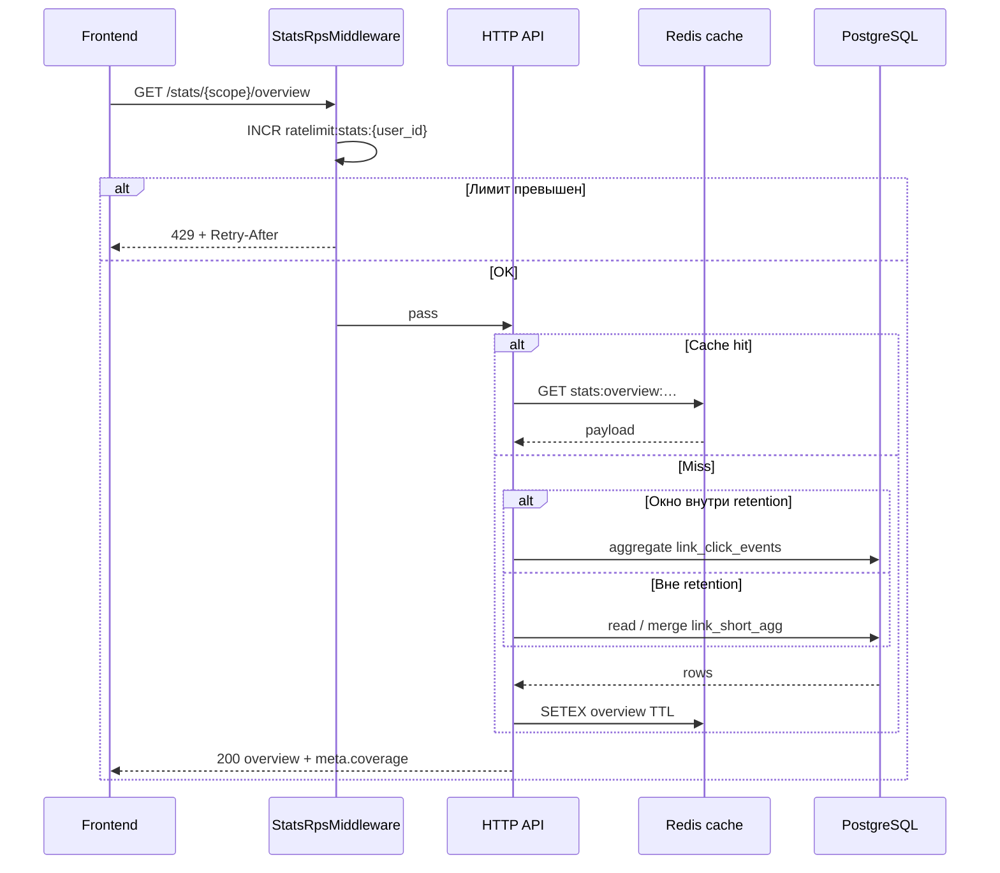

<a id="get-stats-overview"></a>

### <span style="background:#7CB342;padding:5px">GET</span> `/stats/{scope_id:int}/overview`

> Краткая сводка для мини-дашборда. **Не рассчитана на polling** — один запрос
> при открытии папки/ссылки/scope или ручной refresh.
>
> **Всегда доступна** после окончания click-retention: при отсутствии raw
> считается из `link_short_agg` (`coverage=agg`). Не отвечает `400` из‑за
> retention. Контракт —
> [module_stats.md](../module_stats.md#ручки-до--после-окончания-retention).

|                | Описание                                                                                                                                                      |
|----------------|---------------------------------------------------------------------------------------------------------------------------------------------------------------|
| **Назначение** | Упакованный ответ: KPI + короткий ряд + top-N срезы (+ топ ссылок)                                                                                            |
| **Логика**     | 0. `StatsRpsMiddleware` — лимит по `user_id`; превышение → 429                                                                                                |
|                | 1. Проверяет доступ к `scope_id`                                                                                                                              |
|                | 2. Резолвит entity: scope \| `folder_id` \| `short_id`                                                                                                        |
|                | 3. Считает окно по `window` preset (`24h` / `7d` / `30d`)                                                                                                     |
|                | 4. Если окно внутри `stats_click_retention_days` → raw; иначе / частично → agg                                                                                |
|                | 5. Собирает виджеты; при `mixed`/`agg` дни без raw — из `stats_by_day` (rolling 30d) |
|                | 6. Для scope/folder — `top_shorts` (raw + `stats_by_day` в окне) |
| **Параметры**  | `scope_id:int` — path                                                                                                                                         |
|                | `window:str?` — `24h` \| `7d` \| `30d` (default `7d`)                                                                                                         |
|                | `folder_id:uuid?` — entity = папка (поддерево)                                                                                                                |
|                | `short_id:int?` — entity = одна ссылка                                                                                                                        |
|                | `include_bots:bool?` — default `false` (bots всё равно в `kpis.bots`)                                                                                         |
| **Кеш**        | `stats:overview:{scope}:{entity}:{window}:{v}`, TTL 60–120 с                                                                                                  |

`folder_id` и `short_id` взаимоисключающие → иначе `400 validation_error`.

Preset `30d` у FREE совпадает с retention → «свежее» окно ещё из raw; история
старше 30 дней в overview не запрашивается (preset фиксирован), но **lifetime
KPI** при `short_id` можно смотреть через `GET .../shorts/{id}`.

---

| Ответ                   | Код | Описание                                    |
|-------------------------|-----|---------------------------------------------|
|                         | 200 | Сводка собрана (`coverage` raw\|agg\|mixed) |
| validation_error        | 400 | Невалидные параметры / конфликт entity      |
| auth_error              | 401 | Не авторизован                              |
| scope_not_found_error   | 404 | Scope не найден или нет доступа             |
| folder_not_found_error  | 404 | Папка не найдена в scope                    |
| short_not_found_error   | 404 | Ссылка не найдена в scope                   |
| too_many_requests_error | 429 | RPS / ban (`Retry-After`)                   |
| service_unavailable     | 503 | Redis rate-limit backend недоступен         |
| server_error            | 500 | Внутренняя ошибка сервера                   |

---

<details open>
<summary><b>Пример запроса</b></summary>

```http
GET /api/v1/stats/10000001/overview?folder_id=abc12345-e89b-12d3-a456-426614174000&window=7d
Authorization: Bearer <access_token>
```

</details>

</details>

#### Пример ответа

```json
{
  "meta": {
    "retention_days": 30,
    "raw_available_from": "2026-06-16T12:00:00Z",
    "coverage": "raw",
    "subscription": "FREE"
  },
  "entity": {
    "type": "folder",
    "scope_id": 10000001,
    "folder_id": "abc12345-e89b-12d3-a456-426614174000",
    "short_id": null
  },
  "window": {
    "preset": "7d",
    "from": "2026-07-09T12:00:00Z",
    "to": "2026-07-16T12:00:00Z"
  },
  "kpis": {
    "clicks": 1840,
    "bots": 92,
    "spend": "12500.50",
    "currency": "RUB",
    "avg_ttfb_ms": 11.4,
    "shorts_count": 24,
    "active_shorts_with_clicks": 18,
    "failed_password": 3,
    "failed_captcha": 12
  },
  "series": {
    "granularity": "day",
    "metric": "clicks",
    "points": [
      {
        "t": "2026-07-09",
        "clicks": 210,
        "spend": "1400.00",
        "bots": 8
      },
      {
        "t": "2026-07-10",
        "clicks": 255,
        "spend": "1720.00",
        "bots": 11
      }
    ]
  },
  "breakdowns": {
    "device": [
      {
        "key": "mobile",
        "clicks": 1100,
        "share": 0.598
      },
      {
        "key": "desktop",
        "clicks": 640,
        "share": 0.348
      },
      {
        "key": "tablet",
        "clicks": 100,
        "share": 0.054
      }
    ],
    "os": [
      {
        "key": "android",
        "clicks": 700,
        "share": 0.38
      },
      {
        "key": "ios",
        "clicks": 520,
        "share": 0.283
      }
    ],
    "country": [
      {
        "key": "RU",
        "clicks": 1500,
        "share": 0.815
      },
      {
        "key": "KZ",
        "clicks": 120,
        "share": 0.065
      }
    ],
    "utm_source": [
      {
        "key": "yandex",
        "clicks": 900,
        "spend": "9000.00",
        "share": 0.489
      },
      {
        "key": "(none)",
        "clicks": 400,
        "spend": "0.00",
        "share": 0.217
      }
    ],
    "target": [
      {
        "key": "1",
        "label": "https://www.example.com/a",
        "clicks": 1200,
        "spend": "8000.00"
      },
      {
        "key": "2",
        "label": "https://www.example.com/b",
        "clicks": 640,
        "spend": "4500.50"
      }
    ]
  },
  "top_shorts": [
    {
      "short_id": 10000042,
      "short_name": "summer-sale",
      "clicks": 520,
      "spend": "4100.00"
    }
  ]
}
```

Для `entity.type = "short"` поле `top_shorts` отсутствует (или `[]`).

<details>
<summary><b>До / после retention</b></summary>

| Поле / возможность | До retention (`coverage=raw`) | После retention (`coverage=agg` / `mixed`) |
|--------------------|-------------------------------|----------------------------------------------|
| HTTP-код | 200 | 200 |
| `meta.coverage` | `raw` | `agg` или `mixed` |
| `kpis.clicks`, `bots`, `spend` | ✅ в preset-окне | ✅ **то же** — raw + `stats_by_day` |
| `kpis.avg_ttfb_ms` | ✅ из raw | ✅ из `sum_ttfb_ms` / `ttfb_samples` в `stats_by_day` (+ raw при `mixed`) |
| `kpis.failed_password`, `failed_captcha` | ✅ **lifetime** из `link_short_agg` (gate не в day-maps) | ✅ **то же** |
| `series.points` (clicks, bots, spend) | ✅ по дням окна | ✅ **то же** — `stats_by_day` для дней без raw |
| `breakdowns` device / os / country / browser / status_code | ✅ в окне | ✅ **то же** — rollup `stats_by_day` |
| `breakdowns.city` | ✅ при `window` ≤ 7d | ✅ при `window` ≤ 7d |
| `breakdowns.utm_source`, `target` (+ spend) | ✅ в окне | ✅ **то же** |
| `top_shorts` | ✅ в окне | ✅ **то же** |
| Источник данных | `link_click_events` | `stats_by_day` (+ raw для дней ≥ cutoff при `mixed`) |

Меняется только `meta.coverage` и источник под капотом; **форма ответа и семантика окна идентичны**.

</details>

<details>
<summary><b>Схема</b></summary>



</details>
