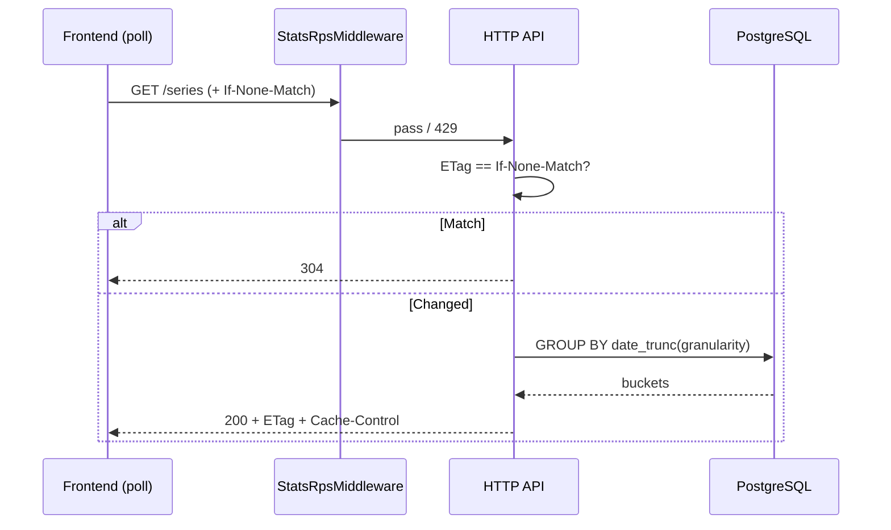

<a id="get-stats-series"></a>

### <span style="background:#7CB342;padding:5px">GET</span> `/stats/{scope_id:int}/series`

> Временной ряд для линейных/столбчатых графиков. Рассчитана на **polling**
> (≥ `stats_rate_limit.min_poll_interval`). Поддерживает `ETag` / `304`.
>
> **Retention:** внутри `stats_click_retention_days` — полный raw (`hour`/`day`,
> фильтры). Вне raw — только `granularity=day` из `link_short_agg`; иначе
> `400 stats_requires_raw_error`. См.
> [матрицу](../module_stats.md#ручки-до--после-окончания-retention).

|                | Описание                                                                 |
|----------------|--------------------------------------------------------------------------|
| **Назначение** | Точки `(t, metrics…)` с заданной гранулярностью по entity и фильтрам     |
| **Auth**       | Bearer или X-Api-Key                                                     |
| **Логика**     | 0. `StatsRpsMiddleware` → 429 при превышении                             |
|                | 1. Доступ к scope + резолв entity                                        |
|                | 2. Нормализация окна + сравнение с `cutoff = now - retention_days`       |
|                | 3. `coverage=raw|agg|mixed`; hour только на raw-сегменте                 |
|                | 4. Агрегация; ETag / 304                                                 |
| **Параметры**  | `scope_id:int` — path                                                    |
|                | `from:datetime?`, `to:datetime?` — UTC; либо `window:str?`               |
|                | `folder_id:uuid?` / `short_id:int?` — entity                             |
|                | `granularity:str` — `hour` \| `day` (default `day`)                      |
|                | `metrics:str[]?` — `clicks`, `bots`, `spend`, `avg_ttfb_ms` (default `clicks,spend`)|
|                | Фильтры: `include_bots`, `target_id`, `utm_*`, `ad_platform`, `country`, `device`, `os`, `browser`, `referrer_domain` |
| **Заголовки**  | `If-None-Match:str?` — условный poll                                     |
| **Кеш**        | `stats:series:{hash}`, TTL 15–30 с                                       |

Число точек ≤ `stats.series_points_max`; иначе `400 validation_error`.

---

| Ответ                         | Код | Описание                               |
|-------------------------------|-----|----------------------------------------|
|                               | 200 | Ряд построен                           |
|                               | 304 | Не изменилось (`ETag`)                 |
| validation_error              | 400 | Окно / granularity / filters           |
| stats_requires_raw_error      | 400 | Нужен raw (hour / фильтр вне retention)|
| stats_window_outside_retention_error | 400 | Окно глубже retention и не выразимо через agg |
| auth_error                    | 401 | Не авторизован                         |
| permission_denied_error       | 403 | Недостаточно прав у API key |
| api_key_scope_mismatch_error  | 403 | API key привязан к другому scope |
| scope_not_found_error         | 404 | Scope недоступен                       |
| folder_not_found_error        | 404 | Папка недоступна                       |
| short_not_found_error         | 404 | Ссылка недоступна                      |
| too_many_requests_error       | 429 | RPS / ban                              |
| service_unavailable           | 503 | Redis rate-limit недоступен            |
| server_error                  | 500 | Внутренняя ошибка                      |

---

<details open>
<summary><b>Пример запроса</b></summary>

```http
GET /api/v1/stats/10000001/series?short_id=10000042&from=2026-07-01T00:00:00Z&to=2026-07-16T00:00:00Z&granularity=day&metrics=clicks&metrics=spend&metrics=bots&utm_source=yandex
Authorization: Bearer <access_token>
If-None-Match: "W/\"a1b2c3\""
```

</details>

</details>

#### Пример ответа

```json
{
  "meta": {
    "retention_days": 90,
    "raw_available_from": "2026-04-17T00:00:00Z",
    "coverage": "raw",
    "subscription": "PERSONAL"
  },
  "entity": {
    "type": "short",
    "scope_id": 10000001,
    "folder_id": null,
    "short_id": 10000042
  },
  "window": {
    "from": "2026-07-01T00:00:00Z",
    "to": "2026-07-16T00:00:00Z"
  },
  "granularity": "day",
  "filters": {
    "include_bots": false,
    "utm_source": "yandex"
  },
  "metrics": ["clicks", "spend", "bots"],
  "points": [
    {
      "t": "2026-07-01T00:00:00Z",
      "clicks": 40,
      "spend": "320.00",
      "bots": 2,
      "avg_ttfb_ms": null
    },
    {
      "t": "2026-07-02T00:00:00Z",
      "clicks": 55,
      "spend": "440.00",
      "bots": 1,
      "avg_ttfb_ms": null
    }
  ]
}
```

Для `granularity=day` поле `t` допускается как `YYYY-MM-DD` или midnight UTC —
клиент должен принимать оба (сервер фиксирует один формат в OpenAPI).

<details>
<summary><b>До / после retention</b></summary>

| Поле / возможность | До retention (`coverage=raw`) | После retention (`coverage=agg` / `mixed`) |
|--------------------|-------------------------------|----------------------------------------------|
| HTTP-код | 200 | 200 или **400** `stats_requires_raw_error` |
| `meta.coverage` | `raw` | `agg` или `mixed` |
| `granularity=hour` | ✅ | ❌ **400** |
| `granularity=day` | ✅ все метрики в окне | ✅ clicks/spend из `clicks_by_day` / `spend_by_day` (rolling 30d) |
| `points[].bots` | ✅ | ❌ **0** (нет в day-map) |
| `points[].avg_ttfb_ms` | ✅ | ❌ `null` |
| Фильтры (`utm_*`, `target_id`, country, …) | ✅ | ❌ **400** при `coverage=agg` |
| `mixed`: day-ряд | — | ✅ raw-дни ≥ cutoff + day-map &lt; cutoff |
| `mixed`: hour | ✅ если окно целиком ≥ cutoff | ❌ **400** |

</details>

<details>
<summary><b>Схема</b></summary>



</details>
