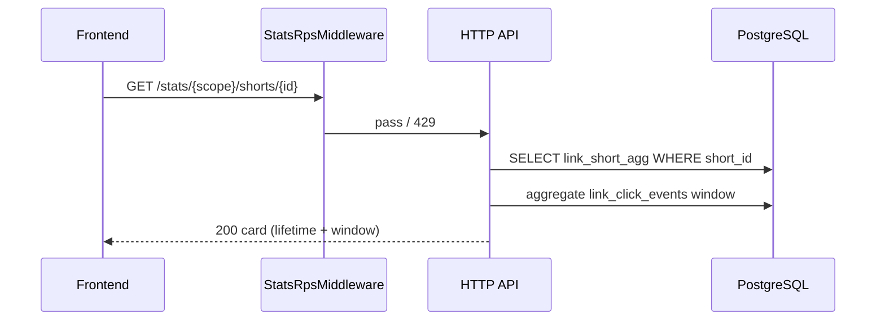

<a id="get-stats-short"></a>

### <span style="background:#7CB342;padding:5px">GET</span> `/stats/{scope_id:int}/shorts/{short_id:int}`

> Карточка одной ссылки: **lifetime** из `link_short_agg` + метрики выбранного
> окна из raw (если окно внутри retention) или из agg day-maps.
>
> **`lifetime` всегда** (даже через годы после удаления raw). Блок `window`
> деградирует в `coverage=agg`, не ломая карточку.
> [Матрица](../module_stats.md#ручки-до--после-окончания-retention).

|                | Описание                                                                 |
|----------------|--------------------------------------------------------------------------|
| **Назначение** | Детальный отчёт по short: lifetime maps + window KPIs/series/breakdowns  |
| **Auth**       | Bearer или X-Api-Key                                                     |
| **Логика**     | 0. `StatsRpsMiddleware`                                                  |
|                | 1. Проверяет, что `short_id` принадлежит `scope_id` владельца            |
|                | 2. Читает `link_short_agg` (lifetime) — **всегда**                       |
|                | 3. Окно: raw если ≥ cutoff, иначе agg maps                               |
|                | 4. Опционально mini-series / breakdowns                                  |
|                | 5. ETag = hash(agg.updated_at + window aggregates)                       |
| **Параметры**  | `scope_id:int`, `short_id:int` — path                                    |
|                | `from`/`to` или `window` (default `7d`)                                  |
|                | `include_bots:bool?` — default `false`                                   |
|                | `with_series:bool?` — default `true` — дневной ряд окна                  |
|                | `with_breakdowns:bool?` — default `true` — device/os/country/utm/target  |
| **Заголовки**  | `If-None-Match:str?`                                                     |
| **Кеш**        | `stats:short:{short_id}:{window}:{filters_hash}`, TTL 15–30 с            |

Не путать с `GET /shorts/{scope}` (список ссылок модуля short) — здесь только
аналитика.

---

| Ответ                   | Код | Описание                    |
|-------------------------|-----|-----------------------------|
|                         | 200 | Карточка собрана            |
|                         | 304 | Не изменилось               |
| validation_error        | 400 | Окно / параметры            |
| auth_error              | 401 | Не авторизован              |
| permission_denied_error       | 403 | Недостаточно прав у API key |
| api_key_scope_mismatch_error  | 403 | API key привязан к другому scope |
| scope_not_found_error   | 404 | Scope недоступен            |
| short_not_found_error   | 404 | Ссылка не в scope / нет доступа |
| too_many_requests_error | 429 | RPS / ban                   |
| service_unavailable     | 503 | Redis rate-limit недоступен |
| server_error            | 500 | Внутренняя ошибка           |

---

<details open>
<summary><b>Пример запроса</b></summary>

```http
GET /api/v1/stats/10000001/shorts/10000042?window=30d&with_series=true&with_breakdowns=true
Authorization: Bearer <access_token>
```

</details>

</details>

#### Пример ответа

```json
{
  "short": {
    "id": 10000042,
    "short_name": "summer-sale",
    "folder_id": "abc12345-e89b-12d3-a456-426614174000",
    "subdomain": null,
    "is_active": true,
    "clicks_count": 15200,
    "budget": "50000.00",
    "spent": "18200.00",
    "currency": "RUB"
  },
  "lifetime": {
    "source": "link_short_agg",
    "updated_at": "2026-07-16T11:58:01Z",
    "total_clicks": 15200,
    "bot_clicks_total": 840,
    "avg_ttfb_ms": 10.8,
    "failed_captcha_total": 12,
    "failed_password_total": 3,
    "clicks_by_day": {
      "2026-07-01": 120,
      "2026-07-02": 140
    },
    "clicks_by_os": { "android": 6000, "ios": 5000, "windows": 3000 },
    "clicks_by_device": { "mobile": 11000, "desktop": 3800, "tablet": 400 },
    "clicks_by_browser": { "chrome": 9000, "safari": 4000 },
    "clicks_by_country": { "RU": 13000, "KZ": 800, "unknown": 400 },
    "clicks_by_status_code": { "302": 15000, "301": 200 },
    "spend_total": "18200.00",
    "clicks_by_target": { "1": 10000, "2": 5200 },
    "clicks_by_utm_source": { "yandex": 9000, "google": 3000, "(none)": 3200 },
    "clicks_by_ad_platform": { "yandex_direct": 9000, "google_ads": 3000 }
  },
  "window": {
    "preset": "30d",
    "from": "2026-06-16T12:00:00Z",
    "to": "2026-07-16T12:00:00Z",
    "coverage": "raw",
    "kpis": {
      "clicks": 4100,
      "bots": 190,
      "spend": "5200.00",
      "avg_ttfb_ms": 11.1
    },
    "series": {
      "granularity": "day",
      "points": [
        { "t": "2026-06-16", "clicks": 90, "spend": "110.00", "bots": 4 }
      ]
    },
    "breakdowns": {
      "device": [
        { "key": "mobile", "clicks": 2800, "share": 0.683 }
      ],
      "utm_campaign": [
        { "key": "summer", "clicks": 2000, "spend": "3000.00", "share": 0.488 }
      ],
      "target": [
        { "key": "1", "label": "https://www.example.com/a", "clicks": 2700, "spend": "3400.00" }
      ]
    }
  }
}
```

Поля `lifetime.spend_*` / `clicks_by_utm_*` / `clicks_by_target` заполняются из agg.

<details>
<summary><b>До / после retention</b></summary>

| Поле / возможность | До retention (`window.coverage=raw`) | После retention (`window.coverage=agg` / `mixed`) |
|--------------------|--------------------------------------|---------------------------------------------------|
| HTTP-код | 200 | 200 |
| Блок `lifetime` | ✅ бессрочно из agg | ✅ **без изменений** |
| Блок `short` (header) | ✅ | ✅ |
| `window.kpis` clicks / bots / spend | ✅ в окне | ✅ **то же** — `stats_by_day` + raw |
| `window.kpis.avg_ttfb_ms` | ✅ | ✅ `stats_by_day` sum/samples + raw при `mixed` |
| `window.series` | ✅ clicks, bots, spend по дням | ✅ **то же** |
| `window.breakdowns` | ✅ в окне | ✅ **то же** (rollup `stats_by_day`) |
| `window.coverage` | `raw` | `agg` или `mixed` |

`lifetime` не зависит от retention; деградирует только источник блока `window`.

</details>

<details>
<summary><b>Схема</b></summary>



</details>
