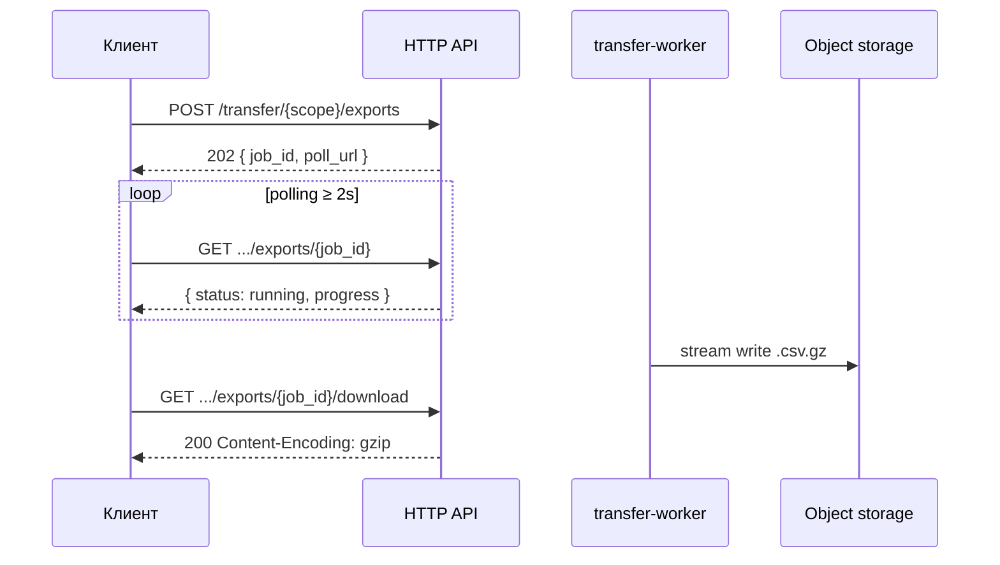
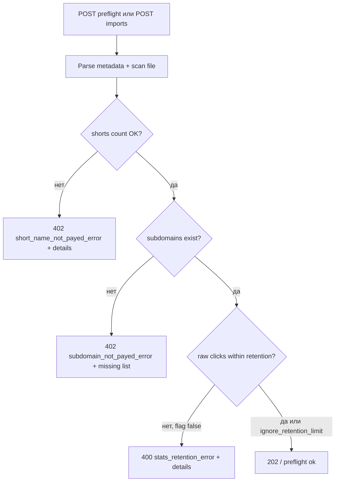
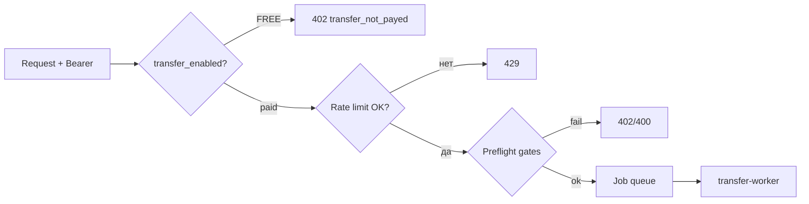

# Transfer Module (Import / Export)

> **Статус:** контракт / дизайн. HTTP-ручек и миграций в backend **пока нет** —
> раздел описывает целевой API, не текущую реализацию.

Модуль **массового импорта и экспорта** данных scope: короткие ссылки с
полной конфигурацией, агрегированная статистика (`link_short_agg`) и
raw-события кликов (`link_click_events`) в пределах retention.

Операции **асинхронные**: HTTP API создаёт job, клиент **поллит** статус и
скачивает готовый файл. Для объёмов от сотен МБ до ГБ — потоковая запись,
**gzip-сжатие** и форматы, удобные для стриминга (NDJSON / CSV).

> Модуль **не** дублирует `GET /shorts/{scope}` и `GET /stats/*` для UI.
> Это offline-выгрузка / миграция / резервное копирование / перенос с
> Linkly и Bitly.

---

## Оглавление

| Иконка | Раздел                                      | Ссылка                                                         |
|--------|---------------------------------------------|----------------------------------------------------------------|
| 🎯     | Use cases                                   | [ссылка](#use-cases)                                           |
| 📦     | Что экспортируем / импортируем              | [ссылка](#что-экспортируем--импортируем)                       |
| 🗜️    | Форматы файлов и сжатие                     | [ссылка](#форматы-файлов-и-сжатие)                             |
| ⏳     | Jobs, polling, SSE                          | [ссылка](#jobs-polling-sse)                                     |
| 🔒     | Preflight и лимиты подписки                 | [ссылка](#preflight-и-лимиты-подписки)                          |
| 🛡️    | Безопасность и скомпрометированный API       | [ссылка](#безопасность-и-скомпрометированный-api)               |
| 📈     | Import статистики: raw + agg                | [ссылка](#import-статистики-raw--agg)                           |
| 🔌     | Адаптеры конкурентов                        | [ссылка](#адаптеры-конкурентов)                                |
| 📐     | Native CSV — схема колонок                  | [ссылка](#native-csv--схема-колонок)                           |
| 📊     | Raw clicks CSV / NDJSON                     | [ссылка](#raw-clicks-csv--ndjson)                              |
| ⚙️     | Лимиты, retention, безопасность             | [ссылка](#лимиты-retention-безопасность)                       |
| 📋     | Сводная таблица эндпоинтов                  | [ссылка](#сводная-таблица-эндпоинтов)                          |
| ↳      | GET /transfer/formats                       | [ссылка](module_transfer/get-transfer-formats.md)              |
| ↳      | POST /transfer/{scope}/exports                | [ссылка](module_transfer/post-transfer-exports.md)             |
| ↳      | GET /transfer/{scope}/exports/{job_id}        | [ссылка](module_transfer/get-transfer-exports-job_id.md)     |
| ↳      | GET /transfer/{scope}/exports/{job_id}/download | [ссылка](module_transfer/get-transfer-exports-job_id-download.md) |
| ↳      | POST /transfer/{scope}/imports                | [ссылка](module_transfer/post-transfer-imports.md)           |
| ↳      | POST /transfer/{scope}/imports/preflight      | [ссылка](module_transfer/post-transfer-imports-preflight.md) |
| ↳      | GET /transfer/{scope}/imports/{job_id}          | [ссылка](module_transfer/get-transfer-imports-job_id.md)     |
| ↳      | GET /transfer/{scope}/imports/{job_id}/errors   | [ссылка](module_transfer/get-transfer-imports-job_id-errors.md) |
| ↳      | DELETE /transfer/{scope}/jobs/{job_id}        | [ссылка](module_transfer/delete-transfer-jobs-job_id.md)     |

---

## Use cases

| Сценарий | Export | Import |
|----------|--------|--------|
| Резервная копия scope перед миграцией | `full` + gzip | — |
| Выгрузка в Excel / BI | `shorts`, format=`csv` | — |
| Выгрузка сырых кликов для DWH | `clicks`, format=`ndjson`, gzip | — |
| Массовое создание ссылок из таблицы | — | `native` + column mapping |
| Переезд с **Linkly** | — | `linkly_links` (+ опционально `linkly_clicks_pivot`) |
| Переезд с **Bitly** | — | `bitly_links` |
| Восстановление после сбоя | `full` | `native` (тот же формат) |



---

## Что экспортируем / импортируем

### Export `shorts` — ссылки + агрегаты

Одна строка = одна короткая ссылка scope (targets — JSON-колонка или
denormalized `target_N_*` при `layout=wide`).

**Данные ссылки** (из `shorts`, `short_targets`, `folders`, `subdomains`):

| Группа | Поля |
|--------|------|
| Идентификация | `short_id`, `scope_id`, `short_name`, `subdomain`, `public_url` |
| Мета | `description`, `folder_id`, `folder_path`, `tags[]` |
| Поведение | `redirect_type`, `is_captcha`, `is_active`, `inactive_reason`, `is_archived` |
| Лимиты | `max_clicks`, `clicks_count`, `budget`, `spent`, `currency` |
| Расписание | `beginning_time`, `expiration_time` |
| Targets | `targets_json` (массив: url, weight, max_clicks, cpc, budget, utm, position) |
| Аудит | `created_at`, `updated_at` |
| Пароль | **не экспортируется** — только флаг `has_password: bool` |

**Агрегированная статистика** (JOIN `link_short_agg`, lifetime):

| Поле export | Источник agg |
|-------------|--------------|
| `agg_total_clicks` | `total_clicks` |
| `agg_bot_clicks_total` | `bot_clicks_total` |
| `agg_failed_captcha_total` | `failed_captcha_total` |
| `agg_failed_password_total` | `failed_password_total` |
| `agg_avg_ttfb_ms` | `sum_ttfb_ms / ttfb_samples` |
| `agg_spend_total` | `spend_total` |
| `agg_clicks_by_day_json` | `clicks_by_day` (+ `stats_by_day` day-map при наличии) |
| `agg_clicks_by_os_json` | `clicks_by_os` |
| `agg_clicks_by_device_json` | `clicks_by_device` |
| `agg_clicks_by_browser_json` | `clicks_by_browser` |
| `agg_clicks_by_country_json` | `clicks_by_country` |
| `agg_clicks_by_status_code_json` | `clicks_by_status_code` |
| `agg_clicks_by_target_json` | `clicks_by_target` |
| `agg_clicks_by_utm_source_json` | `clicks_by_utm_source` |
| `agg_clicks_by_utm_medium_json` | `clicks_by_utm_medium` |
| `agg_clicks_by_utm_campaign_json` | `clicks_by_utm_campaign` |
| `agg_clicks_by_utm_content_json` | `clicks_by_utm_content` |
| `agg_clicks_by_utm_term_json` | `clicks_by_utm_term` |
| `agg_clicks_by_ad_platform_json` | `clicks_by_ad_platform` |
| `agg_clicks_by_referrer_domain_json` | `clicks_by_referrer_domain` |
| `agg_spend_by_day_json` | `spend_by_day` |
| `agg_spend_by_target_json` | `spend_by_target` |
| `agg_updated_at` | `updated_at` |

JSON-колонки сериализуются как escaped JSON string в CSV или как nested
object в NDJSON.

### Export `clicks` — raw-события

Строка = одно событие из `link_click_events` (только human, если
`include_bots=false`).

Колонки — полное соответствие таблице + denormalized `short_name`,
`subdomain` для удобства импорта в BI без JOIN.

Окно выборки:

- `from` / `to` (ISO-8601), **или**
- `retention_window=true` — автоматически `[now − stats_click_retention_days, now]`
  по подписке владельца scope.

События **старше retention не экспортируются** (их уже нет в Postgres).
Lifetime-агрегаты для таких дат остаются в export `shorts`.

### Export `full`

ZIP-архив (store, без двойного gzip внутри):

```text
manifest.json          # метаданные job, schema_version, row counts
shorts.csv.gz          # или shorts.ndjson.gz
clicks.ndjson.gz       # может отсутствовать, если нет raw в окне
README.txt             # краткая расшифровка для человека
```

---

## Форматы файлов и сжатие

| `format` | MIME | Когда использовать |
|----------|------|-------------------|
| `csv` | `text/csv; charset=utf-8` | Excel, Google Sheets, простые пайплайны |
| `tsv` | `text/tab-separated-values` | Alias «txt» с табуляцией |
| `ndjson` | `application/x-ndjson` | **≥ 100k строк**, стриминг, ETL |
| `json` | `application/json` | Только preview / малые выгрузки (< 10 MB) |

### Gzip

| Направление | Поведение |
|-------------|-----------|
| **Download** | Файл **всегда** доступен сжатым. Query `compress=gzip` (default) или `compress=none` для raw (не рекомендуется > 10 MB). Заголовок ответа: `Content-Encoding: gzip`, `Content-Type` исходного формата, `Content-Disposition: attachment; filename*=UTF-8''…` |
| **Upload (import)** | Клиент может передать `Content-Encoding: gzip` **или** загрузить файл с суффиксом `.gz`. Сервер распознаёт magic bytes `1F 8B`. |
| **Accept-Encoding** | Браузер может дополнительно сжать HTTP-транспорт; логически файл уже `.csv.gz`. |

Пример download:

```http
GET /api/v1/transfer/10000001/exports/550e8400-e29b-41d4-a716-446655440000/download
Authorization: Bearer <token>
Accept: text/csv
```

```http
HTTP/1.1 200 OK
Content-Type: text/csv; charset=utf-8
Content-Encoding: gzip
Content-Disposition: attachment; filename*=UTF-8''shorts-scope-10000001-20260721.csv.gz
Content-Length: 18432003
```

---

## Jobs, polling, SSE

### Модель job

```json
{
  "job_id": "550e8400-e29b-41d4-a716-446655440000",
  "kind": "export",
  "status": "running",
  "progress": {
    "phase": "writing_clicks",
    "rows_processed": 1250000,
    "rows_total": 4800000,
    "bytes_written": 943718400,
    "percent": 26
  },
  "created_at": "2026-07-21T09:00:00Z",
  "started_at": "2026-07-21T09:00:02Z",
  "finished_at": null,
  "expires_at": "2026-07-22T09:00:00Z",
  "error": null,
  "result": null
}
```

| `status` | Описание |
|----------|----------|
| `pending` | В очереди worker'а |
| `running` | Идёт чтение / запись |
| `completed` | Файл готов к download |
| `failed` | Ошибка; см. `error.kind` |
| `cancelled` | Отменён пользователем |
| `expired` | TTL download истёк; файл удалён |

### Polling (основной способ)

| Параметр | Значение |
|----------|----------|
| Интервал стартовый | **2 с** |
| Backoff | ×1.5 каждые 30 с, max **30 с** |
| Остановка | `status ∈ {completed, failed, cancelled, expired}` |
| Concurrent jobs | 1 active export + 1 active import на scope |

`result` при `completed` (export):

```json
{
  "download_url": "/api/v1/transfer/10000001/exports/550e8400…/download",
  "filename": "shorts-scope-10000001-20260721.csv.gz",
  "size_bytes": 18432003,
  "sha256": "a1b2…",
  "row_counts": { "shorts": 8420, "clicks": 4800000 }
}
```

### SSE (не v1, зарезервировано)

Опционально в будущем: `GET …/exports/{job_id}?stream=events` с
`Accept: text/event-stream` — события `progress`, `completed`, `failed`.
**v1 — только polling**, чтобы не усложнять инфраструктуру и прокси.

---

## Адаптеры конкурентов

### Linkly — `links.csv`

Пример: [`links.csv`](links.csv) (экспорт Linkly Links).

Авто-маппинг при `adapter=linkly_links`:

| Linkly column | Наше поле | Примечание |
|---------------|-----------|------------|
| `name` | `description` | |
| `note` | `description` (append) | склеивается через `\n` |
| `url` | `targets[0].url` | primary destination |
| `slug` | `short_name` | без domain |
| `domain` | `subdomain` | если совпадает с нашим subdomain |
| `utm_source` … `utm_content` | `targets[0].utm.*` | |
| `enabled` | `is_active` | `false` → деактивировать после import |
| `deleted` / `retired` | `is_archived` | `true` → archived |
| `password` | `set_password` | plaintext при import; хешируется Argon2 |
| `expiry_datetime` | `expiration_time` | ISO / `YYYY-MM-DD HH:MM:SS` UTC |
| `expiry_clicks` | `max_clicks` | |
| `expiry_destination` | `targets[0].url` fallback | если основной url пуст |
| `inserted_at` | `created_at` | metadata-only, не перезаписывает PK |
| `updated_at` | `updated_at` | metadata |
| `clicks_total` | merge в `link_short_agg` | см. [Import статистики](#import-статистики-raw--agg) |
| `clicks_thirty_days` | `import_hints.clicks_30d` | справочно |
| `full_url` | `import_hints.source_url` | для отчёта миграции |
| `id` (Linkly) | `import_hints.external_id` | traceability |

Неподдерживаемые колонки Linkly (pixels, webhooks, qr_styles, cloaking, …)
→ `import_warnings[]`, import продолжается.

### Linkly — `clicks_pivot.csv`

Пример: [`clicks_pivot.csv`](clicks_pivot.csv).

Формат pivot (не классический CSV):

```text
name,<link title>
full_url,<public url>
id,<linkly id>
2026-07-21,1
2026-07-22,5
```

Адаптер `linkly_clicks_pivot`:

1. Парсит блоки по link (header triplet + date rows).
2. Сопоставляет link по `import_hints.external_id`, `full_url` или `short_name`.
3. Записывает **daily totals** в `link_short_agg.clicks_by_day` и пересчитывает
   dimension maps / `total_clicks` / `spend_total` (**только agg**, без raw).
4. `total_clicks` = max(current, sum(day map)) после merge.

Используется **после** import links или с `match_by=full_url`.

### Bitly — Links export CSV

Источник: [Bitly Support — Export from Links page](https://support.bitly.com/hc/en-us/articles/115000268051).

Типичные заголовки (регистронезависимый match):

| Bitly column | Наше поле |
|--------------|-----------|
| `Link` / `Bitlink` | `import_hints.bitlink` |
| `Custom Link` / `Custom Bitlink` | `short_name` (back-half) |
| `Destination URL` / `Long URL` | `targets[0].url` |
| `Title` | `description` |
| `Date created` | `created_at` |
| `Engagements` / `Clicks` | `import_hints.clicks_total` |
| `Status` | `is_archived` если `deleted` / `archived` |

`adapter=bitly_links`:

- Домен `bit.ly/…` **не** переносится как subdomain — только back-half →
  `short_name` на дефолтном домене проекта.
- Custom domain Bitly → warning + `import_hints.original_domain`.
- UTM из Bitly export **отсутствуют** — targets без utm.

### Native import с column mapping

При `adapter=native` клиент передаёт `column_mapping`:

```json
{
  "short_name": "Slug",
  "targets_json": "Destinations",
  "tags": "Tags"
}
```

или inline в POST (см. [post-transfer-imports](module_transfer/post-transfer-imports.md)).

---

## Native CSV — схема колонок

`schema_version=1`. Первая строка — заголовки.

<details open>
<summary><b>shorts.csv — минимальный набор колонок</b></summary>

```csv
short_id,short_name,subdomain,description,folder_path,tags,redirect_type,is_captcha,is_active,is_archived,max_clicks,budget,currency,beginning_time,expiration_time,targets_json,has_password,agg_total_clicks,agg_clicks_by_day_json,agg_updated_at
10000042,summer-sale,,Летняя акция,,tag1|tag2,302,false,true,false,1000,5000.00,RUB,,,"[{\"url\":\"https://example.com\",\"weight\":100}]",false,15200,"{\"2026-07-01\":120}",2026-07-16T11:58:01Z
```

</details>

| Колонка | Обязательна при import | Описание |
|---------|------------------------|----------|
| `short_name` | **да** | Уникальность в `(subdomain, short_name)` |
| `targets_json` | **да** | JSON-массив targets (см. POST /shorts bulk) |
| `subdomain` | нет | NULL → дефолтный домен |
| `description` | нет | |
| `folder_path` | нет | `Marketing/2026` — создаёт папки при `create_folders=true` |
| `tags` | нет | `\|` separated |
| `redirect_type` | нет | default 302 |
| `set_password` | нет | plaintext; mutual exclusive с `has_password` |
| `short_id` | нет | только export; при import игнорируется (новые id) |

Полный перечень колонок — `GET /transfer/formats?schema=native_shorts`.

---

## Raw clicks CSV / NDJSON

<details open>
<summary><b>clicks.ndjson — одна строка = одно событие</b></summary>

```json
{"event_id":"…","short_id":10000042,"short_name":"summer-sale","subdomain":null,"target_id":1,"scope_id":10000001,"occurred_at":"2026-07-21T14:03:11Z","ip":"203.0.113.10","geo_country":"RU","geo_city":"Moscow","os":"android","device":"mobile","browser":"chrome","referrer":"https://t.me/…","referrer_domain":"t.me","status_code":302,"ttfb_ms":12,"is_bot":false,"destination_url":"https://example.com/?utm_source=yandex","utm_source":"yandex","utm_medium":"cpc","utm_campaign":"summer","utm_content":null,"utm_term":null,"ad_platform":"yandex_direct","cpc_charged":"12.50","macro_values":{}}
```

</details>

---

## Preflight и лимиты подписки

Перед созданием import job (и **до** загрузки большого файла на клиенте)
выполняется **preflight** — синхронная проверка лимитов по
[`subscription_plans`](module_auth.md#хранилища-данных) владельца scope.



### Проверка лимита shorts

Аналог [`SubscriptionService::check_short_limit`](../../../../services/backend/src/services/src/services/impls/subscription_service.rs)
при create/bulk:

```
would_create = уникальные новые short_name в (subdomain, scope)
current      = COUNT(shorts) владельца (все scopes)
limit        = subscription_plans.max_shorts
```

Если `current + would_create > limit` → **402** `short_name_not_payed_error`
(тот же `kind`, что `POST /shorts`).

<details open>
<summary><b>Пример ошибки</b></summary>

```json
{
  "kind": "short_name_not_payed_error",
  "reason": "Import добавит 8420 ссылок при лимите FREE = 10",
  "details": {
    "subscription": "FREE",
    "current_count": 8,
    "plan_limit": 10,
    "import_would_add": 8420,
    "over_limit_by": 8418,
    "remaining_slots": 2
  }
}
```

</details>

> Job **не создаётся**. Исправьте файл, апгрейдите подписку или импортируйте
> частями (`max_rows` в metadata).

### Проверка subdomain

Для каждого **непустого** `subdomain` в файле:

1. Subdomain должен **существовать** у пользователя (`subdomains` не soft-deleted).
2. Если subdomain **отсутствует** → **402** `subdomain_not_payed_error` со
   списком `missing_subdomains[]` — фронт предложит создать (как при create short).

```json
{
  "kind": "subdomain_not_payed_error",
  "reason": "В файле указаны subdomain, которых нет у аккаунта",
  "details": {
    "missing_subdomains": ["brand", "promo-campaign"],
    "referenced_in_rows": 1240,
    "plan_max_subdomains": 0,
    "owned_subdomains": []
  }
}
```

Если subdomain есть, но **превышен** лимит создания новых subdomain на тарифе
(отдельный сценарий «нужно создать N новых») — тот же `kind`, поле
`over_limit_by` в `details`.

Preflight **не создаёт** subdomain автоматически (в отличие от `create_folders`).

### Проверка retention (raw-клики)

При import bundle с raw-событиями (`native_clicks`, `full`, колонки
`occurred_at` в NDJSON):

```
cutoff = now() - stats_click_retention_days   // план владельца scope
```

Если в файле есть события с `occurred_at < cutoff`:

| `ignore_retention_limit` | Поведение |
|--------------------------|-----------|
| `false` (default) | **400** `stats_retention_error`, job не создаётся |
| `true` | Job создаётся; события **вне окна** пишутся **только в agg**, raw пропускаются |

<details open>
<summary><b>Пример stats_retention_error</b></summary>

```json
{
  "kind": "stats_retention_error",
  "reason": "842000 raw-кликов старше 30 дней (лимит retention FREE)",
  "details": {
    "retention_days": 30,
    "cutoff_at": "2026-06-21T00:00:00Z",
    "oldest_event_at": "2024-03-01T12:00:00Z",
    "events_outside_retention": 842000,
    "events_within_retention": 158000,
    "ignore_available": true
  }
}
```

</details>

Dedicated ручка: [`POST …/imports/preflight`](module_transfer/post-transfer-imports-preflight.md)
— клиент вызывает **до** upload; `POST …/imports` повторяет те же проверки.

### Доступ к модулю (`transfer_enabled`)

Колонка `subscription_plans.transfer_enabled` (см.
[subscription_politics](../../business/subscription_politics.md)):

| План | `transfer_enabled` |
|------|--------------------|
| FREE | `false` |
| PERSONAL, PRO, BUSINESS, BUSINESS_PLUS | `true` |

Любая **мутирующая** или **data-heavy** ручка transfer (export/import job,
preflight с файлом) проверяет флаг **до** постановки в очередь.

`GET /transfer/formats` — публичный каталог схем, без данных пользователя.

При `transfer_enabled=false` → **402** `transfer_not_payed_error`:

```json
{
  "kind": "transfer_not_payed_error",
  "reason": "Import/export доступен на тарифах PERSONAL и выше",
  "details": {
    "subscription": "FREE",
    "transfer_enabled": false,
    "upgrade_plan": "PERSONAL"
  }
}
```

---

## Import статистики: raw + agg

Импорт статистики **всегда** обновляет `link_short_agg`. Raw (`link_click_events`)
— только когда событие попадает в окно retention (или при export-обратном import
с явными `event_id`).

| Источник import | Raw | Agg |
|-----------------|-----|-----|
| `linkly_clicks_pivot` | — | merge `clicks_by_day`, пересчёт `total_clicks`, maps |
| `links.csv` → `clicks_total` | — | bump `total_clicks` (не уменьшает) |
| Native `agg_*_json` колонки | — | merge maps / counters |
| Native `clicks.ndjson` (в retention) | INSERT + dedup | bump через ту же логику, что `stats_reader.record_click` |
| Native `clicks.ndjson` (вне retention, `ignore_retention_limit=true`) | **skip** | bump agg only (`import_agg_from_event`) |
| Export → re-import `full` | по правилам выше | merge agg полей из файла |

**Agg-only path** (`import_agg_from_event` / merge maps):

- инкрементирует `total_clicks`, `bot_clicks_total`, day-maps, dimension maps,
  `spend_total`, `sum_ttfb_ms` / `ttfb_samples` — зеркально
  [`record_click`](../../../../services/backend/src/services/src/repository/sqlx_lib/stats.rs),
  **без** INSERT в `link_click_events` и **без** `shorts.clicks_count++`
  (счётчик short синхронизируется из agg при commit batch).

**Raw path** (событие в retention):

1. INSERT `link_click_events` ON CONFLICT DO NOTHING.
2. `record_click` side effects → agg + `shorts.clicks_count`.

Bot-события (`is_bot=true`): raw optional; agg `bot_clicks_total` всегда при
import stats.

---

## Безопасность и скомпрометированный API

Preflight — **UX-оптимизация** (не грузить гигабайты заведомо отклонённого
файла), **не** security boundary. Все проверки дублируются на
`POST …/imports` и `POST …/exports` **до** создания job.

### Если токен украден — что может атакующий?

| Действие | Защита |
|----------|--------|
| Пропустить preflight, сразу `POST …/imports` | Те же gate: `transfer_enabled`, лимиты shorts/subdomain/retention **до** job |
| FREE-аккаунт грузит сервер | **402** `transfer_not_payed_error` — worker не стартует |
| Платный аккаунт, flood большими файлами | Rate limit `transfer:*` (per user + per IP), **413** payload cap **1 GB** gzip |
| Много параллельных job | Max **1** active export + **1** active import на scope |
| Долгий CPU/IO на export | Job quota: `transfer.max_jobs_per_user_per_day` (default 10) |
| Preflight spam (лёгкие запросы) | Отдельный лимит `transfer:preflight_rps` (жёстче import); scan capped `transfer.preflight_max_scan_bytes` (default 32 MB заголовка файла для оценки) |
| Polling status | Обычный API RPS; без файлов |
| `GET /transfer/formats` | Публично, статический JSON, CDN-cache |



### Если клиент **не может** вызвать preflight

Сценарии: старый клиент, обрезанный SDK, ручной curl только на `POST …/imports`.

Поведение **идентично**:

1. Inline preflight на `POST …/imports` / `POST …/exports` (шаг 0).
2. Job не создаётся при любом fail gate.
3. Единственный минус UX — пользователь/upload-proxy узнаёт об ошибке **после**
   начала upload, а не до него. Для защиты сервера это не хуже: тело всё равно
   stream-валидируется; при **413** / fail gate connection обрывается без job.

Рекомендация фронту: **всегда** preflight для файлов > 1 MB; для малых — optional.

### Реакция на компрометацию

- Пользователь: `POST /auth/logout_all` — инвалидирует все refresh; access
  истекают по TTL.
- Оператор: ban IP / user id в rate-limit store; kill active transfer jobs.

---

## Лимиты, retention, безопасность

| Ограничение | Значение |
|-------------|----------|
| Max export size (uncompressed) | по подписке; hard cap **5 GB** |
| Max import file (upload) | **1 GB** gzip |
| Max rows per import batch | `transfer.max_import_rows` (default 100 000) |
| Job TTL (download) | **24 ч** |
| Raw clicks export | только в пределах `stats_click_retention_days` |
| Пароли | export: флаг only; import: Argon2 server-side |
| Авторизация | Bearer; scope ownership assert |
| Rate limit | `transfer:*` per user + IP; preflight отдельный bucket |
| `transfer_enabled` | FREE = false; платные тарифы = true → 402 до job |
| Job quota | `transfer.max_jobs_per_user_per_day` (default 10) |
| Preflight scan cap | первые **32 MB** файла для оценки строк (без полного parse) |

Ошибки import строк не отменяют весь job при `on_row_error=continue` (default):
ответ содержит `errors.ndjson.gz` sidecar с `{ row, kind, reason }`.

---

## Сводная таблица эндпоинтов

| Метод    | Путь                                      | Auth | Описание                          |
|----------|-------------------------------------------|------|-----------------------------------|
| `GET`    | `/transfer/formats`                       | —    | Схемы и адаптеры                  |
| `POST`   | `/transfer/{scope}/exports`               | 🔒   | Создать export job                |
| `GET`    | `/transfer/{scope}/exports/{job_id}`      | 🔒   | Статус export (polling)           |
| `GET`    | `/transfer/{scope}/exports/{job_id}/download` | 🔒 | Скачать файл                  |
| `POST`   | `/transfer/{scope}/imports`               | 🔒   | Загрузить файл / создать import   |
| `POST`   | `/transfer/{scope}/imports/preflight`     | 🔒   | Preflight лимитов до upload       |
| `GET`    | `/transfer/{scope}/imports/{job_id}`          | 🔒   | Статус import (polling)           |
| `GET`    | `/transfer/{scope}/imports/{job_id}/errors`   | 🔒   | Отчёт ошибок import (gzip NDJSON) |
| `DELETE` | `/transfer/{scope}/jobs/{job_id}`           | 🔒   | Отменить job                      |
